% Ueber Karyokinese und ihre Beziehungen zu den Befruchtungsvorgängen.
% Heinrich Wilhelm Waldeyer
% 1888

# Vorwort zur digitalen Ausgabe

In der Mitte des 19. Jahrhunderts profitierten die mitteleuropäischen
Biologen von den neuen Zeiss-Mikroskopen und den neuen Azofarbstoffen,
mit denen bisher unerkannte Zellbestandteile sichtbar gemacht werden
konnten. Aber erst mit dem umfassenden Review und der Neubewertung der
Beobachtungen durch *Heinrich Wilhelm Waldeyer* (1836-1921) im Jahr 1886
wurde die Entdeckung der
Chromosomen und der Kernverschmelzung bei der Befruchtung einem breiteren
Publikum bekannt gemacht.

In der vorliegenden Digitalisierung wurden
in der Bibliographie wo möglich Links und DOI-Bezeichner ergänzt.
(R.&nbsp;Stephan)

# Vorwort

Der Inhalt dieses Aufsatzes bildete den Gegenstand zweier Vorträge, gehalten im
„Verein für innere Medicin“ (Berlin) 1886 und 1887. Dieselben wurden
veröffentlicht in dem Organe des Vereins, der „Deutschen medicinischen
Wochenschrift“, der erste Vortrag (Ueber Karyokinese) außerdem noch — auf
Wunsch meines verehrten Collegen, Herrn *E. du Bois-Reymond* — in der
physiologischen Abtheilung des „Archivs für Anatomie und Physiologie 1887.“
Wenn ich mich entschlossen habe an dieser Stelle einen abermaligen Abdruck zu
bringen, so geschah dies wesentlich aus dem Grunde, weil beide Vorträge
zusammengehören und ich sie deshalb in ihrem Zusammenhange zu geben wünschte.
Ich habe dabei eine eingehende Umarbeitung und stellenweise völlige
Neugestaltung einzelner Abschnitte eintreten lassen, so wie die wichtigsten
später erschienenen Veröffentlichungen berücksichtigt. Endlich sind die
Resultate einer im hiesigen anatomischen Institute ausgeführten Untersuchung
von Dr. *N. Kultschitzky* über den Befruchtungsvorgang von Ascaris megalocephala
mit aufgenommen worden[@ku1887ama; @ku1888sbp].  

# Ueber Karyokinese und ihre Beziehungen zu den Befruchtungsvorgängen.

## I.

Die Erscheinungen, welche wir unter dem Namen der „**Karyokinese**“ begreifen,
beruhen im Wesentlichen in dem Auftreten von deutlich sichtbaren, leicht
färbbaren, fadenähnlichen Structuren wechselnder Gestalt in den Zellkernen
während der Theilung derselben. Diese Structuren sind, bevor sie als
allgemeines, wichtiges Vorkommniss erkannt und registrirt wurden, bereits
mehrfach gesehen und abgebildet worden. Soweit wir wissen, hat *Henle* in
seiner Splanchnologie[@hn1866] (S.&nbsp;355) bei den Hodenzellen die erste
Abbildung karyokinetischer Figuren gegeben. Auch *Heller* und
*A.&nbsp;Kowalevsky* (1869),
dann *W.&nbsp;Krause* (1870) fügen, wenn wir hier die botanischen Arbeiten
zunächst unberücksichtigt lassen, sich als Beobachter karyokinetischer
Thatsachen, ohne jedoch eine richtige Deutung derselben zu liefern, an.

Die Ehre der Entdeckung der karyokinetischen (indirecten, metamorphotischen,
mitotischen) Kerntheilung als eines regelmäßigen Phänomens, mit allen den
drei Haupterscheinungen: der **chromatischen Kernfigur**, der **achromatischen
Spindel** und den **Polsternen**, gebührt dem Breslauer Zoologen *A.
Schneider*, damals in Gießen. In seiner Abhandlung: „Untersuchungen über
Plathelminthen“ in den Jahrbüchern der Oberhessischen Gesellschaft für Natur-
und Heilkunde (1873), bringt er für die Theilung von Ei- und Spermazellen,
aber auch von Gewebszellen gewisser Plattwürmer (Mesostomum) die
hierhergehörigen Daten bei.

Die *Schneider*’sche Arbeit wurde, ihrer Publication in einer wenig
verbreiteten Zeitschrift halber, kaum bekannt, und so konnten denn seine
Entdeckungen kurze Zeit darauf in ganz unabhängiger Weise zum zweiten Male
von *Bütschli*[@bo1875zwz2; @bo1876sen] und *H.&nbsp;Fol*[@fol1875az]
gemacht werden. Dr.&nbsp;*Schleicher*, ein Schüler *van Bambeke*’s
in Gent, führte 1878[@si1878cbm]
den Namen „Karyokinesis“, d.&nbsp;h. Kernbewegung, für die Summe der hier in
Rede stehenden Erscheinungen ein, während *Mayzel*[@ma1875cbn; @ma1877cbm; @ma1879za; @ma1884]
in Warschau, besonders aber *Strasburger*[@sb1876; @sb1888; @sb1882ama; @sb1884; @sb1884ama]
in Bonn, *W.&nbsp;Flemming*[@fw1881ama; @fw1882; @fw1883ama; @fw1884ama; @fw1884bc; @fw1885ana; @fw1886za; @fw1887ama]
in Kiel, *E.&nbsp;van Beneden*[@vbe1870bu; @vbe1876bel1; @vbe1876bel2; @vbe1875bel; @vbe1876bel3; @vbej1884bel; @vbe1883; @vben1887bel]
in Lüttich und neuerdings *Rabl*[@ra1885mj] in Prag unsere Kenntniss der
betreffenden Vorgänge am meisten gefördert haben. Vor Allen ist Flemming zu
nennen, dessen Darstellung bei dem Streite der Meinungen meist den Sieg davon
getragen hat. Für einzelne weitere Daten der Entwickelung unseres Wissens über
die karyokinetischen Vorgänge wird sich im Laufe der Darstellung noch Platz
ergeben. Genauere literarhistorische Angaben finden sich bei
*Strasburger*[@sb1876; @sb1884; @sb1888], *Flemming*[@fw1882] und
*E.&nbsp;van Beneden*[@vbe1883] in deren monographischen Darstellungen, ferner bei
*Rabl*[@ra1885mj], *Mark*[@mk1881bmh] und *Carnoy*, in dessen Zeitschrift „La
Cellule“ Vol.&nbsp;I, II, III, IV, auf welche Arbeiten hier verwiesen sein mag.

Dass die Zellen und deren Kerne sich durch Teilung vermehren, hat, wenn wir
von dem 1824 durch *Prévost* und *Dumas* entdeckten Furchungsprocesse absehen,
für die Pflanzen und überhaupt zuerst *H.&nbsp;v.&nbsp;Mohl*[@mo1845]
in Tübingen 1835 gezeigt, für die Thiere, und zwar für embryonale Blutzellen,
*Remak*[@re1841mz] in Berlin im Jahre 1841. Es ist bekannt, dass Letzterer und
*R.&nbsp;Virchow* durch zahlreiche Untersuchungen auf normalem und
pathologischem Gebiete der **Zelltheilung**, gegenüber der Lehre von einer
**Generatio spontanea** der Zellen, allmählich das Feld erobert haben, so
dass heute *R.&nbsp;Virchow*’s Satz: „Omnis cellula a cellula“[@vi1855apa],
was die überhaupt vorliegenden Thatsachen anlangt, unbestrittene Geltung hat.
Aber, wie erfolgt die Zelltheilung?

Das von *Remak* entworfene Theilungs-Schema nimmt an, dass sich die Sache in
der Reihenfolge vom Kernkörperchen durch den Kern zum Zellenleibe
fortschreitend abwickele. Zunächst zerfalle der Nucleolus in zwei Stücke, dann
der Kern und endlich der Zellkörper. Der Vorgang wäre also, wenigstens seiner
äußeren Erscheinung nach, ein sehr einfacher. Selbstverständlich hat man sich
bei der Betrachtung dieser Theilungsform nicht verhehlt, dass man nichts vom
Wesen des so hochwichtigen Processes wisse, nichts von den Kräften, welche
dabei wirksam sind, noch von den Ursachen, welche eine Zelle zur Theilung
bringen. Man war sich vollkommen darüber klar, dass auch die Beobachtungen der
in Rede stehenden Vorgänge noch sehr primitive seien, und hier musste zunächst
die weitere Forschung einzusetzen haben.

Als namhafter Fortschritt darf es bezeichnet werden, dass durch
*Stricker*[@st1870spw] und *Klein*[@kn1870cbm], dann besonders durch *Franz
Eilhard Schulze*[@sc1875ama] und *Ranvier*[@ra1875lh] der Theilungsvorgang bei
einzelligen Thieren (Amoeben) und farblosen Blutzellen (Leucocyten) direct
unter dem Mikroskope von Anfang bis zu Ende verfolgt wurde. Nach den
Schilderungen *F.&nbsp;E. Schulze*’s bei Amoeba polypodia streckte sich
zuerst der Nucleus in die Länge, dann erschien er hantelförmig, dann ließ
sich zwischen den bei­den Hantelknöpfen nur noch ein dünner Verbindungsfaden
wahrnehmen, dieser riss durch und nun sah man zwei Nucleoli im
Thier. Ganz gleichzeitig gingen damit dieselben Veränderungen an dem hellen
Kernhofe um den Nucleolus einher. Der ganze Vorgang der Kern- und
Kernkörperchentheilung, welcher also hier in einem Acte zusammen ablief,
dauerte etwa 1½ Minuten. Darauf begann sich der Zellenleib zu strecken in
derselben Richtung, wie vordem die Nuclei und Nucleoli, und es erfolgten
nun in ganz ähnlicher Weise: Einschnürung, bandartiges Ausziehen der
Verbindungsbrücke und endlich das Durchreißen derselben. Von anderweiten
besonderen Erscheinungen war nichts wahrzunehmen; nur ist hervorzuheben,
dass an der Verbindungsbrücke des Zellkörpers keine Pseudopodien sichtbar
wurden, während sie an den beiden Theilstücken in entgegengesetzter Richtung,
wie auseinanderstrebend, recht deutlich hervortraten. Die Theilung des
Zellkörpers beanspruchte 8½ Minuten, so dass der ganze Vorgang in etwa
10&nbsp;Minuten abgespielt hatte. Ich habe den Vorgang in ähnlicher Weise
bei einer Infusorienart aus dem Rectum des Frosches wiederholt beobachtet;
er verlief nur noch etwas schneller, in 7 bis 8 Minuten.

*Ranvier* gibt für die Leucocyten des Axolotl, deren Theilung er beobachtete,
eine Dauer des Vorganges von nahezu 1½ Stunden an (bei gewöhnlicher
Zimmertemperatur); am Kern wurden auffallende Formveränderungen wahrgenommen,
die von *Ranvier* jedoch als passive, einzig und allein durch die amöboiden
Bewegungen des Protoplasmas bedingt, angesehen werden.
*J.&nbsp;Arnold*[@aj1887ama; @aj1888ama] sah an amöboiden Zellen aus dem
Lymphsacke von Fröschen einen allerdings schon eingeschnürten Kern binnen
5&nbsp;Minuten sich völlig theilen; die Theilung der Zelle beanspruchte in
diesem Falle eine halbe Stunde, in anderen Fällen erheblich mehr.
Formveränderungen an Kern und Protoplasma wurden dabei ebenfalls festgestellt.

Auf die Beobachtungen von *Stricker* und *E.&nbsp;Klein* gehe ich hier nicht
näher ein, da sie zwar die Ersten sind, welche durch directe Beobachtung den
Vorgang der Theilung des Zellenleibes feststellen, jedoch über das Verhalten
des Kerns beim Theilungsacte keine Aufschlüsse bringen. — Noch eines
Umstandes ist hier Erwähnung zu thun, der bereits von *Stricker* besprochen
wird, später auch von *Flemming*[@fw1882], *Frommann*[@fm1884jen] und
*J.&nbsp;Arnold*[@aj1887ama; @aj1888ama]. Es ist das zeitweise
Unsichtbarwerden des Kerns während des einfachen nicht karyokinetischen
Theilungsvorganges. Eine befriedigende Erklärung ist für diese
bemerkenswerthe Erscheinung noch nicht gefunden worden.

Ich habe absichtlich diesen einfachen Vorgang der Kern- und Zelltheilung,
wie er also durch *Remak* erschlossen und durch die eben genannten Autoren
direct beobachtet worden ist, hier vorangestellt, zunächst um das
Eigenthümliche der nunmehr zu schildernden karyokinetischen Theilung um so
besser hervorheben zu können und dann, weil wir später sehen werden, dass
dies alte Schema der Kerntheilung im Wesentlichen auch bei den
karyokinetischen Formen unverändert zu Recht bestehen bleibt.

Diesem *Remak*’schen Schema, welches wir mit *Flemming* als „**directe
Kerntheilung**“ bezeichnen wollen, oder auch als „**amitotische Theilung**“
nach demselben Autor, ist nun in der „**mitotischen Theilung**“
(„**Karyomitosis**“, „**Mitosis**“, „**indirecten Theilung**“ *Flemming* —
„**karyokinetischen** Theilung“, „**Karyokinesis**“ *Schleicher*) eine andere
Form der Theilung gegenüber­gestellt worden, deren äußere Erscheinung in
vielen Punkten von der directen abweicht. Das Auffallende und
Charakteristische dieser Theilungsform besteht darin, dass das Kernkörperchen,
so wie der äußere Umriss des Kerns schwinden — oder sagen wir lieber „zu
schwinden scheinen“ — dafür aber, wie schon eingangs bemerkt, höchst
eigenthümliche Fadenfiguren an der Stelle des Kerns auftreten, die in
bestimmter gesetzmässiger Folge Gestalt und Lage verändern, dann nach zwei
Seiten auseinander­rücken und die Grundlage zweier Tochterkerne bilden. Da
wo diese entstehen, treten auch im Protoplasma schon frühzeitig eigentümliche
strahlige Figuren, „Sterne“, „Astern“, „Sonnenfiguren“, auf; der Kerntheilung
folgt dann in gewöhnlicher Weise die Zelltheilung nach. Der Lage- und
Gestaltveränderung der Kernfäden wegen, hat *Schleicher*, wie bemerkt, dem
ganzen Vorgange den Namen der „Karyokinesis“ oder der „karyokinetischen“
Theilung gegeben, während die von *Flemming* vorgeschlagenen Bezeichnungen:
„Mitosis“, „Karyomitosis“ sich auf die Erscheinung des genannten Fadenwerkes
beziehen^[ϰάϱυον, Nuss, Kern; ϰίνησις, Bewegung; μίτος, Faden]. Der Name
„indirecte“ Kerntheilung ist wohl nur im Gegensatze zur „directen“
Kerntheilung gegeben worden, sonst erscheint er, wie auch *Flemming* zugiebt,
wenig passend.

Ich schildere nun zunächst an der Hand einiger größtenteils
nach *Rabl*[@ra1885mj] copirten Abbildungen, sowie nach dessen Darstellung
den Gang einer Karyomitosis, muss aber in Kürze das Wesentlichste vom Baue
eines nicht in Theilung begriffenen, sogenannten „ruhenden“ Kerns
voraufschicken.

Man unterscheidet an den meisten solcher Kerne (s.&nbsp;Fig.&nbsp;1): das
„Kerngerüst“ (Netzwerk), die „Kernkörperchen“ (Nucleolei), den Kernsaft
(*R. Hertwig*) — Zwischensubstanz (*Flemming*) — und vielfach noch eine
äußere Hülle, die „Kernmembran“.

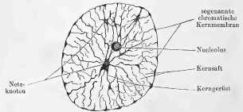

Ohne auf die ansehnliche, an Controversen reiche Literatur über diese Dinge
weiter hier einzugehen, ist es doch nöthig, einige Details näher zu erörtern:

Das **Kerngerüst** stellt unter gewöhnlichen Verhältnissen (im sogenannten
Ruhestande) des Kerns ein Netzwerk von deutlichen, theils schwächeren,
theils stärkeren Fäden oder Strängen dar, deren Anordnung nach den
vorhandenen Beschreibungen und Abbildungen der meisten Autoren eine
bestimmte Regelmäßigkeit und Gesetzmäßigkeit nicht verrathen. Einige
Beobachter dagegen, wie zuerst wohl *Balbiani*[@beg1881za], dann
*Flemming*[@fw1882], *Bütschli*[@bo1885mj], *Rabl*[@ra1885mj] u.&nbsp;A.
haben auf eine besondere und regelmässige Anordnung der Gerüstfäden in
Kernen bestimmter Organe und bei bestimmten Thieren aufmerksam gemacht.
*Balbiani* und *Rabl* gehen so weit, eine regelmässige Anordnung als etwas
Allgemeines, allen ruhenden Kernen Zukommendes anzunehmen; aber es lässt
sich in dieser Beziehung noch nichts Allgemeingültiges aussagen. *Balbiani*
hat z.&nbsp;B. bei den Chironomuslarven in den ruhenden Kernen nur **einen
einzigen**, vielfach verschlungenen Faden
gefunden. *Flemming* ist geneigt dies als ein weit verbreitetes Vorkommniss
anzusehen; Andere bestreiten dies (s.&nbsp;darüber weiter unten). Ferner
ist es noch zweifelhaft, ob nur ein oder mehrere vielfach gewundene, aber
**nicht anastomosirende** Fäden vorhanden sind, oder ob netzförmige
**Anastomosen** zwischen den einzelnen Windungen, mit andern Worten: ein
Netzwerk, wie in Fig.&nbsp;1, vorliegt. Wäre eine regelmässige Fadenanordnung
in allen ruhenden Kernen festzustellen, so wäre dies für die Deutung der
Erscheinungen der Karyokinese sehr wichtig; *Rabl* hat in der That auf eine
derartige Bedeutung der Gerüstfigur der ruhenden Kerne ausdrücklich
hingewiesen. Er unterscheidet „primäre“ Kernfäden von „secundären“. Die
ersteren sind stärker und meist excentrisch im Kern angeordnet und laufen
so um die Oberfläche des Kerns herum, dass sie an einer Stelle desselben,
dem „Polfelde“ (*Rabl*) Schlingen bilden, deren Scheitel eben dieses Polfeld
umkreisen, während sie an der ungefähr gegenüberliegenden Seite frei mit den
Schlingenschenkeln auslaufen, und zwar ohne dass hier eine besondere
Anordnung der letzteren erkennbar wäre. Diese Seite des Kerns, an der also
ein besonderes Polfeld nicht vorhanden ist, nennt *Rabl* die „Gegenpolseite“.
Zur Erläuterung mögen Fig.&nbsp;2, 3 und 4 dienen. In Fig.&nbsp;2 sieht man
die zum Polfelde gekehrten Schlingenscheitel, in Fig.&nbsp;3 ist die
Gegenpolseite wiedergegeben. Beide Figuren entsprechen jedoch nicht dem
Zustande des ruhenden Kerns, sondern dem I.&nbsp;Stadium der Karyokinese,
dem sogenannten „dichten Knäuel“, wobei die secundären Fäden geschwunden
sind und nur die primären hervortreten, so dass die ganze Anordnung
deutlicher wird. Fig.&nbsp;4 gibt an der rechten Seite des dargestellten
Kerns das Schema der Fadenordnung beim ruhenden Kern nach *Rabl*’s
Vorstellung; links sind nur die primären Fäden gezeichnet. Der Kern ist in
der Seitenansicht gedacht, das Polfeld (P.) oben, die Gegenpolseite unten.
Rechts, dem Ruhezustande des Kerns entsprechend, lassen sich noch zwei
primäre Fadenschlingen einigermaassen erkennen, jedoch gehen von ihnen
zahlreiche netzförmig untereinander und mit den primären Fäden verbundene
secundäre Fäden aus und an einzelnen Stellen hat sich die Fadensubstanz in
kleinen knotenförmigen Massen (Netzknoten) zusammengeballt. Auch ein runder
Nucleolus ist sichtbar. Man sieht leicht ein, dass die primären Fäden desto
schwerer erkennbar sein müssen, je mehr die Substanz, aus der sie bestehen,
in die secundären Fäden ausstrahlt und in Knotenpunkten sich anhäuft. So
komme es, meint *Rabl*, dass im ruhenden Kerne die regelmässige Anordnung
in Fadenschlingen mit Polfeld und Gegenpolseite verwischt erscheine; sie
könne über jeden Augenblick wieder hergestellt werden, wenn auf irgend eine
Weise die Filarsubstanz veranlasst werde, in die Hauptbahnen der primären
Fäden zurückzukehren. Hierin eben liegt die Wichtigkeit der besprochenen
Regelmässigkeit der Fadenstructur für die Karyokinese. Wir werden später
darauf zurückkommen.

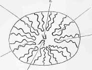

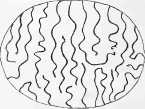

Eigenartig ist die Structur des Kerngerüstes bei gewissen Cilioflagellaten,
wie z.&nbsp;B. bei Ceratium Tripos. *Bütschli*[@bo1885mj] findet hier einen
wabenartigen Bau mit vollkommenem Abschluss der Waben, so dass der Kernsaft,
obwohl eine Kernmembran in toto nicht vorhanden ist, nicht mit dem Protoplasma
in directer Communication stehen kann. Bei den Pflanzenzellen fand
*Strasburger*[@sb1888] keine sog. secundären, eine Netzstructur herstellenden
Fäden, auch lässt sich ihm zu Folge nicht mit Sicherheit ausmachen, ob hier
während des Ruhezustandes nur ein, oder mehrere Fäden vorhanden sind und ob
eine bestimmte Anordnung der letzteren vorliegt.

Wir müssen nun noch gewisser Eigentümlichkeiten in dem Verhalten des Kerns
und seiner Bestandtheile zu chemischen Reagentien und Farbstoffen gedenken,
so wie auch die außer dem Gerüst noch vorhandenen Bestandtheile: Kernkörper,
Kernmembran und Kernsaft kurz besprechen.

Verdünnte Säuren, Essigsäure, Ameisensäure u.&nbsp;A. lassen das Gerüst
sowie die Kernkörper deutlich hervortreten, chromsaure Salze machen dagegen
beiderlei Bildungen undeutlich, Wasser macht sie quellen. In fast allen
Farbstoffen — von den gewöhnlich gebrauchten nenne ich: saures Carmin,
Hämatoxylin, Saffranin — färben sich die Gerüstfäden wie die Nucleolen
sehr intensiv, während die übrige Masse des Kerns, der zwischen den
Gerüstfäden liegende sogenannte „Kernsaft“, ungefärbt bleibt, oder doch
nur eine ganz schwache Färbung wahrnehmen lässt.

Dieser Unterschied im Verhalten gegen Farbstoffe hat *Flemming* (l.l.c.c.)
veranlasst im Kern sogenannte „chromatische Substanzen“ von den
„achromatischen“ zu unterscheiden. Zu den ersteren rechnet er die in
Alauncarmin und in Anilinfarben tief und intensiv färbbare Substanz der
Gerüstfäden und der Nucleolen, zu den letzteren die nicht färbbaren geformten
Theile, wie z.&nbsp;B. die später
zu besprechende bei der Theilung auftretende „Spindelfigur“. Er nennt die
färbbare Substanz des Kerngerüstes geradezu „Chromatin“^[*Pfitzner*
ist im Gebrauche der
Worte Chromatin und Achromatin
noch weiter gegangen. Als „Chromatin“
bezeichnet er mit *Flemming* die
färbbare Substanz des Kerngerüstes.
Da die Nucleolen sich bei den Tinctionen
etwas anders verhalten und auch
sonstige Verschiedenheiten zeigen,
nannte er deren Substanz „Prochromatin“,
womit zugleich angedeutet werden
soll, dass dieselbe eine Vorstufe
des Chromatins bilde. Später wählt er
dafür die Bezeichnung „Pseudochromatin“,
da ein bestimmter Zusammenhang
mit dem Chromatin nicht nachweisbar
sei. Für den „Kernsaft“, der übrigens
in gewissen Farbstoffen tingirbar
ist, behält er den von *Flemming* für
diesen aufgegebenen Namen „Achromatin“
bei, gibt dagegen der Substanz
der Spindelfigur, da diese sich anders
verhält als der Kernsaft, auch einen
anderen Namen: „Parachromatin“.].
Das Chromatin, meint er, gestützt auf Versuche von
*E.&nbsp;Zacharias*, sei vielleicht identisch mit dem Nuclein, oder einem
Derivat des letzteren.

Wichtig erscheint die von *Balbiani*[@beg1876cr] und *Pfitzner*[@pf1881mj]
entdeckte Thatsache, dass die chromatischen Fäden — und es ist dies
namentlich deutlich während der Karyokinese zu beobachten — aus regelmäßig
angeordneten Körnchen (Kügelchen) von der Gestalt kurztonnenförmiger
Scheiben (*Strasburger*) — **Chromatinkugeln** (*Pfitzner*),
**Mikrosomenscheiben**
(*Strasburger*)[@sb1884ama], — zusammengesetzt sind. Wohl allgemein wird
jetzt angenommen, dass außer diesen „Chromatinkörpern“ noch eine dieselbe
zu den Fäden verbindende achromatische **Zwischensubstanz**
(**Nucleo-Hyaloplasma**
*Strasburger*) vorhanden sei. *Carnoy*[@cjb1884lac] meint, dass bei den
Arthropoden der im Kerne vorkommende, einzige, stark gewundene Chromatinfaden
noch eine „Plastinhülle“ habe, im übrigen aus Nucleinsubstanz bestehe,
welche Ansicht *Ch.&nbsp;van&nbsp;Bambeke*[@vbc1887arb], ohne sich über
die chemische Beschaffenheit der Hülle näher zu äußern, bestätigt.

Was die Form der *Balbiani-Pfitzner*’schen Chromatinkörper anlangt, so ist
dieselbe, wie mir scheint, noch nicht endgültig festgestellt. *Pfitzner*
nannte sie „Kugeln“; *Strasburger* beschreibt sie in der eben citirten
früheren und auch in seiner neuesten Mittheilung[@sb1888] als
kurz-tonnenförmige „Scheiben“, ebenso schildert sie *Carnoy* bei den
Arthropoden.

Die **Kernkörperchen** (Nucleoli) bieten in ihrer Deutung noch manche
Schwierigkeiten dar. Allgemein bekannt ist,
dass sie meist rundliche Bildungen sind, die sich scharf von den übrigen
Bestandteilen des Kerns abheben, und die, wie wir oben erwähnten, sich
ebenfalls intensiv färben lassen. Zweifelhaft ist aber ihre Beziehung zum
Kerngerüst. Die Einen — ich nenne *Flemming* und *Pfitzner* — halten die
Nucleolen für verschieden vom Kerngerüst; sie seien als besondere Bildungen
innerhalb des letzteren aufzufassen, hingen nicht mit den Gerüstfäden
zusammen, sondern seien von ihnen getrennt, wenn sie ihnen auch
„angelagert“ erschienen. Die Anderen — z.&nbsp;B. *E.&nbsp;Klein*[@kn1878qj;
@kn1879cmw] in London, dem ich mich anschliessen möchte, und zwar auf Grund
des Verhaltens der Nucleolen bei der Karyokinese — halten dafür, dass die
Nucleolen nur stark verdickte Knotenpunkte des Netzwerkes der Gerüstfäden,
also mit den letzteren identisch seien. Thatsache ist, dass solche verdickten
Knotenpunkte innerhalb des chromatischen Kerngerüstes vorkommen. Diese
müssen jedoch nach *Flemming*[@fw1882] von den ächten Nucleolen unterschieden
werden. Man vergleiche Fig.&nbsp;1, welche neben solchen Knotenpunkten —
„Netzknoten“ werden sie zum Unterschiede von den Nucleolen genannt — einen
gut begrenzten rundlichen Nucleolus zeigt.

Nach *Pfitzner* sollen die ächten Nucleoli nie eine Verbindung mit dem
Chromatingerüst zeigen sondern frei in den Maschen desselben liegen.
Abgesehen hiervon findet *Flemming* auch noch Unterschiede im 
Lichtbrechungsvermögen und im Verhalten gegen gewisse Farbstoffe. — Bei
Ceratium tripos fand *Bütschli* die mitunter in den Kernen gelegenen
Nucleolen wieder aus einem feinen Netzgerüst aufgebaut.
*E.&nbsp;Zacharias*[@z1881bz] gibt für Pflanzenzellen an, dass die Nucleolen
des wesentlichsten Kernbestandtheils, des Nucleins, entbehrten, dagegen
ein Gerüst aus Plastinsubstanz enthielten, in dessen Maschen andere
Eiweißstoffe aufgenommen seien. Dies würde für die Selbständigkeit der
Nucleolen sprechen. *Carnoy*[@cjb1884lac] will vier verschiedene Formen
von Nucleolen (bei den Arthropoden) unterschieden wissen; ob es aber richtig
ist, so verschiedene Dinge, wie er sie beschreibt, mit einem und demselben
Namen zu belegen, bleibt mir fraglich. Untersuchungen aus Gaule’s Laboratorium 
von *Ogata*[@og1883aap] und *Lukjanow*[@lu1887aap], ferner von
*Stolnikow*[@st1887aap] haben ein sehr verschiedenes Verhalten der 
nucleolenähnliehen Körper gegen Farbstoffe (Eosin, Saffranin, Nigrosin und
Hämatoxylin) ergeben. Demnach werden von den genannten Autoren unterschieden:
a) als **Karyosomen** die sich blau färbenden
Körper, b) als **Plasmosomen** die sich roth färbenden Körper, c) als
**Hyalosomen** ungefärbt bleibende (s.&nbsp;*Lukjanow*). Wie *Ogata* zuerst
behauptet hat, können diese Körper auch aus den Kernen in den Zellenleib
auswandern; die auswandernden **Plasmosomen** bilden die sogenannten
„**Nebenkerne**“, denen ein wichtiger Antheil an der Regeneration der Zellen
zugeschrieben wird.

Die Bedeutung aller dieser Dinge für das Zellenleben ist noch fast vollkommen
dunkel. *Strasburger* und *Pfitzner* (l.c.) sind geneigt in den Nucleolis
Ablagerungsstätten für sogenannte „Reservestoffe“ zu erblicken, wofür
allerdings ihr Verhalten bei der Karyokinese spricht. Sie lösen sich nämlich
während derselben auf, um sich erst nach der Theilung in den neuen Kernen
wieder zu bilden. Auch scheinen sie für die Membranbildung um die jungen
Kerne Stoffe herzugeben. *A.&nbsp;Brass*[@brass1883] bringt ebenfalls die
Kernkörperchen in Beziehung zu den Ernährungsvorgängen am Kerne. Bei
Spirogyra ist nach *Meunier*[@me1887lc] alles Chromatin im Nucleolus
enthalten und geht ausschließlich von hier in die mitotische Figur über.

Der „**Kernsaft**“ ist keineswegs als eine einfach wässerige Flüssigkeit
anzusehen; alles spricht vielmehr dafür, dass er ebenfalls Eiweißkörper
enthält. Nach Einwirkung von verschiedenen Reagentien treten feinkörnige
Trübungen im Kernsaft auf; nach *Flemming*[@fw1882] müssen diese aber wohl
als Gerinnungserscheinungen — besser wohl „Niederschläge“ — gedeutet werden
und ist vor der Hand an Structurverhältnisse nicht zu denken.
*Carnoy*[@cjb1884lac] nimmt indessen ein solches an, indem er dem Kernsafte
ein feines Plastingerüst mit einem mehr flüssigen Inhalte (Enchylema)
zuschreibt, während *van Bambeke* (l.c.) und *Platner*[@pl1886mah] sich
gegen diese Annahme aussprechen.

Schwierig ist die Frage nach dem Verhalten der **Kernhüllen**. Von allen
Seiten wird zugestanden — und muss ich dem ebenfalls zustimmen — dass die
Kerngerüstbalken an der Peripherie dichter zusammenschliessen und somit eine 
durchbrochene, korbgeflechtartige Begrenzungsschicht bilden. Von Anderen
wird noch eine nicht färbbare (achromatische) Kernmembran für manche Kerne
angenommen, so z.&nbsp;B. von *Flemming*[@fw1882], während Manche, wie
*Strasburger* und *Pfitzner*[@pf1883ama], auch eine membranartige
Abschließung des an den Kern zunächst anstoßenden Zellprotoplasmas,
„innere Zellmembran“, zulassen. In seiner neuesten Arbeit([@sb1888],
p.&nbsp;30), lässt *Strasburger* mit *Guignard*[@gu1884as] die gesammte
Kernmembran genetisch dem Zellprotoplasma angehören; sie sei also eine
Grenzschicht des Zellprotoplasmas gegen die Kernsubstanz hin. Dieselbe
erlange allerdings bei vollständiger Ausbildung gegen das übrige
Zellprotoplasma eine morphologische Selbständigkeit. Dass die Kernwandung
dem Zellprotoplasma genetisch angehöre gehe daraus hervor, dass sie sich —
bei Pflanzenzellen — während der Karyokinese dem Protoplasma wieder zugeselle,
und aus dem letzteren um die jungen Tochterkerne wieder angelagert werde.

Bezüglich der **chemischen Zusammensetzung** der Zell- und Kernsubstanzen,
welche für eine richtige Auffassung der mitotischen Vorgänge von Tag zu Tage
wichtiger wird, haben neuere Untersuchungen namentlich auf botanischem
Gebiete manches ergeben. Außer dem von *Miescher*[@mi1874vnb] entdeckten
„**Nuclein**“, welches einen wesentlichen Bestandteil der Kernmasse ausmacht, 
fanden *Reinke* und *Rodewald*[@rr1881lg] das „**Plastin**“,
*Kossel*[@ks1883zpc; @ks1884zpc; @ks1885bcg] das „**Histon**“ und das
„**Adenin**“. Nach allen bisherigen Angaben ist das Nuclein vorzugsweise in
den chromatischen Kernsubstanzen enthalten — s.&nbsp;bes.
*E.&nbsp;Zacharias*[@z1881bz; @z1885bz]. *Frank Schwarz*[@sz1887] schlägt
folgende Termini zur Bezeichnung der verschiedenen Zellenleib- und
Kernbestandtheile vor: 1) Das **Chromatin**; dies bildet die Substanz der
*Balbiani-Pfitzner*’schen Chromatinkörper, von denen schon vorhin die Rede
war. Es ist identisch mit *Strasburger*’s „Nucleomikrosomen“, eine Bezeichnung,
die ihr Autor in seiner neuesten Publication[@sb1888] wieder verlässt aus
dem Grunde, weil diese Chromatinkörper chemisch und auch morphologisch
völlig verschieden sind von denjenigen „Mikrosomen“ (Cytomikrosomen), welche
wir als einen der Hauptbestandteile des Zellleibes ansehen müssen. 2) Das
**Linin** (λινον-Faden). Diese Substanz ist identisch mit *Strasburger*’s
„Nucleohyaloplasma“ und mit *Pfitzner*’s Parachromatin; sie ist die kaum
färbbare Grundsubstanz der Chromatinfäden, in welcher die wiederholt
erwähnten, sich lebhaft färbenden Chromatinkörper eingebettet sind. Der
Name „**Linin**“, wird sich, seiner Kürze wegen, wohl leichter einbürgern,
als die unbequemen Ausdrücke „Nucleo-Hyaloplasma“ und „Parachromatin.“
*Strasburger* verwendet ihn bereits in seiner neuesten Arbeit. 3) Das 
„**Paralinin**“; darunter soll die mehr flüssige Substanz des Kerns, die
zwischen den Fäden befindlich ist, verstanden sein. Synonyma sind: Kernsaft
(*O.&nbsp;Hertwig*), Zwischensubstanz, Achromatin (*Flemming*), Karyochylema
(*Strasburger*). 4) „**Pyrenin**“ (ὄ&nbsp;πυϱην = Kern) bezeichnet den Stoff,
aus welchem das Kernkörperchen besteht. Ob *Frank Schwarz* im Rechte ist,
eine einheitliche Kernkörperchensubstanz hinzustellen, mag mit Fug wie
z.&nbsp;B. von *Strasburger*[@sb1888] bezweifelt werden. 5) **Amphipyrenin**
= dem die Kernmembran bildenden Stoffe. Dasselbe ist dem Pyrenin sehr ähnlich
(vgl. das vor­hin über die Beziehungen des Kernkörperchens zur Kernmembran
Gesagte), jedoch nimmt das Pyrenin leicht Farbstoffe an, das Amphipyrenin
nicht; beide zeigen vom Chromatin abweichende Reactionen.

Am meisten dem Nuclein entspricht, nach *Schwarz*, in seinen Reactionen
das Linin, nicht (entgegen der bisherigen Annahme, s.&nbsp;vorhin) das
Chromatin; das Paralinin steht dem Globulin am nächsten. Es ist dies
Paralinin jedoch keine Flüssigkeit im gewöhnlichen Sinne, daher empfiehlt
sich nicht die sonst so passende und gute Bezeichnung „Kernsaft“; auch ist
es nicht achromatisch. Einen wirklichen „Saft“ als „Karyochylema“ kann man
nur in etwaigen Vacuolen annehmen. Wie weit diese Angaben mit der vorhin
er­wähnten Ansicht *Carnoy*’s stimmen, müssen erst weitere Untersuchungen
lehren.

Entgegen den meisten neueren Angaben nimmt *Frank Schwarz* (l.c. p.&nbsp;136)
an, dass im **Zellprotoplasma** keine **präformirten** Netze und Gerüstwerke
vorhanden seien, dass aber wohl ein Theil desselben sich zu Fäden und Strängen
umbilden könne; es sei das Cytoplasma eben eine Mischung, in welcher unter
Umständen eine Trennung von festerer, zäher und flüssiger (gelöster) Substanz
eintreten könne. Auf einer solchen Trennung (Entmischung) beruhe z.&nbsp;B.
die Vacuolenbildung. Als chemische Bestandteile des Cytoplasmas nennt *Frank
Schwarz*: 1) das **Plastin** (*Reinke*) (Cytoplastin) eine zähe, dehnbare
Masse, welche der Pepsin- und Trypsin-Verdauung widersteht. 2) Die in Wasser
und auch im Cytoplasma unlöslichen „**Mikrosomen**“. Diese sind aber unter
Umständen verschieden zusammengesetzt und daher mit den chemisch einheitlichen
Chromatinkörpern des Kerns nicht zu vergleichen. 3) Die in den **Vacuolen**
gelösten Stoffe. Die Mikrosomen können fehlen, 1 und 3 sind aber immer
vorhanden. — Das hier Vorgebrachte gilt natürlich in erster Linie für
Pflanzenzellen.

Wir wenden uns nunmehr zu einer Darstellung der **karyokinetischen Vorgänge**
selbst, und zwar nach der Schilderung, welche *Rabl*[@ra1885mj] jüngst von
ihnen geliefert hat, welche aber, wie bemerkt, in fast allen wesentlichen
Punkten mit der von *Flemming*[@fw1882] gegebenen übereinstimmt.

Gehen wir von dem ruhenden Kerne aus, wie er in Fig.&nbsp;1 dargestellt ist,
so würde als erstes Stadium der Karyokinese dasjenige zu bezeichnen sein, in
welchem alle secundären Fäden des Kerngerüstes, wie auch die Nucleolen und
Netzknoten schwinden, indem ihre Substanz in die primären Gerüstfäden
übergeht. Fig.&nbsp;4 zeigt uns, wie schon vorhin bemerkt, ein Kernschema,
in welchem rechts, ausser zwei primären Fadenschlingen, noch die secundären
Fäden, Netzknoten und ein Nucleolus sichtbar sind, links dagegen fehlen.
Denkt man sich auch rechts die secundären Fäden, Knoten und den Nucleolus
in die primären Fadenschlingen aufgenommen, so wird dann das erste Stadium
der Karyokinese gegeben sein, wie es in Fig.&nbsp;2, und zwar vom Polfelde
aus gesehen, gezeichnet ist. Mit *Flemming* nennen wir dieses das
„**Knäuelstadium**“ oder die **Knäuelform**, kurz: **Knäuel**,
„**Spirem**“^[σπείϱημα, Windung, Knäuel], **Mutterknäuel**. *E.&nbsp;van
Beneden*[@vbe1883] war der Erste, welcher für die Eizellen zeigte, dass die
chromatischen Fäden, mit deren deutlichem Auftreten die Karyokinese beginnt,
nur Theilstücke eines im Kern befindlichen zusammenhängenden Gerüstes sind
und dass sie durch stärkere Chromatinansammlung deutlich werden. *Rabl* hat
dies denn auch für andere Zellen nachgewiesen und verallgemeinert.

Gleichzeitig mit diesen Veränderungen bemerkt man eine Vergrößerung des
gesammten Kerns.

*Balbiani* und *Strasburger* haben, wie erwähnt, die Ansicht ausgesprochen —
und *Flemming*’s wie *Carnoy*’s Darstellung lautet hierin beistimmend —, dass
im ruhenden Kern und zu Anfang des Knäuelstadiums nur ein einziger Faden
vorhanden sei, der sich vielfach winde und so eine grössere Anzahl von
einander getrennter Fadenschlingen vortäusche. So schwierig es ist, wie ich
nach eigener Erfahrung sagen kann, sich über diesen Punkt bestimmt zu äussern,
so möchte ich doch *Rabl* beipflichten, wenn er meint, dass gleich von
Anfang an mehrere — bei thierischen Zellen bis
zu 20 — **getrennte** Fadenschlingen vorhanden sind. Auch *Strasburger* hat in
seiner neuesten Mittheilung[@sb1888] seine frühere Ansicht von dem
Vorhandensein nur eines einzigen Fadens aufgegeben. Bei den Zellen der
Chironomuslarven, wo ihn *Balbiani* zuerst nachgewiesen hat, lässt auch 
*Strasburger* diesen einen Faden noch gelten.

*Rabl* beschreibt, abweichend von seinen Vorgängern, den bereits erwähnten
typischen Verlauf der Fadenschlingen meist quer zur Längsaxe des Kerns mit
einem freien „Polfelde“ an der „Polseite“ und mit der „Gegenpolseite“, und
hebt hervor, dass die Fäden in der Mehrzahl der Fälle an der Oberfläche des
Kerns verlaufen. S.&nbsp;Fig.&nbsp;2 und&nbsp;3.

Polare Strahlungsfiguren im Protoplasma der Zelle, s.&nbsp;Fig.&nbsp;7
(Cytaster) findet *Rabl* in diesem Stadium noch nicht, während *Flemming*
sie bei Eizellen zu dieser Zeit schon bestimmt gesehen hat und auch für die
übrigen zur Theilung sich anschickenden Gewebszellen als früheste Erscheinung
eine „dicentrische Anordnung“ des Protoplasma annimmt, ungeachtet eine
deutliche strahlige Gruppirung desselben an zwei einander gegenüberliegenden
Polen noch nicht erkennbar ist. S.&nbsp;weiter unten *E.&nbsp;van Beneden*’s
Angaben.

Die beschriebene erste Knäuelfigur, die man auch als „dichten Knäuel“
bezeichnet, geht nun zunächst in den „lockeren Knäuel“ über (Fig.&nbsp;5).
Dieser kommt dadurch zu Stande, dass die Fäden dicker und kürzer werden und 
nicht so stark gewunden verlaufen. Gleichzeitig tritt aber an einigen Fäden
eine quere Theilung auf, so dass die Zahl der einzelnen Schlingen etwas
größer wird. *Rabl* schließt aus *Flemming*’s Zählungen und aus eigenen,
dass bei ein und derselben Thierspecies und Zellenspecies die Zahl der
Fadenschlingen in diesem Stadium eine constante sei. So betrug sie z.&nbsp;B.
bei den Epithelzellen von Salamandra stets 24. Bestimmte Zahlen für gewisse
Pflanzenzellen werden auch von den Botanikern, namentlich von *Strasburger*
und *Heuser*[@hs1884bz], angegeben; doch meint neuerdings der Erstere, dass
eine absolute Constanz nicht vorhanden wäre, wenigstens nicht bei allen
Zellenarten. Nur die generativen Zellen sollen bemerkenswerther Weise stets
dieselbe Schleifenzahl (bei einer und derselben Species) aufweisen.
Vgl.&nbsp;hierzu *Boveri* ([@bt1887ber], w.&nbsp;n. pag.&nbsp;103). Diejenigen,
welche, wie *Flemming*, einen einzigen Faden im vorigen Stadium annehmen,
lassen denselben sich nun im Stadium des lockeren Knäuels in die einzelnen
Segmente (Fadenschlingen) spalten. Wie
wir sahen, lässt auch *Rabl* eine solche Theilung einzelner Fadenschlingen zu,
da er ja aber von Anfang an mehrere Schlingen annimmt, so ist für ihn die
Theilung eine viel beschränktere.

Auf den „lockeren Knäuel“ folgt nun als dritte Unterordnung des ersten
Stadiums der Karyokinese der sogenannte „segmentirte Knäuel“ — so bezeichnet
nach einer der **wichtigsten**, von *Flemming* entdeckten und jetzt wohl
allgemein angenommenen Erscheinungen der Karyokinese, nämlich der
**Längstheilung** sämmtlicher Fadenschleifen, s.&nbsp;Fig.&nbsp;6 und&nbsp;7.
Wie sich mit dem weiteren Ablaufe der Dinge herausstellt, wird durch diese
Theilung der einzelnen Fäden eine Zerlegung der gesammten chromatischen Masse
des Kerns in zwei gleiche Hälften bewirkt und die nachkommenden Erscheinungen
haben nur noch den Erfolg, dass die Theilstücke auseinanderrücken und sich zu
den beiden Tochterkernen neu gruppiren. *Rabl* gibt ausdrücklich an, dass er
die Längstheilung der chromatischen Fäden mit dem Schlusse der Knäuelphase
stets vollendet gefunden habe.
— *E.&nbsp;van Beneden* (bei Ascaris megalocephala) legt entschiedenen Werth
darauf, dass die beiden Schwesterfäden bis in die kleinsten Einzelnheiten
einander gleich seien. Die Längstheilung ist, ihm zufolge, anfangs keine
vollständige, so dass an den beiden Enden die Schwesterfäden noch eine
Zeitlang durch eine minder stark sich färbende Substanz zusammenhängen.
Dieser Zusammenhang erhält sich auch noch, wann die zusammengehörigen
Schwesterfäden nach den beiden Polen hin auseinanderrücken. Man sieht dann,
wie es zuerst *E.&nbsp;van Beneden* — später *Rabl* — beschrieben hat, von den
Enden der auseinanderstrebenden Fadenschleifen feine achromatische Fäden
(filaments réunissantes, *E.&nbsp;van Beneden*) ausgehen, die noch eine
Zeitlang die chromatischen Schleifen der beiden Tochterkerne (Dyasteren) mit
einander verbinden. Man muss diese Fäden sehr wohl von denen der Spindelfigur
unterscheiden ( *van Beneden*, s.&nbsp;Fig.&nbsp;11).

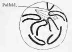

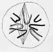

Außer der Längstheilung der Fäden zeigt aber das in Rede stehende Endstadium
des „Knäuels“ noch eine Reihe anderer bemerkenswerther Erscheinungen, und zwar
zunächst das Auftreten der sogenannten „achromatischen Kernspindel“ und die
beginnende Anordnung der chromatischen Fadenschlingen in eine bestimmte
Stellung zu dieser Spindel.

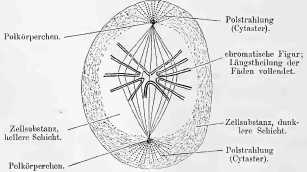

Die vollentwickelte **Kernspindel** ist in Fig.&nbsp;7 dargestellt;
sie zeigt deutlich zwei Pole und einen Aequator. Die feinen Fäden, aus denen
sie sich zusammensetzt, färben sich, wie bereits vorhin bemerkt, viel
schwächer als die dickeren Fäden der chromatischen Figur, wenigstens in den
von *Flemming* sogenannten reinen Kernfärbungsmitteln (Alauncarmin, Anilin,
Bismarckbraun, Gentianaviolett, Methylgrün u.&nbsp;A.), während sie dagegen
in manchen Carmingemischen, wie auch in Hämatoxylin, Färbungen annehmen. Die
Fäden sind viel zarter als die der chromatischen Figur, namentlich ist dies
bei thierischen Zellen der Fall; bei pflanzlichen Elementen dagegen erscheint
die Spindelfigur meist ohne weiteres
sehr deutlich^[Die deutlichsten Spindelfiguren bei
thierischen Zellen habe ich vor Kurzem
in sehr schönen Präparaten *Mayzel*’s
zu sehen Gelegenheit gehabt. Dieselben
betrafen das Endothel der *Descemet*’schen
Haut des Frosches (R.&nbsp;escul.); sie
waren mit schwacher Chromsäure behandelt,
mit Carmin gefärbt und schon seit Jahren
in Glycerin aufbewahrt, ohne an Deutlichkeit
zu verlieren. (Vgl. *Mayzel*’s[@ma1884]
Arbeit in der zu Ehren *Hoyer*’s erschienenen
Festschrift, Warschau 1885.) Neuerdings
beobachtete ich sie in vollendetster Form
an Präparaten *Kultschitzky*’s über die Eier
von Ascaris megalocephala im hiesigen Laboratorium.]. Nach *Carnoy*
sollen sie auch noch über die beiden Pole hinaus in das Zellprotoplasma sich
fortsetzen. (Vgl. darüber *van Beneden* weiter unten und Fig.&nbsp;7 Cytaster.)

Weitere Unterschiede von den chromatischen Fäden liegen darin, dass die
Spindelfäden in Pepsinlösungen schwinden und in verdünnten Säuren, namentlich
Salzsäure, verschärft hervortreten. Nicht immer hat die Figur eine deutliche
Spindelform, sondern zeigt, bei Pflanzen namentlich, nicht selten eine 
cylindrische Gestalt (cylindrisches Fadenbündel), so dass sie von den Polen
angesehen, nicht einem Sterne, sondern einer punktirten Scheibe gleicht.

Ueber ihre Herkunft und Bedeutung gehen die Meinungen noch auseinander. Ich
komme später auf diesen Gegenstand zurück.

Die Untersuchungen *Rabl*’s zeigen nun des Weiteren, dass die Spindelfigur
ihre Lage während des Ablaufs der Theilungserscheinungen ändert, und, was
besonders merkwürdig ist, dass die Fadenschlingen der chromatischen Figur
dieser Lageänderung folgen. Dass sich die Fäden der Tochterkerne nach
geschehener Theilung um die Pole der Spindelfigur gruppiren, ist zwar seit
der Entdeckung der karyokinetischen Zelltheilung bekannt, ebenso lehren
bereits *Flemming* und *E.&nbsp;van Beneden* l.l.c.c., dass die Tochterfäden
den Fäden der Kernspindel entlang sich verschieben, um zu deren Polen zu
gelangen; *Rabl* indessen hat gezeigt, dass schon vom ersten Auftreten der
Spindelfigur an ein gleichsam richtender Einfluss derselben auf die
chromatischen Fäden erkannt werden kann, und diese Erscheinungen spielen
sich eben in der Phase des „segmentirten Knäuels“ ab.

Wann die Spindelfigur zuerst sichtbar wird (bei Salamandra), so wird sie von
*Rabl* in der Nähe des Polfeldes gefunden, so
dass ihr Aequator im Polfelde steht, während ihre Längsaxe schief zur
Längsaxe des Kerns gerichtet ist. Später senkt sie sich tiefer in die
Kernsubstanz ein und nimmt eine Lage der Art an, dass ihr Aequator in
diejenige Ebene fällt, in der später die Theilung des Kerns erfolgt
(**Theilungsebene**). Die Längsaxe der Spindelfigur fällt dann mit der
„Theilungsaxe“ des Kerns zusammen. Fügen wir hier gleich an, dass die
Theilungsaxe der Kerne nicht immer mit deren eigener Längsaxe und mit der
Längsaxe der Zelle dieselbe ist, dass also z.&nbsp;B. eine Cylinderzelle
sich nicht nur der Quere, sondern auch der Länge nach theilen kann, wie
dies n.&nbsp;A. *Arthur Kollmann* in seiner schönen Arbeit über den
Tastapparat der Hand[@km1883] von den tiefliegendsten Zellen des Rete
Malpighii gezeigt und *Rabl* bei Salamandra bestätigt hat. Auch schiefe
Theilungen scheinen vorzukommen. In vielen Fällen liegt die Sache so, dass
(*Rabl*, *Strasburger*) die Theilungsaxe durch Polfeld und Gegenpolseite des
Mutterkerns läuft; bei der späteren Theilung würde demnach das Polfeld des
einen Tochterkerns mit dem ursprünglichen Polfelde des Mutterkerns
zusammenfallen, das Polfeld des anderen Tochterkerns dagegen mit der
ursprünglichen Gegenpolseite (s.&nbsp;Fig.&nbsp;12). Doch ist dies nicht immer
der Fall (*Strasburger*). Bei Pflanzen soll es sogar häufiger sich so
verhalten, dass die Theilungsaxe parallel dem Polfelde liegt.

Bezüglich der Lage der chromatischen Fadenschlingen zur Kernspindel sahen wir 
bereits, dass die Schlingenwinkel anfangs grossentheils zum Polfelde,
d.&nbsp;h. zum Aequator der noch schief gelagerten Kernspindel hin geneigt
sind. Wenn nun die Spindel sich senkt, so dass ihr Aequator mehr in die Mitte
des Kerns zu liegen kommt, so folgen — und das ist eine der Haupterscheinungen
dieser letzten Phase des Knäuelstadiums — die Fadenschlingen dem Aequator der
Spindel, gleichsam als würden sie von ihm angezogen, und gruppiren sich dann
allmählich rings um diesen Aequator, ihm ihre Scheitel zu­kehrend. Es ist
klar, wie das auch *Rabl* hervorhebt, dass damit die Unterscheidung von
Polseite und Gegenpolseite wegfällt und nunmehr zwei Pole am Kern auftreten,
die den Polen der Spindelfigur entsprechen. S.&nbsp;Fig.&nbsp;5, 6, 7.

Noch zweier Vorgänge, welche dem in Rede stehenden Endstadium des Knäuels
angehören, muss hier gedacht werden, es sind dies die **Polstrahlungen** im
**Zellprotoplasma** und das **Schwinden des äußeren Kerncontours**.

Die **Sternfiguren** (Polstrahlungen, Astern) im **Zellprotoplasma** wurden
bereits vorhin berührt. Bei manchen Zellen, z.&nbsp;B. den Eizellen, treten
sie nie, wie besonders *Flemming*[@fw1882] hervorhebt, sehr früh auf. Bei den
meisten Zellen scheinen sie aber erst mit dem Endstadium des Knäuels deutlich
zu werden; die Strahlung geht von den Polen der Spindelfigur aus 
(Fig.&nbsp;7, 9, 10, 11). — Von allen Beobachtern wird übereinstimmend
angegeben, dass die **Kernmembran** gegen das Ende des Knäuelstadiums
unsichtbar werde. Ueber ihren Verbleib sind indessen bestimmte Angaben nicht
vorhanden. *Strasburger* hat sich am eingehendsten mit dieser Seite der Sache
beschäftigt. Seiner Meinung nach, welche bereits vorhin angedeutet wurde,
tritt mit dem Schwinden der Kernhülle Zellplasma in den Kernraum ein und
vermischt sich hier mit dem Kernsafte, so dass der ursprüngliche Contour des
Kerns ganz verloren geht und als körperlicher Ausdruck des Kerns nur die
chromatische und die Spindelfigur übrig bleibt. Ja, wenn wir mit *Strasburger*
annehmen wollen, dass die Spindelfigur auf Rechnung des eingedrungenen
Zellprotoplasmas zu setzen wäre, so würde der Kern formell, von diesem
Stadium an, nur noch durch die chromatische Figur repräsentirt sein. Demgemäß
geben auch die Zeichnungen *Strasburger*’s, wie auch *Flemming*’s, *Rabl*’s
u.&nbsp;A., vom Endstadium des Knäuels an gerechnet, keinen Totalumriss des
Kerns mehr, sondern nur einen hellen Hof um die Fadenfiguren, der aber auch
mehr oder minder von der früheren Kernumrissform abweicht. Was die Vermischung
von Kernsaft und dem betreffenden Antheile des Zellprotoplasmas anlangt, so
sprechen sich, abgesehen von *Strasburger*, die Meisten darüber nicht mit
Entschiedenheit aus. Die erwähnten hellen Höfe, in welchen nach Schwund der
Kernmembran Kern- und Zellsubstanz aneinanderstoßen (Fig.&nbsp;7), werden
namentlich von *Flemming* und *Rabl* eingehend beschrieben. Wir werden später
auch auf diese Frage noch zurückkommen.

Es ist endlich noch der sogenannten „Polkörperchen“ *van Beneden*’s Erwähnung
zu thun, welche mit der völligen Ausbildung der Spindelfigur an deren Polen
auftreten (Fig.&nbsp;7 u.&nbsp;8). Er entdeckte dieselben bei den
Dicyemiden-Eiern[@vbe1876bel1; @vbe1876bel2]. Es sind kleine glänzende
Körperchen, die als selbständige Bildungen anzusehen sind, nicht etwa als
Ausdruck der Vereinigung der Fäden der Spindelfigur. Ihre Herkunft und
Bedeutung ist noch unbekannt. *Carnoy*[@cjb1884lac; @cjb1885lac] glaubt in
ihnen Aufspeicherungen von Nucleinelementen sehen zu sollen, die sich zum
Theil aus dem Cytoplasma bilden und nachher bei der Reconstruirung der
Tochterkerne Verwendung finden. — Bei den Pflanzenzellen sind Polkörperchen
bis jetzt noch nicht gefunden worden (*Strasburger*). Polare Strahlungen
treten indessen auch hier auf, jedoch seltener. — (Weiter unten mehreres über
alle diese Strahlenbildungen und polaren Körperchen, sowie über eine bisher
noch nicht besprochene Bildung, die sog. Attractionssphären *van Beneden*.)

Auf das Stadium des **Spirems**, das wir bislang betrachteten und das mit der
vollendeten Längstheilung der chromatischen Fäden sein Ende erreicht
(Fig.&nbsp;6), folgt nun das Stadium, welches als „**Mutterstern**“, „Aster“,
„Monaster“ bezeichnet wird (Fig.&nbsp;7). Das Charakteristische desselben
beruht in der Fertigstellung der Anordnung der chromatischen Fadenschlingen
um die Aequatorialebene der Spindelfigur, dergestalt, dass die
Schlingenscheitel sämmtlich zur Spindelfigur centralwärts gekehrt sind, die
Schenkel der Schlingen zur Peripherie. *Flemming* hat die einschlägigen
Vorgänge zuerst beschrieben. Wenn wir vorhin schon darauf hinwiesen, dass die
Aequatorialregion der Spindelfigur eine Art Attractionsfeld für die
chromatischen Schlingen sei, so wird eben mit dem Beginn dieses Stadiums das
vollendet, was im vorigen sich einleitete und zwar in einer höchst
bemerkenswerthen und interessanten Form. Die chromatischen Fadenschlingen
folgen, wie gesagt, dem Aequator der Spindelfigur und gruppiren sich hier
dicht zusammen in der erwähnten Weise. Beschaut man einen Kern vom Pol einer
Spindelfigur her, so muss die chromatische Figur als Stern mit heller Mitte
erscheinen, in dieser Mitte steckt als zweiter Stern die blasse Spindelfigur,
deren Pol dem Beschauer zugewendet ist, s.&nbsp;Fig.&nbsp;8. — Die 
längsgetheilten chromatischen Fäden erfahren zugleich eine Verdickung und
Verkürzung.

Dieses Stadium ist nur von kurzer Dauer und geht rasch über in das folgende,
welches gegenwärtig (nach *Flemming*) als das der „**Metakinesis**“ bezeichnet
wird^[Der Ausdruck „Aequatorialplatte“
(*Flemming*), „Kernplatte“
(*Strasburger*) passt wegen des Wortes
„Platte“ wohl am besten für das Ende
des Muttersternstadiums, wann nämlich
die chromatischen Elemente am Aequator
so ziemlich in eine Ebene zusammengerückt
sind. Das Wort „Metakinesis“ findet
bessere Verwendung für das beginnende
folgende Stadium, in welchem
das Auseinanderrücken der Fadenhälften
beginnt; es deckt sich also nicht völlig
mit dem Ausdrucke: Aequatorial- oder
Kernplatte. Das Wort: „Platte“ ist übrigens
nicht besonders bezeichnend für ein aus
Schlingen zusammengesetztes Gebilde; doch
kommen, namentlich bei Pflanzenzellen,
Fälle vor, in denen die chromatischen
Fäden sehr kurz sind, so dass sie Körnern
gleichen; liegen solche Fadenelemente
nahezu in derselben Ebene dicht aneinander,
so kann allerdings der Eindruck einer
„Platte“ entstehen. *Mayzel* in der genannten
Festschrift bildet ein derartiges Verhalten
bei den Spermatocyten von Liparis- und
Sphynx-Raupen, also bei thierischen Zellen
ab. Er hat dasselbe schon früher (1881)
beschrieben. Neuerdings hat *Platner* in
einer eingehenden Arbeit über die Karyokinese
bei den Lepidopteren[@pl1886mah] ähnliche Bilder gegeben.]. In diesem
vollzieht sich im Wesentlichen das Auseinanderrücken der aus der früheren
Längstheilung hervorgegangenen chromatischen Schwesterfäden. *E.&nbsp;van
Beneden*[@vbe1883] hat zuerst für thierische Zellen (Eifurchungszellen von
Ascaris megaloceph.), *Heuser*[@hs1884bz] gleichzeitig für pflanzliche,
mit Bestimmtheit gezeigt, dass von den beiden secundären Fäden, welche aus
einem früheren chromatischen Primärfaden hervorgehen (Schwesterfäden), der
eine zu dem einen Pole der Kernspindel, der andere zum anderen Pole
hinwandert. Nächst dem Nachweise der Längsspaltung der Fäden durch *Flemming*
dürfte dieser Fund *E.&nbsp;van Beneden*’s und *Heuser*’s wohl der
bedeutendste sein, der in der neueren Zeit in Sachen der Karyokinesis gemacht
wurde; durch ihn hat *Flemming*’s Entdeckung erst ihren vollen Werth erhalten,
wie *van Beneden* l.c. p.&nbsp;328, 379 und 380 schon eingehend würdigt.
Bereits bei *Flemming*[@fw1882] finden sich viele genaue Detailangaben über
diese Vorgänge, und *Rabl*[@ra1885mj] hat in jüngster Zeit eine sehr
eingehende Schilderung der Metakinesis bei den Gewebszellen von Salamandra
geliefert, bezüglich derer ich jedoch auf das Original verweisen möchte. Die
nach *Rabl* copirten Fig.&nbsp;9 und 10 (bei denen, wie auch in Fig.&nbsp;11,
der Totalumriss des Kerns nicht mehr angedeutet ist) geben eine ungefähre
Vorstellung vom Gange der Dinge.

Die **Metakinesis** führt nun zum folgenden (4.) Stadium, dem der
„**Tochtersterne**“(**Dyaster**) Fig.&nbsp;11. Dasselbe beginnt von dem
Augenblicke an, wann die offenen Schlingenschenkel der zu beiden Polen, der
Spindelfigur entlang, wandernden chromatischen Fäden sich nicht mehr in der
Aequatorialebene berühren. Die Schlingenwinkel jeder Polhälfte nähern sich
dann einander immer mehr, die offenen Schenkel gehen aus der der Spindelfigur
parallelen Richtung, die sie bei der Trennung annahmen, wieder mehr in die
der Aequatorialebene entsprechende über, so dass man wiederum an jedem Pol,
bei der polaren Ansicht, das Bild eines Sternes, des Tochtersternes,
erhält. Da die Schleifenwinkel sich hier nicht berühren, so zeigt auch
jeder Tochterstern einen
polaren lichten Fleck, der wie eine Delle erscheint (Hilus, *Retzius*
[@rz1881bu]). *Flemming* nimmt an, dass die Fädenschleifen der
Tochtersterne alle gleichlang und gleichschenkelig seien, worin ihm *Rabl*
widerspricht, Man vergl. die hier nach *Rabl* gezeichneten Figuren.

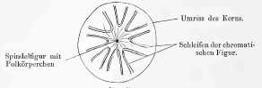

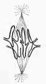

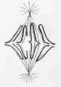

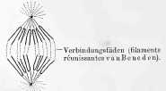

Als letzte Phase erscheint dann, unmittelbar aus dem Tochterstern
hervorgehend, der „**Tochterknäuel**“, **Dispirem**, *Flemming.* Die
Schleifenfäden verkürzen und verdicken sich noch mehr, und wenn wir der
Darstellung *Rabl*’s folgen, würde die polare Fläche des Tochterkerns, da,
wo die eben erwähnte Delle liegt, zum Polfelde; die Schleifenschenkel
biegen zum ehemaligen Aequator hin um und begegnen sich an der dorthin
gewendeten Kernfläche, welche zur Gegenpolseite wird. Bei den
Pflanzenzellen haben *Heuser* und *Strasburger* ähnliches constatirt; doch
kann, wie *Guignard*[@gu1884as] und *Strasburger*[@sb1888] angeben, die
Delle (Hilus) auch fehlen. In diesem Stadium erfolgt dann auch, wenn es zur
Zelltheilung kommt, was in den meisten Fällen eintritt, die **Theilung des
Zellplasmas**, welche im Wesentlichen unter den Erscheinungen einer immer
tiefer durchgreifenden Einschnürung in der Aequatorialebene vor sich geht.
Vergl. über den Process der Theilung des Zellkörpers weiter unten.

Erst, wann die Zelle in zwei Hälften getheilt ist, beginnt die Umwandlung
des Tochterknäuels zum ruhenden (Tochter-)Kern. Die ersten Spuren einer
neuen Kernmembran treten indessen an den Tochterkernen schon vor Beginn der
Zelltheilung auf, bereits mit dem Zustandekommen des Tochterknäuels. Woher
sie stammt, ist bis jetzt ebensowenig festgestellt wie der Modus des
Schwindens der Mutterkernmembran. Nach *Rabl* soll eine Tochterkernmembran
zuerst an der Gegenpolseite sichtbar werden. Das Polkörperchen schwindet
ebenfalls mit dem Beginne des Tochterknäuels. Was die chromatischen Fäden
des Tochterknäuels anlangt, so beginnen sie bald zackig zu werden und
Fortsätze auszusenden, mit denen sie sich unter einander verbinden, so dass
wieder eine Netzform des Gerüstes herauskommt; sie verlieren dabei ihr
gleichmässiges Kaliber. *Rabl* giebt zu, dass auch einzelne dickere Fäden
mit ihren Schenkeln unter einander zu längeren Fäden verschmelzen, stellt
aber, in Uebereinstimmung mit seiner Auffassung vom Baue des ruhenden
Kerns, in Abrede, dass alle dicken Fadenschlingen untereinander an ihren
Enden zu einem Faden verschmelzen, so dass ein einziger stark gewundener
Tochterkernfaden entstehe, wie es *Flemming*, *Retzius* und *Heuser*
wollen. So geht dann aus dem Tochterknäuel wieder der „ruhende Tochterkern“
hervor, der inzwischen sammt seinem Zellprotoplasma an Größe zugenommen
hat und in allen wesentlichen Stücken dem ruhenden Mutterkerne gleicht.
Auch bei ihm sind, man vergl. Fig.&nbsp;12, Hauptfäden und Nebenfäden,
Polfeld und Gegenpolseite zu unterscheiden. Die Unterscheidung dieser
letzteren beiden Abschnitte am ruhenden Kern wird ja, wie man sieht, gerade
durch den Vorgang der Karyokinese erklärlich. Wann das **Kernkörperchen**
auftritt und wie es entsteht, darüber fehlen uns bis jetzt übereinstimmende
und verlässliche Angaben. Fassen wir Alles zusammen, was bis auf unsere
Tage über die karyokinetischen Vorgänge bekannt geworden ist, so können wir
das Wesentliche derselben wohl am einfachsten mit den folgenden Worten
*Boveri*’s[@bt1887jzm] wiedergeben: „Zusammenziehung des chromatischen
Kernmaterials in eine (bestimmte) Anzahl isolirter Stücke von
charakteristischer, nach der Zellart wechselnder Form: **die chromatischen
Elemente**; Ausbildung einer achromatischen Fadenfigur, sei es aus Kern-,
sei es aus Zellsubstanz mit 2 Polen; Lagerung der chromatischen Elemente,
so weit dies ihre Zahl, Größe und Form gestattet, in der Aequatorialebene
der achromatischen Figur; Theilung der chromatischen Elemente in 2
Hälften, von denen jede einem anderen Pol zugeführt wird; Auflösung der
Tochterelemente in das Gerüst zweier neuer Kerne.“

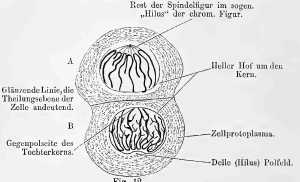

Wir haben nun noch einige Punkte genauer zu besprechen, die bisher nur
flüchtig berührt worden waren, andere, die noch nicht erwähnt wurden,
nachzutragen, in erster Linie möchte ich mir jedoch den Vorschlag erlauben,
diejenigen Dinge, welche soeben mit *Boveri* als „chromatische Elemente“
bezeichnet wurden, an denen sich einer der wichtigsten Akte der
Karyokinese, die *Flemming*’sche Längstheilung vollzieht, mit einem
besonderen terminus technicus „**Chromosomen**“ zu belegen. Der Name
„primäre Schleifen“ passt nicht, da wir bei weitem nicht immer eine
Schleifenform für diese Dinge haben. „Chromatische Elemente“ ist zu lang.
Andererseits sind sie so wichtig, dass ein besonderer kürzerer Name
wünschenswerth erscheint. *Platner*[@pl1886ama] gebraucht den Ausdruck
„Karyosomen“; da dieser aber zu sehr an Kernkörperchen erinnert, dürfte
eine andere Bezeichnung vorzuziehen sein. Ist die von mir vorgeschlagene
praktisch verwendbar, so wird sie sich wohl einbürgern, sonst möge sie
bald der Vergessenheit anheimfallen.

In zweiter Linie gilt es der **Spindelfigur** und den **Strahlenfiguren**
im Protoplasma. Beide sind hier in den Abbildungen Nr.&nbsp;5-11
dargestellt. Die Spindelfigur wurde zuerst abgebildet und kurz beschrieben
von *Alexander Kowalevsky*, damals in Kiew, in dessen berühmter
Abhandlung[@kw1871]: „Embryologische Studien an Würmern und Arthropoden“.
Die Polarstrahlungen des Zellprotoplasmas, welche von den beiden Polen der
Spindelfigur ausgehen, zeigten uns zuerst *Hermann Fol* in
Genf[@fol1873jzmn] und *A.Schneider*[@sn1883]. Während *Fol* und
*Schneider* die Polarstrahlung von vorn herein gut abbilden und
beschreiben, ist *Kowalevsky*’s Spindelfigur nur unvollständig und deutet
er sie als auf einer Theilung des Kernkörperchens beruhend. Dass sich die
Nucleolen an der Bildung der Spindelfäden betheiligen, nimmt neuerdings
wieder *Carnoy*[@cjb1884lac] an. Erst *Bütschli*[@bo1875zwz1; @bo1875zwz2]
gab uns genauere Daten. Ungeachtet zahlreicher Untersuchungen, die auf
diesen Punkt namentlich von *Flemming*, *Strasburger* und *Mayzel*
gerichtet wurden, sind wir jedoch über die Herkunft und Bedeutung der
Spindelfäden und Polstrahlungen noch im Unklaren. Auch über das
Endschicksal beider Bildungen wissen wir nichts Bestimmtes. Unstreitig ist
aber die „Kernspindel“ eine der wichtigsten Erscheinungen bei der
Karyokinese und ich glaube nicht fehl zu greifen,
wenn ich mir wesentliche weitere Fortschritte in der Erkenntniss des Wesens
der mitotischen Theilung hauptsächlich von der Aufhellung der Entstehung
und des Verbleibs der Spindelfäden verspreche.

Wenn wir von den eben erwähnten vereinzelt dastehenden Behauptungen, dass
die Nucleoli sich an der Bildung der Spindelfigur betheiligen, absehen, so
sind zur Zeit drei Ansichten über deren Herkunft vertreten: 1) Die
achromatischen Spindelfäden entstehen der Hauptsache nach aus dem
**Zellprotoplasma** (&thinsp;*Strasburger*,
*Guignard* u.&nbsp;A., namentlich die
Botaniker). 2) Sie entstehen aus der achromatischen Fadensubstanz des Kerns
(&thinsp;*Bütschli*, *Flemming*,
*Pfitzner*, *Carnoy*, *Rabl*, *O.&nbsp;Zacharias*
und *Schewiakoff*). 3) Sie entstehen sowohl aus achromatischen
Kernbestandtheilen, wie auch aus dem Zellprotoplasma (&thinsp;*E.&nbsp;van 
Beneden*, *Heuser*, *Platner* u.&nbsp;A.). Bezüglich der Angaben
*Platner*’s sei bemerkt, dass derselbe bei Arion[@pl1886ama] nur die
achromatische Kernsubstanz betheiligt sein lässt. In einer zweiten
Abhandlung[@pl1886mah] dagegen leitet er den polaren Theil der Fäden aus
dem Zellprotoplasma, den äquatorialen aus der Kernsubstanz ab. Er schließt
sich hiermit an *E.&nbsp;van Beneden* an, welcher angibt[@vbe1883;
@vben1887bel], dass bei der ersten Anlage die beiden Spindelhälften im
Aequator getrennt wären, so dass wir also, statt **einer** Faden-Spindel,
**zwei** Faden-**Kegel** hätten. Dieser Darstellung stimmt für Ascaris
megalocephala auch *Boveri*[@bt1887ber] zu, während *Flemming*[@fw1887ama]
sich dahin äußert, dass dies Verhalten keineswegs Anspruch auf allgemeine
Gültigkeit habe.

Eigentümlich und widerspruchsvoll lautet die Angabe *Boveri*’s[@bt1887ber],
dass die Spindelfäden bei der Bildung der sogenannten „Richtungskörper“ —
s.&nbsp;darüber weiter unten — aus den achromatischen Kernbestandtheilen, bei
der Furchung der Eizelle dagegen aus dem Zellprotoplasma hervorgehen sollen
(Ascaris megalocephala).

*Strasburger*[@sb1888] weist bei Spirogyra polytaeniata nach, dass sich der bei
weitem größte Theil der Spindelfigur aus dem Zellprotoplasma bildet, und zwar
treten, entsprechend der Ansicht *E.&nbsp;van Beneden*’s, die beiden Hälften
der Figur anfangs getrennt auf, um sich erst später zu einem Theil im
Bereiche der Aequatorialplatte zu vereinigen. Der andere Theil der
Spindelfäden heftet sich an die Chromatinschleifen der Aequatorialplatte an.
Wenn die Kernmembran während der Bildung der
Spindelfigur noch erhalten bleibt, so durchbrechen die Spindelfäden die
Membran, welche somit siebartig durchlöchert wird. So erkläre sich, meint
*Strasburger*, die Angabe *Flemming*’s, dass die Spindelfäden innerhalb einer
unversehrt erscheinenden Kernmembran auftreten können. Innerhalb der
Kernmembran finden sich aber außer den Chromatinschleifen noch einige sehr
zarte Fäden, welche die Chromatinschleifen mit der Kernmembran verbinden.
Woher diese feinen Fäden stammen, ob sie ursprünglich dem Kern angehören,
oder aus der Umgebung eingedrungen sind, was aus ihnen schließlich wird, ob
sie sich mit den chromatischen Schleifen, oder mit den Spindelfäden
vereinigen, muss *Strasburger* vor der Hand unentschieden lassen. Er neigt
dazu, sie von der Umgebung des Kerns — d.&nbsp;h. also vom Cytoplasma —
abzuleiten und sie später mit den Spindelfäden sich vereinigen zu lassen.
Wie bei **Spirogyra**, so verhalten sich, hinsichtlich ihres Verlaufes, auch
die Spindelfäden bei **Ascaris megalocephala** (&thinsp;*E.&nbsp;van Beneden*
und *Boveri*). Die Fäden erreichen später zum größten Theile von beiden
Seiten her die Aequatorialplatte; aber nur ein kleiner Theil derselben
verbindet sich direkt, so dass nur einige wenige Fäden von Pol zu Pol
verlaufen. *Boveri* findet dasselbe in den Hodenzellen des Krebses. —
*Carnoy*[@cjb1884lac] lässt dagegen bei sämmtlichen von ihm untersuchten
Arthropoden die Fäden alle von Pol zu Pol ziehen, ebenso *Flemming* für die
Hodenzellen von Salamandra, wenigstens mit großer Wahrscheinlichkeit. So nun
soll es sich auch nach *Went*[@wn1887bbg] und *Strasburger*[@sb1888] für die
höheren Pflanzen verhalten, während *Berthold* (Protoplasmamechanik) wiederum
nur einen Theil der Fäden (bei Pflanzen) von Pol zu Pol sich erstrecken lässt.

*Strasburger* ist jedoch in seiner Ansicht über die Bildung der Spindelfigur
nicht exclusiv; bei Besprechung der Arbeit von Schewiakoff[@sf1887mj] gibt
er die Möglichkeit zu, dass bei den Protozoen die Spindelfasern der
Kernsubstanz entstammten; es hänge dies mit der dauernden Abgrenzung des
Kerns gegen das Cytoplasma zusammen.

Bei Spirogyra bleiben diejenigen Spindelfäden, welche in der Aequatorial-Ebene
mit einander sich vereinigt hatten, während des Auseinanderrückens der
Tochterkerne noch eine Zeitlang als „Verbindungsfäden“ erhalten. (Von den
„filaments réunissantes“ *E.&nbsp;van Beneden*’s, die ja von den Spindelfäden
verschieden sein sollen, spricht *Strasburger* nicht). Schließlich lässt
Letzterer alle
Spindelfäden in das Zellprotoplasma übergehen; aber dieser Theil des
Protoplasmas werde alsbald wieder zur Ernährung, bezw.&nbsp;zum Wachsthum
der Tochterkerne aufgebraucht.

Als sicher bezüglich des Verbleibs der Fäden sieht auch *Flemming*[@fw1887ama]
an, dass ein großer Theil derselben in das Protoplasma der Tochterzellen
übergehe. Daraus folge aber noch nicht, dass die Fäden auch aus dem
Protoplasma hätten abstammen müssen. Man könne vielmehr, falls die Fäden vom 
Mutter**kern** abstammten und später in die Zellsubstanz übergingen, **darin ein
wichtiges Moment für den Vorgang der Vererbung sehen**: „Es könnten damit dem
Zellkörper gewisse Prädispositionen übertragen werden.“ Ausdrücklich verwahrt
sich *Flemming* bei dieser Gelegenheit dagegen, dass er jemals das Chromatin
allein als die wesentliche Kernsubstanz angesehen habe.

Wichtig sind auch die Beziehungen der Spindelfigur zur Bildung der
Zellmembran. Im Aequator kommt es, namentlich bei Pflanzenzellen, bei der
beginnenden Zelltheilung zur Bildung kleiner knötchenförmiger Verdickungen
der Spindelfäden. Die Summe dieser Knötchen („Dermatosomen“ —
*Wiesner*[@ws1886sbw] (in anderer Bedeutung) und *Strasburger*) bildet
*Strasburger*’s „Zellplatte“; sie bezeichnen die Theilungsebene des Kerns und
der Zelle und gehen später in die Zellwand (Scheidewand) der Pflanzenzellen,
welche im Wesentlichen aus einer Verschmelzung dieser sich allmählich
vergrößernden Dermatosomen entsteht, über. Während der Membranbildung
entwickeln sich, wie *Strasburger* in seiner neuesten Mittheilung[@sb1888] mit
Entschiedenheit vertritt, auch noch zahlreiche weitere Verbindungsfäden. Da
bei der Theilung thierischer Zellen Scheidewandbildungen nicht vorkommen, so
lassen sich knötchenförmige Verdickungen der Spindelfäden hier nicht in der
Weise wie bei Pflanzenzellen erwarten. Doch sprechen *Mayzel* bei den
Theilungen der Endothelzellen der vorderen Augenkammer und *E.&nbsp;van
Beneden* bei den Theilungen der vorhin erwähnten „Dicyemiden“, einer niederen
Thierform, von ähnlichen Erscheinungen; auch *Flemming*([@fw1882], S.&nbsp;246),
berichtet, dass bei beginnender Einschnürung der Zelle an manchen Exemplaren
im Aequator deutlichere Fäden auftreten; er vermochte jedoch nicht zu
entscheiden, ob diese Fäden mit den ursprünglichen Spindelfäden
zusammen­hingen. Vgl.&nbsp;hierüber besonders *Carnoy*[@cjb1884lac]
u.&nbsp;w.&nbsp;u. bei Besprechung der Richtungskörper, S.&nbsp;46.

Bei *Rabl*[@ra1885mj] lesen wir (S.&nbsp;282), dass an den Polen der
Tochtersterne eine helle, stark lichtbrechende Masse erscheine, die wohl
„unzweifelhaft“ aus dem Reste der Spindelfasern hervorgegangen sei. Sehr
beachtenswerth sind die Angaben von *Platner*[@pl1885ma] und von *v.&nbsp;La
Valette St. George*[@lv1886ama], dass bei der Bildung der Samenfäden während
der letzten der hier vorkommenden mitotischen Theilungen die Spindelfasern in
den sogenannten „Nebenkern“ übergingen. Man vergleiche hierüber auch die sehr
genauen und eingehenden Untersuchungen von *Prenant*[@pr1886lc].

Mit den Polarstrahlungen haben sich nur wenige Autoren eingehend beschäftigt
und doch glaube ich mit *Fol*[@fol1884rm], dass dieselben eine große Bedeutung
beanspruchen dürfen. *Auerbach*[@al1874], einer der Ersten, welche diese
Strahlungen beobachteten, hielt sie für den Ausdruck einer Auflösung des Kerns
und einer Verbreitung der aufgelösten Kernmasse im Zellprotoplasma; er nannte
sie deshalb „karyolytische Figuren“. Einer Vermischung von Zellsaft und
Kernsaft bei der Karyokinese redet auch, wie wir sahen, noch heute
*Strasburger* das Wort; doch dürfen wir wohl die strahligen Polfiguren nicht
darauf beziehen. Die ausführlichsten Angaben liefern uns jüngst über diesen
wichtigen Punkt *E.&nbsp;van Beneden* und *Platner*. Der Erstere hat überhaupt
den Vorgängen im Zellprotoplasma während der mitotischen Theilung vom Beginne
seiner Untersuchungen an die größte Aufmerksamkeit geschenkt. So zeigte er,
dass das Protoplasma der Zellen, deren Kerne sich zu karyokinetischer Theilung
anschicken (wie z.&nbsp;B. die Zellen der Keimblätter des Kaninchens),
stärkeren Glanz und ein stärkeres Färbungsvermögen gewinnen. Dass dies auf der
Ausbildung einer stärker lichtbrechenden Rindenschicht beruhe, wie *Flemming*
gemeint hat, möchte *E.&nbsp;van Beneden* nicht annehmen. Ist die Theilung
vorüber, so verlieren sich die genannten Eigenthümlichkeiten wieder.

Ferner entdeckte *E.&nbsp;van Beneden*[@vbe1883], wie wir bereits erwähnten,
die „Polkörperchen“ und die von ihm sogen. „sphères attractives“ (Attractionssphären *Strasburger*), über welche nunmehr das Nähere beigebracht
werden soll.

Nach *E.&nbsp;van Beneden*’s und *Neyt*’s neuen Untersuchungen[@vben1887bel]
erscheinen die „sphères attractives“ bei Ascaris megalocephala bereits sehr
früh, schon zur Zeit, wann die beiden sogen. pronuclei, s.&nbsp;darüber weiter
unten im II.&nbsp;Theile, noch eine reticulirte Structur haben
und weit von einander entfernt liegen. Sie stellen zwei anfangs nahe bei
einander gelagerte, sphärisch gestaltete und sich dunkler tingirende Stellen
im Protoplasma dar. Im Centrum derselben zeigt sich das bereits erwähnte, von
einem lichteren Hofe umgebene Polkörperchen (oder „Centralkörperchen“, wie
*E.&nbsp;van Beneden* es nunmehr zu nennen vorschlägt). Später rücken sie in
eine polare Stellung auseinander und von ihnen gehen die verschiedenen
**Strahlungen** aus, die man während der Theilungsvorgänge im Eiprotoplasma und 
an der Stelle des Kerns beobachtet. Die dunkle Partie der „Sphère attractive“
heißt die „Rindenzone“, der helle Hof um das Centralkörperchen die „Markzone“.
	

Die **Strahlungen** zeigen sich 1) als die bekannte **Spindelfigur**, deren
polare Spitzen sich an beide Centralkörperchen anheften, 2) als der als **„cône
antipode“** (s.&nbsp;Fig.&nbsp;13), der in umgekehrter Richtung — mit der Basis
zur Peripherie gewendet — zieht und 3) als die **Hauptstrahlung im
Protoplasma**, die **Sternfigur (Aster)**. Alle diese drei Strahlungen kommen
im Centralkörperchen zusammen; der „cône antipode“ ist ein Theil der
Hauptsternfigur, durch stärkere Strahlen von ihr abgesetzt. Da, wo der „cône
antipode“ die Eioberfläche trifft, markirt sich ein Kreis, der „Polarkreis“;
zuweilen ist dieser als seichte Furche erkennbar. Eine ähnliche
Furche begrenzt, jederseits zum Aequator hin die Asterfiguren; *van Beneden*
nennt sie den „Wendekreis“ (cercle subéquatorial). Zwischen beiden
Wendekreisen bleibt eine äquatoriale Zone frei von Strahlen; dieselbe
(hourrelet équatorial) springt ein wenig vor. In dieser Zone liegt der
äquatoriale Bezirk der Spindelfigur und die chromatischen Schleifen während
des Stadiums der Aequatorialplatte und der Metakinese. Ich habe eine Figur
nach *E.&nbsp;van Beneden* wiedergegeben (Fig.&nbsp;13), welche die hier
beschriebenen Dinge zu klarer Anschauung bringt.

Wichtig ist die Angabe *van Beneden*’s[@vben1887bel], dass die sphères 
attractives bleibende Bildungen seien, welche bei den successiven Theilungen
der sich furchenden Eizelle sich mit theilen und zwar zuerst, selbst vor der
Theilung des Kerns. Die Theilung der sphère attractive beginnt mit dem
Centralkörperchen, dessen beide Theilstücke ein wenig auseinanderrücken; es
folgt dann die Theilung der sphère nach, so dass die beiden Tochtersphären
naturgemäß zunächst nahe bei einander liegen. Denkt man sich — vgl.
Fig.&nbsp;13 — die erste Theilung der Eizelle in deren Aequator vollzogen, so
würden dann, bei der nächstfolgenden Theilung, in jeder der beiden ersten zur
Theilung sich an­schickenden Blastomeren (Furchungskugeln) die
zusammengehörenden beiden Tochtersphären dicht nebeneinander in der Gegend
des Polarkreises gelegen sein. Zieht man nun die Zellenaxe jeder
Furchungskugel von der Mitte des Polarkreises zwischen den beiden neuen
Centralkörperchen hindurch zum entgegengesetzten Ende der Zelle, so hat diese
Axe offenbar zwei ungleiche Pole, denn an dem einen Pole liegt der eine der
Polarkreise und beide Tochtersphären nebst beiden Centralkörperchen, während
an dem andern Ende dieser Axe nichts dem entsprechendes zu finden ist. Jede
Furchungskugel ist also um diese Zeit ihrer Existenz einaxig, aber von
bilateral symmetrischer Structur, denn man kann sie ja mittelst einer in der
genannten Axe zwischen beiden Sphären durchgehenden Ebene in zwei
gleichgebaute Hälften zerlegen. Dieselbe bilaterale Symmetrie muss aber jede
weitere Furchungszelle aufweisen und schließt *E.&nbsp;van Beneden* hieraus
auf einen bilateral symmetrischen Bau aller Zellen und möchte darin die
Grundlage der bilateralen Symmetrie der Organismen erblicken.

In Folge des genannten Verhaltens der Sphären bei der Theilung muss diesen
eine wichtige Bedeutung zugeschrieben werden.
(Nous sommes donc autorisés, sagt *van Beneden*[@vben1887bel], à penser que
la sphère attractive avec son corpuscule central constitue un organe
permanent, non seulement pour les premières blastomères, mais pour toute
cellule; qu’elle constitue un organe de la cellule au même titre que le noyau
lui-même; que tout corpuscule central dérive d’un corpuscule antérieur; que
toute sphère procède d’une sphère antérieure, et que la division de la sphère
precède celle du noyau cellulaire.) Man könne daher, meint *E.&nbsp;van
Beneden*, die Theilungsursache **nicht** in den **Kernen** suchen, sondern es
müsse diese vielmehr in den Centralkörperchen und in den Sphären gelegen sein.

*Platner*[@pl1886mah] hat bei einem anderen Objecte, bei den Lepidopteren,
sehr eingehend die Strahlenfiguren im Zellprotoplasma beschrieben. Auch er
schildert den Zusammenhang der Astern (Cytastern), welchen offenbar der cône
antipode *van Beneden*’s entspricht, mit dem Centralkörperchen und mit der
Spindelfigur; er lässt ferner aber von beiden Astern große bogenförmige
Strahlungszüge das ganze Protoplasma durchsetzen und einander im Aequator
begegnen; eine strahlenfreie Zone finde ich bei ihm nicht erwähnt.

Ich gehe jetzt auf einen Punkt ein, der bis auf die neuere Zeit kaum beachtet
worden ist, ich meine auf das Verhalten des Kernsaftes während der Theilung.
Wir haben schon erwähnt, dass, wenn man von den Protozoen absieht, zur Zeit
der Muttersternbildung jede Spur einer Kernmembran, man mag diese nun
auffassen, wie man will, schwindet. Es berühren sich dann unmittelbar Kernsaft
und Zellprotoplasma (Zellsubstanz), und der Gedanke liegt nahe, dass eine
Mischung beider stattfinde, und dass darin die Bedeutung des Schwindens der
äußeren Kernhülle zu suchen sei. In der That betont namentlich *Strasburger*,
wie wir mehrfach hervorhoben, das Eindringen von Bestandteilen des Zellleibes
in die Kernmasse und leitet von diesen eingedrungenen Bestandteilen die
Spindelfigur ab. Auch *Carnoy*[@cjb1884lac] und *Schewiakoff*[@sf1887mj] nehmen
das Eindringen von Cytoplasma in den Bereich des Kerns und *Carnoy* umgekehrt
von Karyoplasma in den Bereich der Zelle an. Aus den Abbildungen und
Beschreibungen fast aller Autoren ist ferner ersichtlich, dass sie die
Totalform des Kerns mit dem Schwinden der Membran ebenfalls vergehen lassen
und Vielen mag die Meinung vorgeschwebt haben, dass dann der
Kern nur durch die Spindelfigur und die chromatische Figur repräsentirt sei;
wenigstens sieht man an den in der üblichen Weise hergestellten Präparaten
nichts von dem Kernsaft und den früheren Umrissen des Kerns, und es wurde dem
Kernsafte, der doch auch seiner Masse nach einen so wesentlichen Bestandtheil
bildet, im Ganzen wenig Beachtung geschenkt.

*E.&nbsp;Sattler*[@sa1882ama] und mir, die wir im Jahre 1882 die
Froschhornhaut unter Anwendung des Lapisstiftes auf Kerntheilungen
untersuchten, fiel es auf, dass wir dabei stets nur Kerntheilungsfiguren nach
dem früheren *Remak*’schen Schema erhielten, niemals karyokinetische Figuren,
während wir letztere jedoch an anders behandelten Froschhornhäuten leicht
darzustellen vermochten. Wir versuchten vergebens in den Theilungsbildern der
Silberkerne auch die chromatischen Figuren zu bekommen; es gelang uns nicht.
Schon damals äusserten wir uns a.&nbsp;a.&nbsp;O. S.&nbsp;675 folgendermaaßen:
„Sucht man die Differenzen der Bilder wie sie die Silberbehandlung und die
Kernfärbungsverfahren ergeben, zu erklären, so scheint nur die Annahme
zulässig, dass das andere Aussehen der Silberkerne auf Rechnung der
achromatischen Substanz *Flemming*’s
—  heute möchte ich vorziehen präciser zu sagen, des „Kernsaftes“
—  zu setzen sei. Diese lässt sich bei den Kerntinctionen nicht deutlich
machen, verschwindet wenigstens gegenüber den auffallenden Zeichnungen, wie
sie die chromatischen Bestandtheile des Kerns während der Theilung zeigen. Das
Silber zeigt stets das Bild des Gesammtkerns mit seiner chromatischen und
achromatischen Substanz und man ersieht aus den geschilderten Bildern, dass
die achromatische Substanz auch amöboide Bewegungen während der Theilung
zeigt, im übrigen aber bei der Theilung sich in einfacherer Weise, nach Art
der früher gegebenen Theilungsschemata gerirt. Man muss daher aus den
Ergebnissen der Tinctions- und der Silberbilder den Schluss ziehen, dass die
mehr flüssige achromatische Kernsubstanz stets um die Kernfäden erhalten
bleibt, sich nicht etwa im Zellprotoplasma auflöst, sondern sich mit dem
chromatischen Kerngerüste theilt; während dabei aber das Chromatin des Kerns
successive die bekannten auffallenden Gestalt- und Lageveränderungen
durchmacht, theilt das Achromatin sich in einfacher Weise, indem es immer eine
Art Hülle um die Chromatinfiguren bildet.“

Neuerdings hat nun *Pfitzner*[@pf1886mj2] in einer sehr bemerkenswerthen
Arbeit den factischen Beweis dafür erbracht, dass es sich in der That so
verhalte. Es gelang ihm gleichzeitig die chromatischen Fadenfiguren und die
übrigen Bestandteile des Kerns — er fasst sie, abgesehen von der Spindel, jetzt
unter dem Namen „Kerngrundsubstanz“ zusammen — während der Theilung sichtbar
zu machen und er sah nun pari passu eine einfache Theilung der Grundsubstanz,
in Form einer Durchschnürung, neben den kinetischen Vorgängen an der
Fadenfigur ablaufen. Er kommt demnach zu folgenden Schlüssen:

1.  Der Kern ist zu jeder Zeit ein vollständig selbständig innerhalb der Zelle
gelegenes abgeschlossenes Gebilde.

2.  Die Karyokinese ist der Ausdruck eines innerhalb des Zellkernes
ablaufenden Vorganges, bei welchem keine morphologischen Bestandtheile des
Zellleibes activ eingreifen.

Uebrigens beobachtete *Pfitzner*, dass die Configuration des Kernsaftes
(Kerngrundsubstanz) sich stets eng an die chromatische Figur anschloss, so
dass er zu der Annahme gelangt, die Bewegungen des Chromatins seien das
Primäre.

Mit dem hier Berichteten stimmen die Angaben von *E.&nbsp;Zacharias*[@z1881bz],
dass stets die Abgrenzung des Kerns gegen das Zellprotoplasma deutlich sei.

Auch *Strasburger*[@sb1876;@sb1884ama] hatte sich dahin geäußert, dass
zwischen den auseinanderweichenden Hälften der chromatischen Figur stets
Substanz sei und bleibe, dass sie sich mit theile und zum Theil zu dem einen,
zum Theil zu dem anderen Tochterkerne trete; außerdem aber nahm er dabei,
abweichend von *Pfitzner*, ein Hineintreten von Bestandteilen des
Zellprotoplasmas zwischen die Fadenbestandtheile des Kerns an. Einer solchen
Vermischung der Interfilarmasse des Zellleibes mit dem Kernsafte während der
Mitose redet neuerdings wieder *Tangl* in einer aus *Flemming*’s Laboratorium
hervorgegangenen Arbeit[@ta1887ama] das Wort, indem er sich speciell gegen die
Beweiskräftigkeit der nach dem Verfahren von *Pfitzner* erhaltenen Präparate
wendet. In seiner neuesten Mittheilung[@sb1888] spricht sich *Strasburger* in
ähnlicher Weise aus und bekräftigt seine eben mitgetheilten früheren
Aeußerungen, so dass wieder gewichtige Zweifel gegen die Richtigkeit der von
*Pfitzner*, *Sattler* und mir vertretenen Ansicht laut geworden sind. Ich
möchte indessen die Sache nicht fallen lassen, denn für diese ganze Frage sehr
wichtig ist zweifellos der wiederholt gemachte
Befund von ächt mitotischen Kerntheilungen bei Protozoen, wobei nach der
übereinstimmenden Angabe aller Beobachter (&thinsp;*Bütschli*[@bo1876sen],
*R.&nbsp;Hertwig*[@hwr1877jzn], *Pfitzner*[@pf1886mj1],
*Gruber*[@gr1881zwz;@gr1882zwz;@gr1883zwz;@gr1884zwz;@gr1885zwz], insbesondere
*Schewiakoff*[@sf1887mj] die Kernmembran während der ganzen Dauer des Vorganges
erhalten bleibt, und erst gegen den Schluss desselben sich durchschnürt,
während alles übrige im Wesentlichen in derselben Weise, wie bei den gewöhnlich
studirten Objecten sich vollzieht. *Strasburger*[@sb1888] meint freilich
hierzu, dass dies nur dann möglich sein dürfte, wenn der Kerntheilung, wie bei
den genannten Protozoen, keine Zelltheilung folgt. Doch passt diese Bemerkung
nicht zu *Schewiakoff*’s Object, bei welchem der Process ganz typisch verläuft
und eine reguläre Zelltheilung eintritt. *Schewiakoff* kommt auch zu dem
Schlusse, dass das Nichtsichtbarwerden der Kernmembran nicht zur Annahme
berechtige, dass dieselbe zu einer gewissen Zeit während der Karyokinese
schwinde; er ist sogar geneigt mit *Pfitzner* das Gegentheil zn vermuthen,
will es jedoch nicht als feste Behauptung hinstellen. Ich, für meinen Theil,
lege auf das Bestehenbleiben einer Kern**membran** kein Gewicht, wohl aber auf
die Erhaltung des **Kernumrisses**, worunter ich verstehe, dass auch die mehr
flüssigen Bestandteile des Kerns ihre Selbständigkeit gegenüber dem Zellleibe
wahren. Vergl. das vorhin gelegentlich der Arbeit *Sattler*’s Bemerkte.

In der ersten Bearbeitung dieser Gegenstandes (s.&nbsp;Deutsche med.
Wochenschrift 1886 und „Archiv f.&nbsp;Anatomie und Physiologie“,
Physiologische Abtheilung, herausg. v.&nbsp;*E.&nbsp;du Bois-Reymond*) hatte
ich auf Grund der Angaben vom Bestehenbleiben des Kernumrisses bei der Mitose
mich folgendermaßen geäußert:

„Ich möchte nach eben diesen Befunden jetzt die Schranke zwischen einer
„directen“ und „indirecten“ Kerntheilung ganz fallen lassen. **Es *giebt* nur
eine Art der Kerntheilung und zwar, wenn wir von den Kernkörperchen absehen,
nach dem Remak’schen Schema, wobei der Kern, wie später die Zelle, in einer
bestimmten Ebene, der Theilungsebene, in zwei meist gleiche Hälften
durchgeschnürt wird.** Wir haben nur jetzt, Dank den verbesserten technischen
Verfahrungsweisen, kennen gelernt, dass dabei gewisse Bestandteile des Kerns,
die sogenannten Kerngerüste, besondere Umformungen erleiden, sich besonders
gruppiren und auf ihre Art in zwei Hälften zerlegen:
**alles dieses aber stets innerhalb des Rahmens der sich in alter Weise
theilenden Gesammtfigur“**.

„Wenn noch vielfach die Rede davon ist, dass man bei Kerntheilungen gewisser
Zellen — namentlich die Leucocyten werden genannt — die chromatischen Figuren
vermisse, so muss doch betont werden, dass solche Befunde von Tag zu Tag
seltener werden. Namentlich ist hier auf die schönen Untersuchungen
*Flemming*’s und seiner Schüler[@fw1884ama] zu verweisen, die gerade bei
allen lymphoiden Zellen die karyokinetischen Figuren als die Regel erwiesen
haben“.

„Sollte es nun auch einzelne chromatinarme Kerne mit schwach entwickelter
Gerüstsubstanz geben, bei denen unsere bisherigen Hülfsmittel nicht ausreichen
die Umgestaltungen des Gerüstes bei der Theilung nachzuweisen, so kann das
keinen Grund abgeben, zwischen einer directen und indirecten Kerntheilung —
die Ausdrücke sind ohnehin nicht glücklich gewählt — zu unterscheiden. Es
würde dies vielmehr nur erweisen, dass die alte von *Remak* festgestellte
einfache Form die Grundform ist, bei der nur Modificationen auftreten in den
Fällen, wo die Kerne ein deutliches Gerüst mit chromatischer Substanz
enthalten“.

Inzwischen haben sich nun freilich die Befunde von amitotischen Zelltheilungen
in bedenklicher Weise gemehrt und kann ich den Satz, den ich am selben Orte
einige Seiten später hinstellte: „Man kann fast sagen, dass man nach directen
Theilungen suchen muss und dass sicher constatirte Beispiele dafür sehr selten
berichtet sind und immer seltener berichtet werden“, füglich nicht mehr
wiederholen. Im Uebrigen aber möchte ich aus Gründen, die ich weiter unten
angeben werde, an dem eben Citirten festhalten. Vorher mögen Beispiele
amitotischer und mitotischer Theilungen gewöhnlicher und abweichender Form
angeführt werden.

*Flemming*[@fw1882] und *Rabl*[@ra1885mj] halten die directe (amitotische)
Theilung noch für einen Theil der Leucocytcn fest. *Mayzel* ([@ma1884],
Taf.&nbsp;II, Fig.&nbsp;49) vermisste die Mitosen bei der Bildung von
Riesenzellen in dem sich regenerirenden Cornealepithel beim Frosch; auch bei
Pflanzen, namentlich bei den Characeen, sind von *Johow*[@jo1881bz] und
Anderen dahin lautende Angaben gemacht worden. Directe Kerntheilung fand
*Frenzel*[@fz1885ama1] im Darmepithel von Krustern; bei Insecten zeigte sich
dasselbe, auffallender Weise zugleich eine indirecte Theilung bei den
specifischen Drüsenzellen der Darmkrypten. — *Fraisse*[@phf1885] vermisst bei
der Regeneration der verschiedenen Gewebe sehr häufig die Karyokinese und
constatirt hier wieder fast überall die einfachen directen Theilungen; er
meint sogar, dass die typischen Kerntheilungsfiguren nur da auftreten, wo es
zur Bildung eines **bestimmten Organs** kommt. Die Mitosen vermissten ferner: 
*Overlach*[@ov1885ama] im Epithel der cervix uteri, ungeachtet lebhafter
Kernvermehrung, dann *Nissen*[@ni1886ama] in den Epithelzellen der Milchdrüse.
— *Berggrün*[@bje1887mj] fand zahlreiche amitotische Kerntheilungsbilder im
Froschlarvenschwanz und in der Frosch-Cornea nach mechanischer Reizung der
betreffenden Theile. *Carnoy*[@cjb1884lac] findet directe neben indirecter
Theilung in den verschiedensten Geweben der Arthropoden — Theilung eines
Infusoriums (Euplotes harpa Stn.), ohne das Auftreten von mitotischen Figuren
im Kern, beobachtete *K.&nbsp;Möbius*[@mo1887sbb], während wir wiederum von
anderen Protozoen — s.&nbsp;die vorhin gegebenen Beispiele — die ächten
mitotischen Kerntheilungen kennen.

Besonders merkwürdig sind die namentlich in letzter Zeit zahlreich
mitgetheilten Befunde bei der Spermatogenese: *A.&nbsp;Bolles
Lee*[@bla1887lc;@bla1887rzs] fand amitotische Theilungen bei der ersten
Generation der Samenbildungszellen, den sogenannten „Spermatogonien“ *von La
Valette St.&nbsp;George*’s, während bei den folgenden Generationen regelmäßig
mitotische Theilungen nachzuweisen waren. Dieselben Verhältnisse zeigte mir
*Dostojewski* an seinen im hiesigen anatomischen Institute angestellten
Untersuchungen über die Samenbildung bei den Amphibien. Auch bei *La Valette
St.&nbsp;George*[@lv1886ama;@lv1887], bei *Gilson*[@gi1887lc],
*Sabatier*[@sb1885cr] u.&nbsp;A. finden wir gleichlautende Angaben. Nur
*Platner*[@pl1886mah] constatirte bei den Pulmonaten sowie bei den
Lepidopteren ausschließlich mitotische Theilungen; allerdings sollen
Abweichungen von dem gewöhnlichen Schema vorkommen.

Wie wir diese Verschiedenheiten erklären sollen und wie wir überhaupt das
Verhalten der mitotischen zur amitotischen Theilung auffassen sollen, darüber
lässt sich etwas Bestimmtes zur Zeit nicht sagen. Es fehlt zwar nicht an
Aeußerungen der Autoren in dieser Beziehung. So meinen *Pfitzner*[@pf1886va]
und *E.&nbsp;Zacharias*, dass wahrscheinlich die amitotischen Theilungen nur
bei solchen Zellen vorkämen, die als allmählich dem Untergange entgegengehend
betrachtet werden müssten. Hochinteressant erscheint für die in Rede stehende
Frage auch die weiter unten genauer mitzutheilende Erfahrung
*Boveri*’s[@bt1887aa], dass unter den Furchungskugeln von Ascaris
megalocephala immer eine beschränkte Anzahl sich vor­finden, welche bei der
Theilung stets sehr deutlich die chromatischen Schleifen wahrnehmen lassen,
während diese bei der Mehrzahl der Furchungszellen nicht gut sichtbar sind
und das Chromatin nur in Gestalt zahlreicher Körnchen auch bei der Theilung
zeigen. *Boveri* spricht die Ansicht aus, dass die Zellen mit den deutlichen
Mitosen die Anlagen der späteren Geschlechtszellen seien.

Den Beobachtungen über die directen Theilungen stehen nun sehr zahlreiche
Erfahrungen über mitotische Theilungsprocesse gegenüber, die sich von Tag zu
Tage mehren.

Für die normalen Karyokinesen liefern die allbekannten Werke von
*Strasburger*[@sb1876;@sb1888;@1884] und
*Flemming*[@fw1882;@fw1883ama;@fw1884ama] die reichste Casuistik. Den hier
zahlreich aufgezählten Fällen möchte ich aus der neueren Literatur noch
hinzufügen: Die Karyokinesen bei der Vermehrung und Regeneration der **glatten
Muskelfasern** (&thinsp;*Pfitzner* u. *H.&nbsp;Stilling*[@sp1886ama], *Cattani*
(Gazzetta degli ospitali 1885), *Paladino* (Riforma medica 1886), *Busachi*
(Estratto Giornale della R.&nbsp;Accad. di Medic. di Torino 1886, Nro. 3 e 4),
die Karyokinesen bei den quergestreiften Muskelfasern
(&thinsp;*Nikolaides*, Archiv für Anat. und Physiologie, Physiol. Abtheilung,
herausgeg. v.&nbsp;*E. du Bois Reymond* 1883, p.&nbsp;441) — bei den
zahnbildenden Geweben (&thinsp;*Canalis*[@ca1886aa]) — bei den Leberzellen
(&thinsp;*Podwyssotzki* in: Ziegler und Nauwerck, Beiträge zur pathol. Anat. und Physiologie Bd.&nbsp;I und *Canalis*[@ca1886mph]). Wie im Thierreiche so
ist es auch im Pflanzenreiche: fast jede histologische und
entwicklungsgeschichtliche Arbeit bringt neue Belege für das Vorkommen der
Mitosen.

Auch bei den **pathologischen** Zellvermehrungen tritt die mitotische Form in
den Vordergrund. Namentlich *J.&nbsp;Arnold* in seiner Arbeit über die
Theilungsvorgänge an den Knochenmarkzellen[@aj1884va1] gibt schon ein
stattliches Verzeichniss der bis dahin erschienenen einschlägigen Abhandlungen;
wir finden dies noch ansehnlich vermehrt in einer der jüngsten Arbeiten
desselben Verfassers: Ueber Theilungsvorgänge an den Wanderzellen, ihre
progressiven und regressiven Metamorphosen[@aj1887ama] und bis zum heutigen
Tage fortgesetzt in der aus *J.&nbsp;Arnold*’s Laboratorium hervorgegangenen
Arbeit von *Schottländer*[@sl1888ama]. Auch *Unna*[@un1883md] bespricht das
Vorkommen der Karyokinese bei pathologischen Zellbildungsprocessen.

Hier ist der Ort, die eigenthümlichon und in mehrfacher Beziehung abweichenden
Formen der Karyokinese zu besprechen, die wir bei den Wanderzellen und bei den
sogenannten Riesenzellen des Knochenmarks antreffen. Die Wanderzellen und
deren ganze Sippe, die wir einmal zusammenfassend mit dem Namen „lymphoide
Zellen“ belegen wollen, schienen lange Zeit der Karyokinese nicht unterthan.
Erst den sorgfältigen Untersuchungen *Flemming*’s (l.&nbsp;c.) und seiner
Schüler ist es zu danken, dass wir auch diese wichtige und eigenartige
Zellengruppe in diesem Punkte als eine den übrigen Zellen sich gleich
verhaltende anzusehen haben. Immerhin sind aber grade bei diesen Zellen die
direkten Kerntheilungen häufig und eine völlige Einigung unter den Autoren
ist noch nicht erzielt, wobei zu beachten ist, dass es augenscheinlich eine
Menge verschiedener Arten oder Spielarten von lymphoiden Zellen giebt, die
sich bezüglich ihrer Theilungserscheinungen verschieden verhalten mögen. Wir
kennen z.&nbsp;B. von lymphoiden Zellen: die **Wanderzellen** in den Geweben,
die **farblosen Blutkörper**, von denen wieder verschiedene Unterarten
unterschieden werden müssen (vgl.&nbsp;die Arbeiten von *Ehrlich* und dessen
Schüler *Einhorn*, cf. d.&nbsp;Letzteren Dissertation[@ei1884]), die
runden Zellen der Lymphdrüsen und der Milz, die Thymuszellen, wie sie sich
postembryonal in diesem anfangs epithelial angelegten Organe entwickeln, die
Markzellen. Wie alle diese verschiedenen Zellarten sich zu einander verhalten
ist keineswegs völlig klar gestellt. Besonders heben *Löwit*[@lo1885sbw] und
*J.&nbsp;Arnold*[@aj1887ama;@aj888ama] hervor, dass die Natur der lymphoiden
Zellen, an welchen man die Mitosen beobachtet hat, noch nicht mit
wünschenswerther Sicherheit festgestellt sei. Es könne sich z.&nbsp;B. bei
den mitotisch sich theilenden, im Blute beobachteten farblosen Zellen nicht
um ächte Wanderkörperchen, sondern um Vorstufen rother Blutkörperchen oder
losgelöste, in mitotischer Theilung begriffene Endothelzellen gehandelt haben.

Sicher ist, dass an farblosen, im Blute circulirenden Zellen Mitosen
beobachtet wurden (&thinsp;*J.&nbsp;Arnold*[@aj1887ama;@aj888ama],
*Peremeschko*, *Flemming*, *Lavdowsky*[@la1884va], *Bizzozero*, *Kultschitzky*
— Letzterer bei neugeborenen Hunden (Centralbl. f. d. med. Wissenschaft 1885,
5.&nbsp;Jan. und Archives slaves de Biologie T.&nbsp;IV. fasc.&nbsp;2
p.&nbsp;230), ferner an den ähnlich geformten Zellen des Knochenmarkes
(&thinsp;*Flemming*, *Werner*, *Löwit*, *Denys*, *Geelmuyden*, *Cornil* und
*J.&nbsp;Arnold*; bei Letzterem sind auch die hier genannten Autoren citirt.)
Zweifellos sind auch Mitosen an den Zellen der Lymphdrüsen nachgewiesen worden
(&thinsp;*Flemming*, *J.&nbsp;Arnold*). *Flemming*[@fw1884ama] ist, wie
Eingangs dieses Abschnittes hervorgehoben wurde, der Ansicht, dass es sich
dabei um ächte lymphoide Zellen gehandelt habe, während *Baumgarten*[@bp1879va]
meint, dass die Mitosen an den fixen, sogenannten Stromazellen der Lymphdrüsen
sich abspielten.

*J.&nbsp;Arnold* kommt in seinen wiederholt angeführten
Arbeiten[@aj1887ama;@aj888ama] zu dem Schlusse, dass Wanderzellen, farblose
Blutzellen, Lymphzellen und die entsprechenden Zellformen des Knochenmarkes,
der Milz und der Lymphdrüsen sich nach dem Typus der Mitose vermehren
**können**, dass aber der stringente Beweis dafür noch nicht erbracht sei,
jedenfalls sei es zurückzuweisen, dass diese Zellen **nur mitotisch** sich
theilten. Darin stimmt ihm auch *Löwit* zu.

An derartigen Zellen, an Bindegewebszellen, namentlich aber an Zellen von
Neubildungen und an den sogenannten Riesenzellen des Knochenmarkes sind nun
allerlei Abweichungen von dem gewöhnlichen Verhalten der Karyokinese beobachtet
worden. So wurden wiederholt drei- und mehrpolige Figuren (pluripolare)
gesehen, z.&nbsp;B. in pathologischen Neubildungen von *J.&nbsp;Arnold* und
*Martin*[@ma1881va]; auch *Rabl*[@ra1885mj] beschreibt solche von
einem Hämatoblasten aus der Milz von Proteus. *Mayzel*[@ma1884] verfolgte bei
einer Axolotl-Larve die mitotische Theilung einer Bindegewebszelle in vier
Stücke in vivo. *Denys*[@dj1886lac] schildert die mehrfachen Mitosen bei
Riesenzellen, *Cornil*[@cv1886cr] bei Sarkomen und Carcinomen. Desgleichen
sind dreipolige Kernspindeln bei Pflanzen beobachtet worden. Ungleich große
Tochtersterne erwähnt *Rabl*. Insbesondere hat aber *J.&nbsp;Arnold* aus dem
Knochenmarke und der Milz sehr von dem Gewöhnlichen sich unterscheidende Formen
geschildert. *Arnold* möchte auf Grund seiner Befunde eine neue Eintheilung der
Kerntheilungsformen aufstellen und zwar unterscheidet er: 1) **Segmentirung**
mit den beiden Unterarten: **directe** und **indirecte** Segmentirung,
2) **Fragmentirung**, ebenfalls eine **directe** und **indirecte**. Erfolgt
die Theilung des Kerns in der bisher besprochenen Weise, oder wie sie bei der
Eifurchung geschieht, d.&nbsp;h. theilt sich der Kern entweder in der
Aequatorialebene oder in den Meridianen (Segmentalebenen) und trennen sich
dabei die meist vollkommen gleichen Theilstücke in ebenen Flächen, so haben
wir die „Segmentirung“. Dieselbe ist eine „indirecte“, wenn sie von
karyokinetischen Erscheinungen begleitet ist, anderenfalls eine directe. Bei
der „Fragmentirung“ (die Bezeichnung wurde ursprünglich von *E.&nbsp;van
Beneden* für die directe gewöhnliche Theilung verwendet, *Strasburger* gebraucht
sie für „Kernzerfall“) ist die Trennungsfläche der Tochterkerne eine ganz
beliebige unregelmäßige; es werden Stücke von außen her in unregelmäßigen
Trennungscontouren abgeschnürt, oder sondern sich im Inneren ab, hängen noch
längere Zeit brückenartig mit dem Mutterkern zusammen. Dabei brauchen die
Stücke, in die der Kern zerfällt, nicht immer ungleich groß zu sein, obgleich
sie es meistens sind. Auch hierbei kommen karyokinetische Erscheinungen vor
(indirecte Fragmentirung) oder sie fehlen (directe Fragmentirung). Wenn
karyokinetische Erscheinungen bei der Fragmentirung gefunden werden, so
bezieht sich das auf eine Vermehrung der chromatischen Substanz, auf das
Auftreten von chromatischen Schleifen und Körnern in größerer Deutlichkeit und
Zahl; bei allem diesem, und darin liegt der Hauptunterschied zwischen directer
Fragmentirung und directer Segmentirung, kommt es aber im Falle der
Fragmentirung zu keiner **äquatorialen Anordnung**. Weitere Unterschiede liegen
noch in der mehr wechselnden und unregelmäßigen Form der Chromosomen, seien
dies nun Körner, Fäden oder Bänder. Eine bandartige Gestaltung der Chromosomen
fand *Arnold* häufig in der Milz. Ferner ist die „Aufstellung“ der Chromosomen
unregelmäßig, oft wird die polare Orientirung vermisst; ob stets die typische
Längstheilung eintritt, lässt Arnold unentschieden. Sehr lange erhält sich die
Kernmembran und schon in den frühesten Phasen kommen Abschnürungen an den
Kernen vor. Wie man sieht, läuft die Fragmentirung im Wesentlichen wohl auf
Sprossungs- oder Knospungsvorgänge hinaus; auch sprechen *Arnold*s Abbildungen
dafür. Dass derartige abweichende Theilungsformen, die an Sprossungs- und
Furchungsvorgänge erinnern, namentlich bei pathologischen Neubildungen sehr
häufig sind, hat bereits *Virchow* wiederholt hervorgehoben, so z.&nbsp;B.
1857 im Archiv für pathologische Anatomie, Bd.&nbsp;XI, S.&nbsp;89 und
besonders in seinem Artikel über Reizung und Reizbarkeit, ebenda Bd.&nbsp;XIV,
1858, allerdings jedoch ohne Kenntniss der karyokinetischen Erscheinungen.
Indirecte und directe Fragmentirung ist nun nach *J.&nbsp;Arnold* die bei den
lymphoiden Zellen sowohl, wie bei den Riesenzellen am häufigsten
vorkommende Kerntheilungsform. Die Riesenzellen zeigten dies ebenso bei ihrem
natürlichen Vorkommen im Knochenmarke, wie bei künstlicher Züchtung nach
Einbringen von Hollundermarkstückchen in einen Lymphsack oder in eine seröse
Körperhöhle, wie dies (behufs der Züchtung von Riesenzellen) auf meinen
Vorschlag zuerst von *Bernhard Heidenhain*[@hh1872diss] ausgeführt und
neuerdings von *J. Arnold* in sehr vervollkommneter Weise in Anwendung gebracht
wurde. Bezüglich der Riesenzellen des Knochenmarkes haben *Arnold*s Angaben von
*Denys*, *Cornil*[@cv1886cr] und *Fütterer*[@fu1887sw] Widerspruch erfahren.
*Denys*[@dj1888anz] vermag die so genannte indirecte Fragmentirung *Arnold*s,
d.&nbsp;h. also eine Fragmentirung mit mitotischen Erscheinungen, nicht
anzuerkennen. Er findet entweder nur eine „Division directe“ (ohne jede
Vermehrung oder Veränderung des Chromatins), oder eine ächte Mitose (indirecte
Segmentirung im Sinne *Arnold*s, wobei der Kern unter Auftreten regulärer
V-förmiger Chromatinschleifen, Längstheilung derselben, Tochterkränzen etc.
sich in eine mehrfache Anzahl gleichgroßer Tochterkerne mit entsprechender
Zellsegmentation theilt. Die von *Cornil* beschriebenen abweichenden Formen
vermag *Denys* ebenfalls nicht anzuerkennen. Wie Letzterer seine „Division
directe“ schildert, so werden wir in allen Stücken an einen Sprossungs-Vorgang
erinnert und sehe ich nicht ein, weshalb man diesen ganz bezeichnenden
altgewohnten Namen nicht beibehalten will.

Ich habe nunmehr die **Frage nach den Beziehungen zwischen der directen
und indirecten Kerntheilung** wieder aufzunehmen. Gibt es in der That **zwei
verschiedene** Theilungsformen, die keine vermittelnden Uebergänge haben oder
gibt es nur **eine** Grundform der Kerntheilung, die aber, wie fast alle
verwickelten organischen Vorgänge unter verschiedenen Bedingungen mannichfach
abändert, so dass alle diese verschiedenen Abänderungen nur Glieder einer Reihe
darstellen, die alle von einer Grundform und eins vom andern ableitbar sind?
Die reguläre einfache amitotische Theilung würde dann das Anfangsglied, die
reguläre vollkommene Mitose das Endglied darstellen.

Ich muss gestehen, dass ich, wie bemerkt, auch nach den Einwänden *Tangl*s und
*Strasburger*s mich nicht von dem Gedanken losmachen kann, dass die
Kerntheilung ein einheitlicher Vorgang sei mit der einfachen *Remak*schen
amitotischen Theilung als Grundform. Die positiven Präparate von *Pfitzner*
und *Sattler* liegen vor, und wenn auch eine Vermischung von Kernsaft und
Zellprotoplasma eintritt, so wird dadurch doch sicherlich nicht die Existenz
des Kerns allein auf seine chromatischen Bestandteile beschränkt. Im
Gegentheil, wir finden sofort bei dem Wiederaufbau der Tochterkerne die
achromatischen Kernbestandtheile mit den chromatischen vereinigt. Dazu kommen
die vielerlei Uebergangsformen z.&nbsp;B. bei Spirogyra, wo die Kernmembran
erst spät, nach Bildung der Spindelfigur schwindet; auch *Flemming* theilt
ähnliche Beobachtungen mit, die er gegen die Lehre von der Abstammung der
Spindelfäden vom Zellprotoplasma verwerthet, wie wir vorhin anführten. Es
gehören dahin ebenfalls die bei verschiedenen Protozoen nachgewiesenen Fälle
von Mitosen bei Erhaltung der Kernmembran, wie sie vorher aufgezählt wurden.
Auch der *Arnold*schen Beobachtungen der mitotischen Segmentirung und
Fragmentirung muss hier nochmals gedacht werden. *Arnold* selbst
(briefl.&nbsp;Mittheilung) erblickt in der mitotischen Fragmentirung
Uebergangsformen. Ich möchte die Sache so auffassen, dass wir in der einfachen
amitotischen Theilung, die ja nun an vielen Beispielen festgestellt ist, die
Grundform zu erblicken haben; sie tritt überall dann auf, wann die Kerne
entweder chromatinarm sind, oder wann es auf eine genaue Halbirung des
Chromatins nicht ankommt. Soll letzteres erreicht werden, so treffen wir die
Mitosen, denn diese sind der geradeste, sicherste und einfachste Weg die exacte
Zweitheilung der chromatischen Substanz herbeizuführen; dies wird wohl als das
Ziel der Karyokinese betrachtet werden müssen^[Vergleiche hierzu auch die
wiederholt citirte Arbeit von Carnoy, [@cjb1884lac], p.&nbsp;395 — Rapports
entre les deux modes de Division.] S.&nbsp;über dieses Ziel weiter unten bei
der theoretischen Betrachtung der Mitose.

Ehe ich zu dieser Betrachtung übergehe, seien erst noch einige andere
abweichende Formen der Karyokinese hervorgehoben und gewisse Besonderheiten
zusammengestellt, die sich, ohne zu große Abschweifung, in den Rahmen der
bisherigen Darstellung, nicht gut einreihen lassen. Auch muss der Vorgang der
**Zell**-Theilung vorerst noch gebührende Berücksichtigung finden.

Einen eigenartigen Gang der Mitose bei der Spermatogenese beschreibt
*Sanfelice*[@sf1887nap]. Es soll sich eine achromatische Spindel bilden, an
deren beiden Polen sich das Chromatin aufhäuft; dann soll letzteres in Form
eines kugeligen Körpers von jedem der Pole sich lostrennen und frei im
Zellenleibe lagern; weiter folge die Theilung der Spindel und die Wiedervereinigung jeder Chromatinkugel mit einer Halbspindel, darauf die
Theilung des Zellleibes.

Was die so wichtige Frage nach der **Ursache der Bewegung** der chromatischen
Schleifen vom Aequator zu den Polen (Metakinesis) anlangt, so sei hier
hervorgehoben, dass *E.&nbsp;van&nbsp;Beneden*[@vbe1883,@vbe1887bel] die
Fadenstructuren des Protoplasmas mit der Fibrillenstructur des quergestreiften
Muskelgewebes vergleicht. Er hält die achromatischen Fäden der Spindelfigur für
contractil, zumal er die kleinen Granula, welche sie enthalten, häufig einander
sich nähern und wieder von einander entfernen sah; er ist der Ansicht, dass die
Fäden der Spindelfigur in Verbindung stehen mit den Polkörpern einerseits und
den chromatischen Fäden andererseits, so dass nun die letzteren durch eine
Contraction der Spindelfäden zu den Polen hingezogen würden. Diese Anschauung
theilt auch Boveri[@bt1887ber]. — *E.&nbsp;van Beneden* geht überhaupt, wie
hier eingeschaltet werden mag, in seinem öfter citirten Werke sehr genau auf
die Protoplasma- und Kernstructur ein. Ebenso *Platner*[@pl1886mah]. Mit
Rücksicht auf die jetzt wiederum beginnende Bewegung bezüglich der Frage,
welches dann die eigentlichen Elementarorganismen seien, ob die Zellen und die
Kerne, oder deren kleinste Theile, die von *Hanstein*[@hs1880] zuerst so
benannten Mikrosomen (Mikrozymas Béchamp), **Granula** (Altmann[@ar1886]),
möchte ich hier ausdrücklich darauf hingewiesen haben.

Nicht wenige Abweichungen von der bislang geschilderten Weise der Karyokinese
finden wir bei *Carnoy*[@cjb1884lac,@cjb1885lac,@cjb1886lac]. Er war wohl der
Erste, der die in nicht seltenen Fällen noch in den Tochterkernen eintretende
Längstheilung der Fäden bestimmt behauptet hat. *E.&nbsp;van Beneden*
hatte sie freilich schon als sehr wahrscheinlich hingestellt, da er factisch
die Zahl der Fäden größer dort fand, als sie nach einmaliger Längsspaltung
hätte sein dürfen. *Flemming* bestätigt jetzt diese Angaben; aber in der
Deutung weichen *Carnoy* und *Flemming* erheblich von einander ab, wie ich
alsbald erörtern werde.

Wichtig ist ferner, dass *Carnoy* bei der Bildung der sogenannten
Richtungskörper, s.&nbsp;w.&nbsp;u., stets eine echte „Zellplatte“ im Sinne
*Strasburger*s wahrgenommen hat; es ergibt sich daraus, dass die Bildung der
Richtungskörper als eine echte Zelltheilung anzusehen ist. Auch *Boveri*
kommt zu diesem Ergebnisse.

Das Hauptresultat der *Carnoy*schen Untersuchungen, welche wohl einen
größeren Leserkreis finden würden, wenn sie in größerer Kürze in einer mehr
verbreiteten Zeitschrift niedergelegt worden wären, liegt nun darin, dass er
gegen die Regelmäßigkeit des von *Flemming*[@fw1882] aufgestellten sogenannten
karyokinetischen Gesetzes Verwahrung einlegt. Die karyokinetischen Vorgänge
unterlägen so zahlreichen Abweichungen, dass es bis jetzt nicht möglich sei,
eine allgemein gültige Regel zu geben. Jedenfalls sei keine der verschiedenen
bei der Karyokinese auftretenden Phasen obligatorisch, jede könne in Wegfall
kommen oder abgeändert werden. *Carnoy* wiederholt auch in seiner neuesten
Publication[@cjb1886lac], p.&nbsp;311 den Satz: „Tous les phénomènes
caryocynétiques sont variables; aucun d’eux ne paraît essentiel“.

Besonders schwer träfe dies das wichtigste Phänomen der Karyokinese, die
Längstheilung und die gleiche Vertheilung der Schwesterfäden auf beide Pole,
worin ja die ganze Ratio der Karyokinese zu liegen scheint, denn nur so können
wir die gleiche Vertheilung der chromatischen Substanz auf beide Tochterkerne
als völlig gesichert ansehen. Möglich wäre sie auch durch eine Quertheilung
gleichmäßig starker Fäden am Aequator, wenn daraus gleich große Theilstücke
hervorgingen; aber das ist schwierig durch die Beobachtung festzustellen.
*Carnoy* nimmt nun dies in der That als eine Form der Karyokinese an,
z.&nbsp;B. bei Astacus, Forficula und Scolopendra ([@cjb1885lac],
pag.&nbsp;334). In manchen Fällen ordnen sich nach ihm die chromatischen
Segmente, **ohne vorherige** Längstheilung, in der Axe der Spindelfigur in
langen Stäben an (Tonnenform, couronne à bâtonnets, *Carnoy*), dann erfolgt die
Quertheilung dieser Stäbe im Aequator und das Zurückweichen der beiden Hälften
nach den Tochterpolen. Dies wäre ganz abweichend von allem bisher Angegebenen;
es würde sich dabei die chromatische Figur ganz wie die Spindelfigur verhalten.

Nach Carnoy soll ferner eine karyokinetische Verlagerung der Chromatinfäden
nach beiden Tochterpolen ohne jede Längs-­und äquatoriale Quertheilung
vorkommen können, z.&nbsp;B. l.&nbsp;c. Pl.&nbsp;V. Fig.&nbsp;178 bei Clubiona
(Arachniden). Dasselbe nimmt neuerdings *Arthur Bolles Lee*[@bla1887lc] für
die Karyokinesen bei der Spermatogenese der Chaetognathen an. — *Von La Valette*
St.&nbsp;George (briefl.&nbsp;Mitth.) hat bei Forficula keine Längstheilung
der äquatorialen Chromatinelemente (&thinsp;**Chromosomen**) gesehen; vielmehr
wiesen seine Bilder — [@lv1887], Taf.&nbsp;III, Fig.&nbsp;35, 36 etc.&nbsp;—
auf eine Quertheilung hin. Ebenso äußert sich *Prenant*. Bei allen derartigen
Vorgängen wäre die gleiche Vertheilung unsicher. Wie wir erwähnt haben, fand
*Carnoy*, dass die Längsspaltung, die er an sich keineswegs leugnet, auch erst
während des Stadiums der Tochterkernbildung vor sich gehen könne. Ist dies
richtig (Askaris megalocephala, *Carnoy*), so bekommt damit die Längspaltung
nur einen sehr untergeordneten Werth. *Flemming*[@fw1887ama] hat gegen diese
Herabsetzung der Längspaltung zu einem variablen Phänomen von untergeordneter
Bedeutung neuerdings entschieden Stellung genommen. Er fand bei der
Spermatogenese der Salamandrinen abweichende Formen, die *Carnoy*s
Behauptungen auf den ersten Blick Recht zu geben schienen. Nur tritt hier
dennoch überall eine **Längstheilung** der Fäden ein, und zwar schon im
**Anfange der Karyokinese**, im sogenannten Spirem-stadium (s.&nbsp;meine
früheren Figuren).

Die beiden Schwesterfäden bleiben zu einem langgestreckten Ellipsoid verbunden,
strecken sich, und alle diese Ellipsoide, stark gestreckt, ordnen sich nun in
der „Tonnenform“ (Couronne à bâtonnets *Carnoy*) um den Aequator der
Spindelfigur. Nur sind das nicht einzelne primäre
(&thinsp;*E.&nbsp;von&nbsp;Beneden*) Stäbe (Fäden, Chromosomen), sondern
ellipsoidisch lang gestreckte Ringe, von denen jeder aus zwei durch
Längstheilung entstandenen, aber an den Enden verbunden gebliebenen
Schwesterfäden besteht und schon in einem früheren Stadium gebildet worden ist.
Vergl.&nbsp;hierzu auch die Angaben *E.&nbsp;van&nbsp;Beneden*s, S.&nbsp;17.
— Wenn jetzt die Quertheilung am Aequator eintritt, so wird damit an dem
*Flemming*schen Principe der Karyokinese nichts geändert und es kann auch,
unbeschadet dieses Principes, wie *E.&nbsp;van&nbsp;Beneden* und *Flemming*
zeigen, noch im Dyaster-Stadium die von *Carnoy* beschriebene Längstheilung
folgen, diese ist dann aber nicht die **erste**, für die Karyokinese so
bedeutungsvolle, sondern eine **zweite**, secundäre, welcher vielleicht
gar keine allgemeine Bedeutung zukommt, da sie offenbar nur bei wenigen
Zellarten (Geschlechtszellen) bis jetzt gesehen worden ist (vergl.&nbsp;darüber
*Weismann*, [@wm1886za], p.&nbsp;39&nbsp;ff.).

Auch bei einer anderen Abweichung, die *Flemming* als die **homöotypische
Form** (will sagen „eine mehr der gewöhnlichen ähnliche Form — die
ebenbeschriebene nennt er die heterotypische“) bezeichnet, könnte es scheinen,
als ob *Carnoy* mit seiner Behauptung, die Längsspaltung könne ganz fehlen, im
Rechte wäre. Auch hier tritt indessen die Längsspaltung schon im
Spiremstadium ein; die Schwesterfäden trennen sich rasch völlig von einander,
werden kurz und dick, so dass sie primären Fäden (Chromosomen) ähnlich sehen
und leicht für solche genommen werden können. Auch bildet sich kein
regelmäßiger **Monaster** am Aequator, sondern sofort mit der Bildung desselben
wandern auch schon einige Fäden nach den Polen hin, die Metakinese fällt also
mit ihrem Beginn schon in die Monasterform.

Da nun bei der Tochterkernbildung hier keine Längsspaltung vorkommt, so kann
man, falls man die erste Längstheilung im Spiremstadium nicht beachtet hat,
wohl der Meinung sein, dass hier eine Karyokinese ohne Längstheilung vorliege.

*Flemming* ist gewiss im Rechte, wenn er mit der ihm eigenen Ruhe und
Objectivität, die alle seine Arbeiten in so vortheilhafter Weise auszeichnet,
die Vermuthung hinstellt, *Carnoy* habe bei seinem abweichenden Befunde die
erste Längsspaltung übersehen. Andererseits kann man es *Carnoy* nicht
verargen, wenn er dies nicht ohne Weiteres zugiebt, sich vielmehr mit
Entschiedenheit dagegen verwahrt und die Forderung aufstellt, dass man, wenn
man ihn widerlegen wolle, **dieselben Objecte** untersuchen müsse. Ehe dies
geschieht, wird der Streit auch nicht entschieden werden. Freilich, darf ich
wohl hinzufügen, sind auch **geeignete** Objekte zu wählen. Es wäre zu
wünschen, dass die wissenschaftlichen Versammlungen, speciell die
Zusammenkünfte der neugegründeten anatomischen Gesellschaft, noch mehr als
bisher dazu benutzt würden, durch die Vorlegung der betreffenden Präparate
derartige Differenzen zum Austrage zu bringen.

Ich bemerke *Carnoy*s Auffassung gegenüber, dass *Strasburger* in seiner
neuesten Arbeit[@sb1888]. wenigstens für die höheren Pflanzen und Thiere, mit
*Flemming* die Längsspaltung der Muttersegmente (Chromosomen) und die
Vertheilung der aus dieser Spaltung hervorgegangenen Fäden auf beide
Tochtersegmente für einen allgemein gültigen Vorgang und für den Höhepunkt der
mitotischen Kerntheilung hält (l.&nbsp;c.&nbsp;p.&nbsp;135).

*Platner*[@pl1886mah] fand zwar, wie *Carnoy*, bei Lepidopteren zuweilen ein
ganz unregelmäßiges Auseinanderweichen der Chromatinkörper, ohne vorherige
Bildung einer Aequatorialplatte und ohne Längstheilung; doch will er nicht
entscheiden, ob man diesen Vorgang für einen normalen und nicht vielmehr für
ein Zeichen von Entartung der betreffenden Zellen halten solle.

Jedenfalls sehen wir, wie die Sachen z.&nbsp;Z. liegen, dass die meisten
Autoren in der aequatorialen *Flemming*schen Längstheilung noch das
wesentlichste Phänomen der Karyokinese erblicken, und, wie ich nach meinen
eigenen Befunden sagen zu dürfen glaube, mit Recht.

Abweichende Verhältnisse schildert ferner vor Kurzem
*Oskar Schultze*[@sz1887sbw] in Bestätigung früherer Angaben von
*Bellonci*[@bg1885lin] bei den Furchungszellen vom **Axolotl**. Hier soll der
gewundene Fadenknäuel nicht durch directe Umwandlung der (gestreckten) Fäden
des Kerngerüstes entstehen, sondern in der Weise, dass man in der Kernwandung,
in welcher bei diesem Objecte ausschließlich der Fadenknäuel liegt, kleine
Chromatinkörnchen (&thinsp;*Pfitzner*sche Körnchen *O.&nbsp;Schultze*)
auftreten sieht, die sich später verbinden und in gewundene Reihen ordnen.

Wir haben vorhin erwähnt, dass der Kern so wie die von ihm ausgehende
Spindelfigur während des Ablaufs der karyokinetischen Theilung eine
Lageveränderung durchmacht. Besonders deutlich ist dies bei der Bildung der
Richtungskörperchen, s.&nbsp;w.&nbsp;u. Abschnitt&nbsp;II. Wichtig wird die
Betrachtung dieser Dinge vor Allem bei der Untersuchung des
Eifurchungsprocesses. Bezüglich der hier in Frage kommenden Kräfte hat
*Pflüger* an einen Einfluss der Schwerkraft gedacht, während *O.&nbsp;Hertwig*
in seiner Schrift: „Welchen Einfluss übt die Schwerkraft auf die Theilung der
Zellen?“ Jena, 1884, dies zurückweist und als Grundsatz hinstellt, dass der
Kern allemal in der Zelle diejenige Lage einzunehmen bestrebt sei, welche der
Mitte seiner Wirkungssphäre entspricht. In einer kugligen rein
protoplasmatischen Eizelle wird er demnach z.&nbsp;B. genau im Centrum liegen;
bei einem meroblastischen Eie, in welchem das die Wirkungssphäre des Kerns
darstellende Protoplasma wie eine Calotte auf dem Nahrungsdotter ruht, wird er
in der geometrischen Mitte dieser Calotte liegen und sich bei der Spindelfigur
in der Längsrichtung des Protoplasmas strecken müssen. Da nun die Theilung des
Kerns stets senkrecht zur Längsaxe der Kernspindel erfolgt, wird durch die
Lagerung des Kerns nach dem *Hertwig*schen Gesetz auch die Richtung der
Theilungsebene bei der Furchung bestimmt. Was die eigenthümlichen Lagerungen
der Spindelfigur bei der Richtungskörper-Bildung belangt, so hat
*O.&nbsp;Schultze*[@sz1887zwz,@sz1887sbw] sie zu erklären versucht; ich verweise
hier auf seine interessante Darstellung.

Endlich sei der Wiederherstellung der
**Kernkörperchen** in den Tochterkernen gedacht, sowie der eigentlichen
**Zelltheilung**. Ersteres anlangend, so sah *Strasburger*[@sb1888], dass in
den Tochterkernen an den chromatischen Fäden, diesen dicht anliegend, eine
Anzahl kleiner Körperchen auftreten, die erst später untereinander zu 1-2
größeren Nucleolen verschmelzen (Spirogyra). *Meunier*[@me1887lc], entsprechend
seinem vorhin mitgetheilten Befunde, gibt an, dass sich **alles** Chromatin
(Nuclein) der Tochterkerne wieder im Nucleolus vereinige; dieser habe auch
eine eigene Membran. — Ich übergehe die sonstigen nur sehr vereinzelten und
dürftigen Angaben, welche in der Literatur über die Nucleolen und deren Bildung
bei der Karyokinese vorliegen, indem sie noch nicht ausreichen, um eine nur
einigermaßen gesicherte Meinung sich bilden zu lassen.

Ich erwähnte vorhin,
dass die Zelltheilung in der Phase der Tochterknäuelbildung einzutreten pflege.
Was nun das Nähere über die Erscheinungen der Zelltheilung anlangt, so mag hier
in der Kürze gesagt sein, dass bei thierischen Zellen, nach *Flemming*s
Schilderung[@fw1882] dem Aequator der Spindelfigur entsprechend, zunächst eine
Einschnürung im Zellprotoplasma erscheint. Um diese Zeit zeigt sich, wie
besonders *Rabl*[@ra1885mj] hervorhebt, das Protoplasma sehr deutlich in zwei
Zonen, eine äußere dunklere und innere lichte getheilt (s.&nbsp;Fig.&nbsp;12).
Die innere Zone umgiebt den Kern bez.&nbsp;die Tochterkerne, ohne scharfe
Abgrenzung. Die Einschnürung beginnt meist einseitig und ihr entsprechend
gewahrt man eine stärker lichtbrechende Substanz, die während der ganzen
folgenden Durchschnürung fortbesteht und sich in Haematoxylin stärker färbt
(s.&nbsp;Fig.&nbsp;12). Der Theilungsprocess des Zellenleibes muss, wie *Rabl*
bemerkt, verhältnissmäßig rasch von Statten gehen, da er mit dem
Tochterknäuelstadium beginnt und bereits abgelaufen ist, bevor der Ruhezustand
der Tochterkerne eintritt.

Ich hatte schon Gelegenheit bei der Besprechung der Spindelfigur
hervorzuheben, dass an deren Fäden im Aequator bei Pflanzenzellen besondere
knotenförmige Verdickungen auftreten. Dabei soll sich auch die Zahl der
Spindelfäden vermehren, und, indem die Verdickungen aneinanderschließen und
sich bis zur Oberfläche der Zelle hin ausbreiten, entsteht das, was
*Strasburger* die „**Zellplatte**“ nennt, und welche später die
„Scheidewand“ zwischen den beiden Tochterzellen darstellt. Da nun, wie schon
früher bemerkt, eine derartige Scheidewand bei den thierischen Zellen nicht
vorkommt, so finden wir auch keine Zellplattenbildung, höchstens Anklänge
derselben, von denen bereits die Rede war. Hierin liegt denn ein Unterschied
zwischen dem Ablauf der Theilungsvorgänge bei Thieren und Pflanzen. Ich
wiederhole aber, was (S.&nbsp;47) gesagt wurde, dass, nach *Carnoy*s
Beobachtungen, bei der Bildung der Richtungskörperchen von Ascaris
megalocephala eine deutliche Zellplatte in Gestalt der beschriebenen
Verdickungen auftritt. An Präparaten, welche mir *van Gehuchten* vorlegte,
konnte ich mich davon überzeugen.

Es hat natürlich nicht an Versuchen gefehlt, den auffallenden Erscheinungen
der Karyokinese von der theoretischen Seite her beizukommen. Es sind hier vor
Allem — abgesehen von den Schriften *Bütschli*s[@bo1876sen],
*Fol*s[@fol1879] und *Mark*s[@mk1881bmh], welche das Problem der Zelltheilung
und der hier in Betracht zu ziehenden physikalischen Kräfte auf breiter
Grundlage behandeln — die Arbeiten von *Roux*[@rx1883],
*Pfitzner*[@pf1881mj,@pf1883ama], *Carnoy*[@cjb1884lac,@cjb1885lac] und
*Platner*[@pl1886mah] zu erwähnen. Dass die gegebenen Theorien glückliche
seien, wird schwerlich behauptet werden. Es ist immer eine missliche Sache zu
theoretisiren, wenn die Thatsachen selbst noch ungenügend bekannt sind. Die
neueren Mittheilungen haben gezeigt, dass in der Erforschung des
Thatsächlichen noch manches zu leisten war und, da wir über die Entstehung der
Kernspindel und der Polstrahlungen, über deren Verbleib, über die Kernmembran,
über das Verhalten des Kernsaftes, über die chemische und physikalische
Constitution der chromatischen und achromatischen Substanzen noch so gut wie
gar nichts wissen, da es noch eine unausgeglichene Controverse zwischen den
beiden ersten Autoritäten auf diesem Gebiete, *Flemming* und *Strasburger*,
ist, in wie weit die Substanzen des Zellenleibes bei der Karyokinese betheiligt
sind, da selbst die äquatoriale Längstheilung als typisches Phänomen noch
bestritten wird: so sind wir auch jetzt noch nicht in der Lage irgend etwas
gut Begründetes über die theoretische Seite der Karyokinese auszusagen.

Indessen möchte ich doch Denen entgegentreten, welche, wie
*Brass*[@ba1883za,@brass1883], *Fraisse*[@phf1883za] und
*Fol*[@fol1884rm] der chromatischen Kernfigur jegliche wesentlichere Bedeutung
absprechen wollen. *Brass* behauptet, dass die chromatische Substanz lediglich
Ernährungsmaterial für die übrigen Theile des Kerns und der Zelle sei, welches
sich im Kerngerüst aufspeichere, um bei den Lebensprocessen und dem Wachsthum
der Zelle und des Kerns ihre Verwendung zu finden. Der Sitz der Kräfte, welche
die Vorgänge der Kerntheilung beherrschen, sei in den beiden Polen der
Kernspindel su suchen. Dem hellen Plasma des Kerns (Kernsaft) schreibt er die
wichtigste active Rolle bei allen Lebenserscheinungen der Zelle und des Kerns,
namentlich auch bei der Theilung zu. Die chromatischen Substanzen verhielten
sich als passive Massen; sie würden von den beiden Kernpolen her angezogen und
folgten den Bewegungen des Kernplasmas. Gewiss war es eine Uebertreibung, in
den chromatischen Figuren die Hauptsache bei der Kerntheilung zu suchen, die
treibenden Kräfte vorzugsweise in die sie zusammensetzende Substanz zu
verlegen. Doch mag man sich auch vor dem Fehler hüten, ihr jegliche active
Bedeutung bei der Kerntheilung absprechen zu wollen. Die vorliegenden
Thatsachen, auf welche Brass z.&nbsp;B. sich stützt, berechtigen wenigstens
hierzu noch nicht. Seine Angabe, dass in hungernden Zellen die chromatischen
Kernfiguren fehlen oder unvollkommen auftreten, scheint nicht durchweg
richtig, insofern *Rabl*[@ra1885mj] bei Salamandern, die fünf Monate ohne
Nahrung geblieben waren, reichlich chromatische Substanz bei den
Theilungsfiguren antraf. Ist es richtig, was *Rabl* angiebt, dass nämlich ein
Grundplan der chromatinhaltigen Fadenfigur auch im völlig ruhenden Kerne
bestehen bleibt mit Pol- und Gegenpolseite, so ist es schwer, sie als völlig
bedeutungslos hinzustellen und dem Kernsafte allein die active Rolle
zuzuschreiben. Vor allen Dingen muss hier aber das merkwürdige Verhalten der
chromatischen Elemente bei den Befruchtungserscheinungen herangezogen werden,
worauf weiter unten genauer eingegangen werden soll.

Vieles spricht freilich dafür, dass wir in den Polen der Spindelfigur sowie in
den Attractionssphären *E.&nbsp;van&nbsp;Beneden*s (Richtungssonnen,
*Kultschitzky*) höchst bedeutungsvolle Punkte, sagen wir auch „Centren“, für
die Kerntheilungserscheinungen annehmen dürfen, wie fast Alle, die diesen
Gegenstand behandelten, anerkannt haben. Ich möchte aber davor warnen, dass
wir uns nun in den Wahn einwiegen, damit sei alles Wesentliche gesagt, und wir
vermöchten nun, von diesem Standpunkte aus, sämmtliche Erscheinungen
theoretisch zusammenzufassen und einheitlich abzuleiten. Die so verschieden
ausgefallenen Meinungen der Autoren, welche Alle die in Rede stehenden Pole
als bedeutungsvoll anerkennen, zeigen, dass dies zur Zeit noch unmöglich ist.
Mit *Flemming* und *Rabl* halte auch ich daher den Zeitpunkt noch nicht für
gekommen, in welchem wir uns eine erfolgreiche theoretische Behandlung der
Karyokinese versprechen dürfen.

Eines, worauf *Rabl*[@ra1885mj] hinweist, möchte ich jedoch nicht unerwähnt
lassen, und ich knüpfe damit an einen bereits früher betonten Umstand an: Wenn
es richtig ist. wie *Rabl* es darstellt; dass bereits im ruhenden Kerne die
Hauptfadenstructuren in typischer Form vorhanden sind — vgl. die Fig. 2, 3, 4,
12 — so muss man gestehen, dass der gesammte Formenwechsel der
karyokinetischen Figur sich einfach unter dem Probleme einer geforderten
genauen gleichmäßigen Theilung einer solchen Fadenstructur begreifen lässt.
Man kann sich dann kaum eine einfachere Lösung dieses Problems denken, als die
Natur sie in der Karyokinese vollzieht: die unter Auftreten eines Polfeldes
und einer Gegenpolseite im ruhenden Kerne typisch angeordneten Hauptfäden
ziehen zunächst die in Form von Nebenfäden, Fortsätzen und Nucleolen
ausgesendeten Bestandtheile wieder an sich, dann ordnen sie sich in einer sehr
regelmäßigen Figur — sammeln sich gleichsam — in der Mitte (Theilungsebene)
des Kernes (Mutterstern); jeder (Mutter-)Faden (Chromosom), theilt sich der
Länge nach in zwei (Tochter-)Fäden, je zwei aus einem Mutterfaden
hervorgegangene Tochterfäden rücken einfach auseinander nach den
entgegengesetzten Kernpolen, um sich dort in der typischen Grundfigur wieder
zur Ruhe zu begeben^[Für die Pflanzenzellen stellt *Strasburger* in seiner
neuesten Mittheilung[@sb1888] es als ein allgemeines Vorkommniss hin, dass die
Chromatinschleifen sich aufbauen aus regelmäßig alternirenden dicken
tonnenförmigen **Chromatinscheiben** und dünnen **Lininscheiben**. Während
des Ablaufes der Karyokinese sehe man, wie beim Uebergange aus der ruhenden in
die kinetische Knäuelform allmählich die kleinen Chromatinkörner
zusammenrücken und zu den genannten Scheiben verschmelzen; dabei nimmt die
Masse des Chromatins zu, während die des farblosen Bindemittels, des Linins,
abnimmt. Das Umgekehrte findet wiederum bei der Bildung der Tochterkerne statt.
*Strasburger* vermuthet, dass in dieser der Längstheilung der Fäden
voraufgehenden regelmäßigen Aufspeicherung des Chromatins eine weitere
Vorrichtung zur möglichst genauen Halbirung desselben bei der Theilung gegeben
sei.]. Vor der Hand können wir nicht mehr hinter dem Formenspiel der
karyokinetischen Figur suchen; wenigstens ist es rein hypothetisch, wenn
*Carnoy* l.&nbsp;c. p.&nbsp;402 außerdem noch als Ziel der Karyokinese angiebt,
dass sie zur Herstellung der Dicentricität der Zelle beitrage, dass sie eine
totale Regeneration der Kernbestandtheile ermögliche und dem Zellprotoplasma
neue Plastinelemente zuführe. Schwer verständlich bleiben die Polstrahlungen
und die Spindelfigur; auf diese wird sich die Aufmerksamkeit der künftigen
Forschung insbesondere zu concentriren haben.

Dass die Kernmembran schwindet, scheint wohl begreiflich, wenn wir bedenken,
dass solche Hüllen einer Theilung des Gesammtkerns leicht hinderlich sein
können. Es ist dies übrigens ein Punkt, der ebenfalls noch weiterer Aufklärung
bedarf, zumal wir ja, wie bemerkt, noch nicht einmal recht wissen, wie es mit
der Kernmembran steht.

Wir ersehen aus dem zuletzt Besprochenen, dass es mit der theoretischen
Verwerthung der karyokinetischen Erscheinungen noch recht dürftig bestellt ist,
und dass wir ihnen von dieser Seite her noch keine besondere Bedeutung
abzugewinnen vermögen. Dagegen lassen sich dieselben in ausgezeichneter Weise
nach einer anderen Richtung hin verwerthen und sind auch bereits hier
verwerthet worden: ich meine **bei allen auf die Beurtheilung von Wucherungs-,
Neubildungs- und Ersatzvorgängen im thierischen und pflanzlichen Organismus
auslaufenden Fragen**. Wollte man früher entscheiden, welche zelligen Elemente
bei derartigen Vorgängen betheiligt waren, von welchen Orten und Zellen aus
z.&nbsp;B. das normale Wachsthum oder die Regeneration eines Gewebes vor sich
ging, so war man fast ausschließlich auf den Befund eingeschnürter Zellen und
Kerne oder zwei- und mehrkerniger Zellen angewiesen. Die Schlüsse aus solchen
Befunden waren aber in vielen Fällen zweifelhafter Natur, zumal die Frage
aufgeworfen worden war, ob denn überhaupt eine zwei- oder mehrkernige Zelle
den Beweis für eine statthabende Zelltheilung abgeben könne? Durch die
Karyokinese haben wir für die entscheidende Beurtheilung gerade dieser so
außerordentlich wichtigen Dinge eine gute Grundlage gewonnen, und da die
karyokinetischen Erscheinungen so klar und bestimmt auftreten, sind die
betreffenden Untersuchungen von dieser Seite her bedeutend erleichtert und
gefördert worden. Die genannten Arbeiten von *Flemming*[@fw1884ama] und
*A.&nbsp;Kollmann*[@km1883], die Arbeiten von *Kölliker*[@kl1882],
*Altmann*[@ar1881lb], *Merk*[@me1885sbw], *Podwyssotzki*[@po1885fm],
*Bizzozero* und *Vassale*[@bv1887va], *Rauber*[@rb1886ama] u.&nbsp;A., die
aus meinem Laboratorium hervorgegangenen Untersuchungen von
*Kogane&iuml;*[@ko1883ama], *Uskow*[@us1882ama], *Simanowsky*[@sm1883ama],
*Beltzow*[@ba1883ama] und *Biondi*[@bd1885ama] zeigen, wie die Karyokinese in
dieser Richtung hin fruchtbringend verwerthet werden kann. Namentlich möchte
ich an dieser Stelle auf die Untersuchungen über die Herkunft und das
Wachsthum der Neoplasmen und der zelligen Entzündungsproducte aufmerksam
machen, worüber wir von *Homén*, *Klemensiewicz*, *Eberth*, *Mayzel*,
*J.&nbsp;Arnold*, *Ostry*, *Unna*, *Beltzow*, *Simanowsky* u.&nbsp;A.
(vgl. die Literaturnachweise bei *J.&nbsp;Arnold*[@aj1884va1] und
*Schottländer*[@sl1888ama] bereits Mittheilungen vorfinden.

Ungeachtet der kurzen Zeit, seit der wir über die Karyokinese etwas wissen,
haben sich doch schon nach altem deutschen Gelehrtenbrauch — den übrigens auch
die übrigen wissenschaftlich arbeitenden Völker nachzuahmen beginnen — eine
stattliche Fülle von verschiedenen Benennungen eingebürgert, von denen ich hier
die am meisten gebrauchten, so weit sie bisher nicht zur Sprache kamen, noch
kurz erklären möchte.

Will man den Gesammtleib einer Zelle bezeichnen (abgesehen vom Kern), so
gebraucht man jetzt den Ausdruck: Zellleib, Zellkörper, **Zellsubstanz**.
In dieser werden nun zwei Hauptbestandtheile unterschieden, die von *Kupffer*
seiner Zeit mit den Namen „Protoplasma“ und „Paraplasma“ belegt wurden. Unter
dem ersteren versteht er die festeren Massen der Zellsubstanz, deren Anordnung
in Fäden, sei es nun mit oder ohne netzförmige Verbindung, man neuerdings —
Dank den Untersuchungen von *Heitzmann*, *Frommann*[@fm1884jen], *Kupffer*,
*Flemming*, *Leydig*[@le1885] u.&nbsp;A. — kennen gelernt hat. *Flemming* hat
dafür die vielfach angenommene Bezeichnung: „Filarmasse“ oder „Mitom“
vorgeschlagen, *Hanstein* und *Strasburger* wollen sie als „Cyto-Hyaloplasma“,
*Leydig* als „Substantia opaca“ bezeichnet wissen.

Das *Kupffer*’sche „Paraplasma“ umfasst die mehr flüssige Substanz des
Zellleibes, welche die Räume zwischen den Gerüstfäden des Protoplasma’s
(Mitoms) ausfüllt. Synonyme sind: „Inter-filarmasse“, „Paramitom“ (*Flemming*),
„Substantia hyalina“ (*Leydig*), „Cytochylema“ (*Strasburger*). Letzterer
unterscheidet aber beim Cytochylema wieder zwei verschiedene Bestandtheile:
das „Plasmochym“, und das „Cytochym“, indem er unter „Plasmochym“ den
dickflüssigeren eiweissreichen Bestandtheil des Zellleibes, unter Cytochym
dagegen den wässrigen Saft, wie er in den sogenannten Vacuolen von
Pflanzenzellen vorkommt, versteht.

Die gebräuchlichen Namen für die Bestandteile des Kerns haben wir bereits
früher anführen müssen. Hier sei nun bezüglich der Nomenclatur *Strasburger*’s noch nachgetragen, dass er das Kerngerüst mit dem Namen „Kernprotoplasma“ oder
„Nucleoplasma“ belegt. Es besteht dieses jedoch wieder aus einer hyalinen
Grundsubstanz = „Nucleo-Hyaloplasma“ und den darin abgelagerten
*Balbiani*-*Pfitzner*’schen Chromatinkügelchen, die, wie wir bereits erwähnten,
von *Strasburger* als „Nucleo-Mikrosomen“ bezeichnet werden. Den die
Maschenräume des Nucleo-Hyaloplasma’s erfüllenden „Kernsaft“ nennt er:
„Nucleo-Chyma“. Falls, wie das öfter vorkommt, auch in Gerüstfäden des
Cyto-Hyaloplasma’s Mikrosomen vorkommen, so werden diese als „Cyto-Mikrosomen“
aufgeführt.

Bezugnehmend auf den Namen „Mitom“, hat *Flemming* für die *Schleicher*’sche
Bezeichnung „Karyokynesis“, wie wir schon Eingangs anführten, das Wort:
„Karyomitosis“ vorgeschlagen. Unter dem Namen „Kernspindel“ verstehen
*Flemming* und *Pfitzner* ausschliesslich die achromatische Spindelfigur,
*Strasburger* schliesst sich neuerdings[@sb1888] dieser Auffassung an. Die
„**Kernplatte**“ wieder ist für *Strasburger* die Muttersternform der
chromatischen Fäden, s.&nbsp;Fig. 7. Den Namen „Kernplatte“ an Stelle des
*Flemming*’schen „Monaster“ oder „Mutterstern“ wünscht *Strasburger* mit
Rücksicht auf die Verhältnisse der Pflanzen beizubehalten, in­dem hier häufig
keine klare Sternform auftritt, sondern auch in der Mitte des sogenannten
Aster noch dichtgestellte Fadenschlingen erscheinen, so dass derselbe, vom Pol
aus gesehen, nicht das Bild eines Sterns mit leerer Mitte, sondern das einer
Platte, die aus dicht in einer Ebene zusammengelegten Fäden besteht, darbietet.
Was unter „Aequatorialplatte“ bezw. „Metakinesis“ zu verstehen sei, wurde
bereits angegeben (s. besonders die Anmerkung zu S.&nbsp;22). Schliesslich sei
bemerkt, dass neuerdings *Strasburger* die Summe der karyokinetischen
Erscheinungen, welche bis zu der entscheidenden Längstheilung der Fäden
ablaufen, „Prophasen“, den Zustand der Theilung selbst bis zum vollendeten
Auseinanderrücken der Tochterfäden „Metaphase“, und den Rest der Erscheinungen
bis zur Herstellung der ruhenden Tochterkerne als „Anaphasen“ bezeichnet.
— Für die Sternfiguren des Zellleibes, die sogen. „Polstrahlungen“ könnten wir
mit *Flemming* die Termini: Cytaster (Helioma, Aureola), für die des Kerns,
d.&nbsp;i. der Spindelfigur (Kernspindel im *Flemming*’schen Sinne) den
Namen: „Karyaster“ in Anwendung bringen.

*Carnoy* gebraucht den Namen: **Cytodiérèse** (nach *Henneguy*[@hy1882ass])
für Zelltheilung. *Strasburger*[@sb1888] stellt jetzt — wesentlich im Anschlusse
an *Flemming* — für die höhereu Pflanzen folgende Reihe der mitotischen
Erscheinungen auf:

I.  **Prophasen**.
    1)  Gerüstwerk des ruhenden Kerns,
    2)  Dichtes Knäuelstadium,
    3)  Lockeres Knäuelstadium,
    4)  Umlagerung zur Kernplatte,
    5)  Kernplatte (Aequatorialplatte — Mutterstern).
II.  **Metaphase**.
    6)  Trennung und Umlagerung der secundären Segmente (Metakinese).
III.  **Anaphasen**.
    7)  Stern (Tochterstern, Doppelstern, Dyaster),
    8)  Lockeres Knäuelstadium (lockerer Tochterknäuel),
    9)  Dichtes Knäuelstadium (dichter Tochterknäuel).
    10) Gerüstwerk des ruhenden Toehterkerns.
	
*Carnoy* gebraucht die Ausdrücke:

(Spirem)
:    = 1) Seission du boyau, ou du peloton,
(Aster)
:    = 2) Couronne equatoriale,
(Metakinese)
:    = 3) Ascension polaire,
(Dyaster)
:    = 4) Couronnes polaires,
(Dispirem)
:    = 5) Reeonstitution du noyau.

Es wäre nur zu wünschen, dass bei den Eintheilungen der mitotischen Vorgänge
in verschiedene Stadien, das wichtigste der­selben, die **Längstheilung der Segmente**, sowie das Auftreten der **Kernspindel**, einen besonderen Platz
erhielte. Man könnte vielleicht, um eine alle Fälle umfassende Eintheilung zu
haben, folgende Reihe aufstellen:

* **A**
    I.  Ruhender Mutterkern,
    II.  Mutterknäuel (Spirem),
    III.  Schleifentheilungs- und Spindelstadium,
    IV.  Mutterstern (Monaster).
* **B**
    V.  Metakinese.
    VI.  Tochtersterne (Dyaster),
* **C**
    VII.  Tochterknäuel (Dispirem),
    VIII.  Ruhende Tochterkerne.

Ein paar Worte zur Erläuterung dieses Eintheilungsvorschlages mögen noch
Platz finden:

Alle Beobachter stimmen darin überein, dass auf den Ruhezustand (I) ein anderer
zunächst folgt, der das Chromatin in Form eines deutlichen Knäuelfadens
angeordnet zeigt. Mit den Worten „Knäuelstadium“ oder „Mutterknäuel“, „Spirem“
ist nichts präjudicirt, ob dabei nur **ein** Faden, oder ob **mehrere** Fäden,
die zunächst noch unentwirrbar in einander verschlungen erscheinen, vorhanden
sind. Mir scheint es unwesentlich, von einem lockeren und von einem dichten
Knäuel zu sprechen. Dagegen ist es unbestreitbar sehr wesentlich, dass im
weiteren Verlaufe der Mitose deutlich getrennte **Segmente** (Chromosomen) in
Stäbchenform oder in Schleifenform auftreten, dass diese eine
**Längstheilung** erfahren und dass in diesem Stadium die **Kernspindelfigur**
auftritt. Wir wissen freilich, dass die Längstheilung bald früher, bald später
vor sich gehen kann, dass sie sich bis an die Muttersternbildung erstrecken
kann; immer aber liegt sie zwischen dem ersten Auftreten eines deutlichen
Knäuels und dem vollendeten Mutterstern. Wir wissen ferner, namentlich aus
*Strasburger*’s neuester Arbeit, dass wahrscheinlich in den meisten Fällen
auch im ruhenden Kern und im Knäuelstadium **mehrere** Fäden vorhanden sind,
vielleicht stets ebensoviele als man später deutlich getrennte Segmente sieht;
indessen kann man eben im Knäuelstadium die einzelnen Segmente noch nicht
deutlich von einander sondern. Unbestritten ist aber in allen Fällen, dass
später zwischen Knäuel- und Muttersternstadium sehr deutlich die einzelnen
Segmente (Chromosomen), und zwar meist in Schleifenform, hervortreten, und
dass in dieselbe Zeit auch die so wichtige Erscheinung der Kernspindel fällt.
Dies sind die Gründe, welche mich bewegen, statt des „lockeren Knäuelstadiums“
und des Stadiums der „Umlagerung zur Kernplatte“ zur Bezeichnung der
entsprechenden Abschnitte der Mitose die wichtigsten Vorgänge zu wählen und zu
sagen: „Schleifenbildungs-Theilungs- und Spindelstadium“.

Da ein kürzerer Ausdruck wünschbar ist, so kann man auch, wie in der Tabelle,
sagen: „Schleifentheilungs- und Spindelstadium“.

Die Worte: „Kernplatte“, „Aequatorialplatte“ passen nicht gut auf manche
Fälle; es wird sich meines Erachtens *Flemming*s „Mutterstern“ (Monaster)
oder auch „Aequatorialstern“ (couronne équatoriale *Carnoy*) besser empfehlen.
Für „Metakinese“, welches in seiner Bedeutung nicht ohne weiteres klar ist,
würde man vielleicht besser: „Trennungsstadium“ sagen können. Es passt dies
Wort auch für alle Fälle, indem ja, wie z.&nbsp;B. bei Spirogyra, keine
besondere Umlagerung und Umgestaltung der Fäden vorzukommen braucht. Man
vergleiche bezüglich der **Namengebung** noch die Mittheilung *Flemming*s:
Zur Orientirung über die Bezeichnung der verschiedenen Formen von Zell- und
Kerntheilung, Zoolog. Anzeiger 1886, Nro. 216.

## II.

**Was die Beziehungen der karyokinetischen Vorgänge zu der Lehre von der
Befruchtung und der Vererbung anlangt**, so werde ich mich hierbei vorzugsweise
auf zwei Arbeiten einlassen, von denen die eine schon wiederholt angeführt
wurde: Recherches sur la maturation de l’oeuf, la fécondation et la division
cellulaire par Edouard *van Bénéden*, Gand, Leipzig et Paris 1883, die andere
in den jüngsten Tagen erschienen ist: *A.&nbsp;Weismann*: Ueber die Zahl der
Richtungskörper und über ihre Bedeutung für die Vererbung, Jena, 1887. Eduard
*van Beneden*’s Werk, welches zu den hervorragendsten Erscheinungen unserer
heutigen biologischen Literatur gehört, verfolgt die Sperma- und Eibildung,
dann die Befruchtungserscheinungen bei dem grossen Spulwurme der Pferde,
Ascaris megalocephala, welcher in der That, nach *van Beneden*’s Ausspruch,
bestimmt zu sein scheint, für diese Dinge ein klassisches Object zu werden.
Ich übergehe hier die auf die Sperma- und Eibildung bezüglichen Angaben,
obgleich sie des Neuen und Wissenswerthen einen reichen Schatz enthalten, um
eingehender mich mit den Befruchtungserscheinungen und mit der bedeutsamen
Rolle, welche die Karyokinese dabei spielt, zu befassen.

Die **Befruchtungserscheinungen** anlangend, so war bis dahin bekannt
geworden, dass eine „Verschmelzung“ (Copulation) zwischen dem Kopfe des in das
Ei eingedrungenen Samenfadens in dem in eigentümlicher Weise reducirten Kerne
der reifen Eizelle statthabe.

Es mag hier in Kürze die geschichtliche Entwicklung unserer Kenntnisse dieses
so hoch bedeutsamen Vorganges besprochen werden. Alle Diejenigen, welche, wie
z.&nbsp;B. *Purkyne*[@pu1825], *v.&nbsp;Baer*[@bke1835; @bke1837],
*Oellacher*[@oe1872ama], *Götte*[@go1879], *Reichert*[@rc1846aap],
*Kleinenberg*[@kb1872], *Lovén*[@lo1848aap] u.&nbsp;A. **vor** der Befruchtung
das **ganze** Keimbläschen sammt dem Keimflecke schwinden liessen, mussten
natürlich das Wesen des Befruchtungsvorganges in ganz etwas Anderem suchen,
als in einer morphologischen Copulation von Samenkörper und Keimbläschen. Es
fehlte indessen auch früher nicht an Forschern, welche das Keimbläschen
erhalten bleiben liessen. So wird immer als klassisches Beispiel
J.&nbsp;*Müller*[@ml1852aap] bei Entoconcha mirabilis, einer Molluskenart,
citirt; ihm gesellen sich *Leydig*[@le1849zwz; @le1855zwz],
*Gegenbaur*[@gg1854; @gg1855] und vor Allen E.&nbsp;*van Beneden* in seiner
grossen Abhandlung über das Ei (Recherches sur la composition et la
signification de l’oeuf. Mem. couronné de l’Académie royale des Sc.&nbsp;de
Belgique, Bruxelles 1870). Von den Meisten dieser Beobachter wird jedoch
angegeben, dass die persistirenden Keimbläschen vor dem Beginne ihrer Theilung
bei der Furchung sich gegen ihren früheren Zustand mehr oder minder verändert
zeigen, namentlich lassen Manche den Keimfleck schwinden; wir finden aber auch
Angaben (&thinsp;*Kölliker*[@kl1853], *Gegenbaur*[@gg1855], *Haeckel*[@ha1869]
und speciell E.&nbsp;*van Beneden* bei Distomum cygnoides), dass Keimbläschen
und Keimfleck bis zur Theilung intact erhalten blieben. *Fol* (Recherches sur la fécondation et le commencement de l’hénogénie chez divers animaux,
Mém.&nbsp;de la Société de Physique et d’Histoire naturelle, Genève,
T.&nbsp;XXVI. 1878-79) hat die präliminaren, der Befruchtung voraufgehenden
Veränderungen des Keimbläschens am eingehendsten geschildert.
— Endlich lassen eine dritte Reihe von Autoren: *Derbès*[@der1847asn],
*v.&nbsp;Baer*, *Leydig*, *Bischoff*[@bt1842; @bt1845], *Fol*[@fol1875az],
für verschiedene Fälle zwar das Keimbläschen zu Grunde gehen, den Keimfleck
indessen bestehen bleiben. Allerdings spricht sich nur *Derbès* ganz positiv
aus, die Uebrigen sehr reservirt; *Bischoff* gar hat diese seine Vermuthung
später ausdrücklich zurückgenommen. O.&nbsp;*Hertwig*[@hwo1875mj] ist der
Meinung von *Derbès* in seiner ersten Abhandlung, wo sich auch eine
eingehende literarische Besprechung findet, — s.&nbsp;ferner ibid.&nbsp;1876
Septbr. und 1877 Mai — beigetreten.

Die Autoren der zweiten und dritten Reihe konnten also mit einer Copulation
zwischen dem eingedrungenen Samenfaden und dem entweder ganz oder nur
rudimentär erhaltenen Kerne rechnen; es waren indessen erst O.&nbsp;*Hertwig*
und E.&nbsp;*van Beneden*[@vbe1875bel], welche 1875 diese wichtige Thatsache
erkannten.

Es muss übrigens erwähnt werden, dass das Auftreten **zweier** Kerne (oder
kernähnlicher Gebilde) und eine Copulation derselben unmittelbar nach dem
Zutritt der Samenfäden zum Ei und vor der beginnenden Furchung schon von
*Warneck*[@wk1850bsm], *Bütschli*[@bo1873na] und *Auerbach*[@al1874] gesehen
und behauptet worden war. *Warneck*’s Angaben bei Lymnaeus und Limax sind
etwas unbestimmt gehalten; er sagt, dass vor der Theilung (Furchung) im Eie
zwei kernähnliche Körper vorhanden seien, die zu einem einzigen verschmelzen,
der dann bei der beginnenden Theilung des Eies eine biscuitförmige Gestalt
annehme.

*Bütschli* (Beiträge zur Kenntniss der freilebenden Nematoden) beschreibt
ebenfalls die Bildung zweier Kerne bei einem Fadenwurm (Rhabditis dolichura).
Dieselben sollen hier an dem einen Eipole dicht nebeneinander entstehen;
*Bütschli* lässt es unentschieden, ob nicht etwa der eine (zweite) sich aus
dem anderen (ersten) hervorbilde. Er fand, dass die beiden Kerne sich
einander nähern und nach dem Centrum des Dotters sich hinbewegen. Es habe,
meint er, den Anschein, als seien die beiden Kerne vollständig verschmolzen,
doch glaubt er, dass dies nicht eintrete, sondern dass nur
die Uebereinanderlagerung, in der man die Kerne gewöhnlich zu sehen bekomme,
diesen Anschein hervorrufe. Unzweifelhaft nimmt also *Bütschli* in dieser
seiner ersten Arbeit über den betreffenden Gegenstand eine Verschmelzung der
beiden Kerne nicht an.

Die positive Angabe einer unmittelbar nach der Befruchtung eintretenden
**Verschmelzung zweier** unabhängig von einander entstandenen Kerne zu
**einem**, der sich dann im Eidotter wieder auflöse, gebührt (nach *Warneck*)
unzweifelhaft *Auerbach* (bei Ascaris nigrovenosa und Strongylus auricularis).
*Auerbach*, dessen Angaben viel zu wenig Berücksichtigung gefunden
haben^[So hat Auerbach z. B. die Angabe, dass die beiden bei der Kerntheilung
auftretenden Sternfiguren durch ein Mittelstück verbunden sind, welches er
ebenso wie die Astern vom Kern ableitet. S.&nbsp;l.&nbsp;c. Heft 2,
Taf.&nbsp;IV.], trug seine Beobachtungen darüber im Jahre 1874 auf der
Breslauer Naturforscher-Versammlung vor und veröffentlichte sie in demselben
Jahre.

Später erst (1875) hat dann *Bütschli*[@bo1875zwz1; @bo1875zwz2] auch den
Verschmelzungsprocess beobachtet, und zwar bei verschiedenen Nematoden und
Schnecken; er erweitert die bisherigen Erfahrungen dahin, dass er auch 3 bis 5
Kerne bei einzelnen Thierarten an der Dotteroberfläche entstehen und im
Eicentrum mit einander verschmelzen sah.

Keiner der bisher aufgezählten Beobachter wies aber nach, dass der eine (oder
mehrere) dieser Kerne von den Samenfäden, der andere vom Keimbläschen des
Eies abstamme. Des letzteren als Vorläufer wird zwar gedacht, z.&nbsp;B. von
*Bütschli*; von den Zoospermien meint derselbe indessen nur vermuthungsweise,
dass ein Theil ihrer Substanz sich an der Bildung der in Rede stehenden Kerne
beteiligen könne.

Für diesen fundamentalen Punkt gebührt O.&nbsp;*Hertwig*[@hwo1875mj] das
Verdienst eines ersten völlig bestimmten Ausspruches. Auch E.&nbsp;*van
Beneden*[@vbe1875bel; @vbe1876bel3] hat gleichzeitig und unabhängig von
O.&nbsp;*Hertwig* sich dahin geäussert, aber seine Auffassung spricht nicht
für eine morphologische Continuität zwischen Samenfaden und dem einen der
copulirenden Kerne.

O.&nbsp;*Hertwig* beschreibt in seiner ersten Mittheilung den Vorgang der
Eireifung und Befruchtung in der Weise, dass das Keimbläschen durch
Contractionen des Eiprotoplasmas an die Dotteroberfläche getrieben werde.
Seine Membran löse sich auf, der Inhalt zerfalle und werde vom Dotter
resorbirt; der **Keimfleck scheine** unverändert erhalten zu bleiben und zum
bleibenden Kerne des nunmehr befruchtungsfähigen Eies zu werden.
O.&nbsp;*Hertwig* schliesst sich also hierin an die vorerwähnten Angaben von
*Derbès* etc. an. Er nennt diesen, seiner damaligen Meinung nach, aus dem
Keimflecke hervorgegangenen reducirten Kern den „Eikern“, während er dem
früheren Kern den alten Namen „Keimbläschen“ gewahrt wissen will.

Den zweiten Kern, den schon *Bütschli* und *Auerbach* sahen und dessen
Copulation mit dem ersten Kerne sie beschrieben, sieht nun O.&nbsp;*Hertwig*
— und darin besteht sein hervorragendstes Verdienst in dieser Sache — **als den
Kopf eines eingedrungenen Samenfadens** an. Er schliesst dies vorzugsweise aus
dem Umstande, dass diese Erscheinung eines zweiten von der Eiperipherie her
eindringenden kernähnlichen Gebildes regelmässig wenige Minuten nach der
Besamung der Eier auftrete, und ferner daraus, dass er in einigen Fällen
direkt von diesem Kerne einen feinen Faden abgehen und über die
Dotteroberfläche hinausragen sah.

Endlich beobachtete O.&nbsp;*Hertwig*, dass die beiden Kerne sich zu einander
hin bewegten und sich dicht aneinander legten, und an anderen Präparaten sah
er dann wieder nur einen Kern, der aber grösser war als die beiden
ebenerwähnten. Er **schliesst** daraus, dass beide Kerne, der „**Eikern**“ und
der „**Spermakern**“, wie er den vom Samenfaden abstammenden Theilkern nennt,
mit einander verschmelzen. Den aus dieser Verschmelzung hervorgehenden Kern
nennt nun O.&nbsp;*Hertwig* den „**Furchungskern**“, denn der letztere ist es,
welcher sich bei der alsbald nach diesem Vorgange eintretenden Befruchtung und
Eifurchung theilt und zum Stammkern für sämmtliche Kerne des sich
entwickelnden neuen Organismus wird.

Fast gleichzeitig mit der genannten Arbeit O.&nbsp;*Hertwig*’s erschien die
erste Untersuchung E.&nbsp;*van Beneden*’s[@vbe1875bel] über diesen
Gegenstand. — Eine weitere Mittheilung[@vbe1876bel3] erfolgte im Jahre 1876.
Sie[@vbe1875bel] war völlig unabhängig von *Hertwig* unternommen worden und
bezieht sich auf die Eier des Kaninchens, während O.&nbsp;*Hertwig*
Seeigel-Eier verwendet hatte. E.&nbsp;*van Beneden* sieht auch zwei
kernähnliche Gebilde auftreten, die er als „pronucleus central s. femelle“
und als „pronucleus périphérique s. mâle“ bezeichnet. Auch er findet eine
Conjugation dieser beiden Pronuclei und sieht darin den Befruchtungsact.
(Le premier noyau embryonnaire résulte de l’union de ces deux pronuclei, ce
premier noyau est le product d’une véritable conjugaison entre un élément
mâle (Pronucleus périphérique) et un élément femelle (Pronucleus central).)

Von O. *Hertwig* weicht E. *van Beneden* aber in folgenden Punkten ab:

1.  Der Eikern (Pronucleus femelle) ist nicht der übriggebliebene Keimfleck.
2.  Ueberhaupt bleibt vom ganzen Keimbläschen kein morphologisches Element mehr erhalten.
3.  Der Spermakern (Pronucleus mâle) ist nicht der Kopf des Samenfadens.

Es sind vielmehr die beiden Pronuclei morphologisch neue Bildungen,
substanziell aber entsteht der Pronucleus femelle aus der Eimasse; in wie
weit etwa die Substanz des Keimbläschens dabei betheiligt ist, darüber lässt
sich *van Beneden* in seiner ersten Mittheilung nicht aus. Substanziell ist
auch der Samenfaden an der Bildung des Pronucleus périphérique (mâle)
betheiligt. *Van Beneden* fand nämlich, dass die Köpfe der Spermatozoen sich
immer dicht an die Corticalzone des Eies legen, und dass substanzielle Theile
der Spermatozoenköpfe in die Corticalschicht der Eizelle hineingelangen. Da
nun der Pronucleus périphérique in dieser Corticalschicht entsteht, so ist
*van Beneden* der Meinung: „que le pronucleus superficiel se forme au moins
partiellement **aux dépeus** de la substance spermatique“.

*Van Beneden* beobachtete ferner, dass beide Kerne, selbst wenn sie sich
berühren, noch deutlich von einander verschieden bleiben. Doch nimmt er, wie
erwähnt, eine Verschmelzung (Conjugation) beider Kerne an.

Wie wir sehen, weichen die beiden bewährten Forscher in nicht unwesentlichen
Punkten von einander ab und lassen auch noch viele wichtige Fragen
unentschieden. O.&nbsp;*Hertwig* kann sich nicht entschliessen, den Keimfleck
ganz bestimmt als den späteren Eikern zu bezeichnen, er hat ferner den Act des
Eindringens der Spermatozoen in das Ei und deren continuirliche Umwandlung in 
die Spermakerne nicht direkt beobachtet, ebensowenig gelang es ihm, den Act
der Verschmelzung in flagranti wahrzunehmen; hier müssen bei ihm noch Schlüsse
die direkte Beobachtung ersetzen. Aehnlich ergeht es *van Beneden*; auch bei
ihm bleibt der nähere Modus der Bildung der beiden Pronuclei noch unklar, auch
er hat nicht den Act der Verschmelzung direkt beobachtet, in der Erkenntniss
des spermatischen Elements beim Pronucleus mâle bleibt er hinter
O.&nbsp;*Hertwig* zurück; dagegen hat er richtiger gesehen, was den Keimfleck
anlangt, denn *Hertwig* selbst hat bald darauf seine Meinung, dass der
Keimfleck zum Eikern werde, wieder aufgegeben.

Nun, es kann nicht Wunder nehmen, dass solche fundamentalen Vorgänge wie das
Verhalten der männlichen und weiblichen Kern-Elemente bei ihrer Begegnung in
der Eizelle nicht auf einmal und in allen Stücken von einem einzigen
Beobachter entdeckt und richtig gestellt werden. Ich stehe nicht an, die
Angaben der genannten Forscher zu den wichtigsten zu rechnen, mit denen unsere
Wissenschaft überhaupt bereichert worden ist. Das zeigt sich in der mächtigen
Anregung, welche sie zu zahlreichen, theils speculativen, theils auf
Entdeckung neuer Thatsachen und Bestätigung bezw. Widerlegung früherer
Behauptungen gerichteten Arbeiten gegeben haben. Man muss es nur anerkennen,
dass sich die genannten Beobachter: *Bütschli*, *Auerbach*, O.&nbsp;*Hertwig*
und E.&nbsp;*van Beneden* nicht haben hinreissen lassen weiter in ihren
Speculationen zu gehen, als es ihre äusserst sorgfältig und zahlreich
angestellten Beobachtungen gestatteten.

Die eben angedeuteten Lücken wurden später durch
O.&nbsp;u.&nbsp;R.&nbsp;*Hertwig*[@hwr1887] und
E.&nbsp;*van Beneden*[@vbe1883; @vben1887bel] selbst, sowie durch
R.&nbsp;*Hertwig*[@hwr1877jzn; @hwr1884jzn],
H.&nbsp;*Fol*[@fol1877cr; @fol1879], *Greeff*[@gf1876sbm; @gf1879sbm],
*Selenka*[@sl1878], *Mark*[@mk1881bmh], *Calberla*[@ce1878zwz],
*Kupffer*[@kb1878; @kf1878bcm; @kf1882sbm; @kf1886bfz],
*Flemming*[@fw1881ama; @fw1884bc], *Hensen*[@he1876zae; @he1881; @he1885lj],
*Giard*[@gi1877cr1], *Weismann*[@wi1888bgf; @wm1886za],
*Nussbaum*[@nu1880ama; @nu1886ama; @nu1884ama],
*Carnoy*[@cjb1884lac; @cjb1885lac; @cjb1886lac; @cjb1887lac],
*Zacharias*[@zo1887ama], *Boveri*[@bt1887ber; @bt1887aa; @bt1887jzm]
u.&nbsp;A. zum Theil ausgefüllt — aber, wie es in den Naturwissenschaften
geht: neue Beobachtungen, neue Thatsachen schaffen neue Probleme, und gerade
das in Rede stehende Gebiet eröffnet uns einen so weiten Horizont, dass mehr
und mehr *Virchow*’s Wort (Gesammelte Abhandlungen, p.&nbsp;737): „Die
Entstehung und Entwicklung der Eizelle im mütterlichen Körper, die Uebertragung
körperlicher und geistiger Eigentümlichkeiten des Vaters durch den Samen auf
dieselbe berühren alle Fragen, welche der Menschengeist je über des Menschen
Sein aufgeworfen hat“, Geltung gewinnt. —

Es kann hier nicht der Ort sein die Ergebnisse aller dieser einzelnen Arbeiten
zu besprechen; nur das mag hervorgehoben werden, dass die ersten bestimmten
Angaben bezüglich der Continuität des *Hertwig*’schen Spermakerns mit dem Kopfe
des eingedrungenen Samenfadens sowie die Beobachtung des Actes des
Eindringens dieses letzteren selbst *Fol*^[
Wenn ich hier *Fol* als denjenigen nenne, der **zuerst** und zwar bei Echinodermen
die morphologische Continuität zwischen dem frisch eingedrungenen Spermatozoon
und dem Spermakern Hertwig’s zweifellos nachgewiesen hat, so weiss ich sehr
wohl, dass von vielen Beobachtern, z.&nbsp;B. *Bischoff* (Bestätigung etc.,
Giessen, 1854), *Meissner* (Z. für wiss. Zool. VI), *Weil* (Med. Jahrb.,
herausgegeben von S. *Stricker*, 1873), *Hensen* (Zeitschr. f. Anat. u.
Entw.-Geschichte I, 1876), E. *van Beneden* (Bull. l. c. 1875) bei
Säugethieren, Newport (London Philos. Transact. T. 144, 1854) bei Fröschen,
*Calberla* (Zeitschrift f. wiss. Zool. 1877, XXX. Bd.) bei Petromyzon,
*Nelson* (London Phil. Transact. 1852), *Meissner* (Zeitschrift für rat. Med.,
1853, und Zeitschr. f. w. Zool. VI, 1855), *Leuckart* (Die menschlichen
Parasiten, Cap. Nematoden) und A. *Schneider* (Monographie der Nematoden,
1866) bei Nematoden frühere Angaben über das Eindringen der Spermatozoen in
das Ei, oder wenigstens durch die Eihaut hindurch, vorliegen — nicht zu
vergessen M. *Barry*’s (Lond. Philos. Transact. 1843) allerersten Fundes von
Spermatozoen innerhalb der Dotterhaut von Kaninchen — aber *Barry*, eben so
wenig wie später *Keber* (Untersuchungen über die Porosität der Körper,
Königsberg, 1854) und *Bischoff* (Bestätigung des von Dr. *Newport* bei den
Batrachiern und Dr. *Barry* bei den Kaninchen behaupteten Eindringens der
Spermatozoiden in das Ei, Giessen, 1854) sahen den Act des Eindringens, noch 
gelang es den übrigen, zeitlich vor *Fol* zu nennenden Forschern, über das
Schicksal der eingedrungenen Spermatozoen in’s Klare zu kommen und die
morphologische Continuität des *Hertwig*’schen Spermakerns mit dem Kopfe,
bezw. Kernelemente des Samenkörpers zur Evidenz zu bringen. *Fol* gebührt
auch, wie hier nebenbei bemerkt werden mag, die Entdeckung des von ihm
sogenannten „cône d’attraction“ (Empfängnisshügel O.&nbsp;*Hertwig*),
d.&nbsp;h. eines kleinen konischen Vorsprunges, den das Eiprotoplasma dem
eindringenden Zoosperm entgegenstreckt.] zukommen. Jedenfalls sind jetzt alle
Autoren, wenn wir A.&nbsp;*Schneider*[@sn1883] ausnehmen, darin einig, dass
**erstens** der Spermakern (Pronucleus mâle *van Beneden*) morphologisch auf
den Kopf, bez. den Kernbestandtheil eines Samenkörpers zurückzuführen ist.
Namentlich hat gerade E.&nbsp;*van Beneden* dies bei Ascaris megalocephala
in überzeugender Weise dargelegt und den Vorgang des Eindringens am
genauesten geschildert. **Zweitens** ist man darüber einig (*Hertwig*, *Fol*,
*Flemming*, *Selenka*, *Platner*, *E.&nbsp;van Beneden*), dass bei niederen
Thieren ein **einziger** Samenfaden zur Befruchtung genügt, ja, dass das
Eindringen mehrerer die normale Entwickelung hindert oder stört.
(Polyspermie, O.&nbsp;*Hertwig*.)[^longnote]

[^longnote]: Besonders
interessant sind in dieser Beziehung die neueren experimentellen
Untersuchungen von O.&nbsp;und R.&nbsp;*Hertwig*[@hwr1887]. Abnorme
Befruchtung, gefolgt von anomalen Entwicklungserscheinungen, tritt ein bei
Bastardirung und bei Polyspermie. Was die Bastardirung anlangt, so fanden die
Brüder *Hertwig*, dass die Samenfäden, wie sie sich ausdrücken, nicht
wählerisch sind, sondern die Tendenz haben, in jedes beliebige Ei jeder
anderen Thierspecies einzudringen. Wenn ihnen dies nun nicht gelingt, was ja
in den weitaus meisten Fällen bei Bastardirungsversuchen der Fall ist, so
müssten, meinen O.&nbsp;und R.&nbsp;*Hertwig*, die Hindernisse im Ei gelegen
sein. Ich glaube, dass von den genannten Forschern hier zu sehr die Eizelle
betont wird. Meines Erachtens ist auch die verschiedene Form und Grösse der
Spermatozoen in Betracht zu ziehen, worauf bereits *His*[@his1873] und später
C.&nbsp;K.&nbsp;*Hoffmann*[@hf1881] aufmerksam gemacht haben. Die
Mannichfaltigkeit der Samenfäden nach Form und Grösse ist ja erstaunlich; mir
wenigstens ist kein einziger Fall bekannt, dass die Samenfäden anerkannt
verschiedener Thierspecies völlig gleichgestaltet wären, und möchte ich
darauf hinweisen, dass man mit Vortheil bei der Frage nach der Bestimmung und
Feststellung der Species auch die Form der Samenfäden verwerthen könnte.

    Bei der regelrechten Befruchtung innerhalb derselben Species liegen nach
O.&nbsp;und R.&nbsp;*Hertwig* die Gründe, dass normaler Weise nur **ein**
Samenkörper eindringt, einmal in der raschen Bildung einer Art Dotterhaut,
wohl veranlasst durch den Reiz des ersten eingedrungenen Spermatozoons
(Echinodermen, *Fol*, *Hertwig*); es müssen aber auch, da nicht überall eine
derartige bei der Befruchtung sich bildende Hautschicht vorhanden ist, noch
andere abweisende Kräfte des Eiprotoplasmas vorhanden sein. Lässt man auf die
Eizellen vor der Befruchtung störende oder schwächende Agentien einwirken,
wie Chloral, kühlt man die Eier ab oder erwärmt sie über das Normale,
chloroformirt man dieselben, so dringen meist mehrere Spermatozoon ein. Bei
allen überfruchteten Eiern gestaltet sich, wenn es überhaupt zu einer
nachfolgenden Entwicklung kommt, diese letztere anomal. Von *Fol* ist die
Hypothese ausgesprochen worden, dass die Mehrfachbildungen mit der Polyspermie
im Zusammenhange stehen möchten. Hier würde sich vielleicht zur Prüfung, die
O.&nbsp;*Hertwig* (Lehrbuch der Entwickelungsgeschichte p.&nbsp;34) dringend
empfiehlt, der von *Kleinenberg*[@klb1878] untersuchte Lumbricus trapezoides
empfehlen, bei welchem Wurme aus jeder Eizelle sich regelmässig zwei Embryonen
entwickeln. Es erscheint übrigens noch verfrüht derartige Hypothesen für
weitere Kreise der Thierwelt aufzustellen, denn für mehrere Wirbelthierarten
(Batrachier, Neunauge, Forelle) ist es nach den höchst beachtenswerthen und
genauen Untersuchungen von
*Kupffer*[@kb1878; @kf1878bcm; @kf1882sbm; @kf1886bfz] sicher anzunehmen,
dass eine physiologische Polyspermie besteht, d.&nbsp;h. dass mehrere
Zoospermien in das Ei eindringen, und ihre Substanz mit der des Eies sich
mischt. Beim Neunauge z.&nbsp;B. fand *Kupffer*[@kb1878] den Vorgang
folgendermassen: Es dringt zuerst ein Spermatozoon mit Kopf und Schwanz in
den Dotter ein. In der Nähe dieses bevorzugten Spermatozoons bohren sich noch
mehrere andere durch die Eihülle hindurch, treten aber nicht weiter in den
Dotter ein, sondern ihre Köpfe quellen zu hyalin erscheinenden
tropfenförmigen Gebilden auf, die an der inneren Fläche der Eihaut, zwischen
dieser und dem Dotter, zu finden sind. Nunmehr erhebt sich vom Eiprotoplasma
aus ein zapfenförmiger Fortsatz (= einem cône d’attraction, *Fol*, s.o.),
gleitet an der inneren Eihautfläche entlang und nimmt dabei die eben erwähnten
hyalinen Spermatropfen in sich auf, welche dann in der Substanz des Zapfens
sich auflösen. Allerdings, das hebt *Kupffer* ausdrücklich hervor, entstehen
auch in allen diesen Fällen nur *zwei* Vorkerne die sich zum neuen Kern des
befruchteten Eies conjugiren. Auch E.&nbsp;*van Beneden* sah bei Kaninchen,
selbst wenn mehrere Spermatozoen mit der Dotterperipherie verschmolzen waren,
stets nur **einen** männlichen Vorkern sich bilden, der dann mit dem zweiten,
dem weiblichen Vorkern zum „Furchungskern“ verschmilzt. Dieser
„Furchungskern“ im Sinne *Hertwig*’s könnte freilich sehr wohl, wie ich meine,
Bestandtheile von „**mehreren**“ Spermatozoen enthalten, aber auch nur von
„**einem**“. Man kennt die Vorgänge bei der Vorkernbildung der Wirbelthiere
noch nicht genau. Jedenfalls wird aber durch das Eindringen mehrerer
Spermatozoen bei den Wirbelthieren die Entwickelung nicht gestört. Auch bei
Wirbellosen haben *Selenka* (l.&nbsp;c.) und *Schneider* (l.&nbsp;c.)
überfruchtete Eier normal sich entwickeln gesehen.

Ueber einen **dritten** wichtigen Punkt indessen, über die **Verschmelzung**,
ist man auch heute noch nicht in’s Reine gekommen. Es bietet freilich diese
„Conjugation“, „Verschmelzung“ der beiden „Kerne“, „Vorkerne“ oder
„Pronuclei“, wie wir sie nun nennen mögen, auch nicht geringe Schwierigkeiten
dar.

Offenbar haben die ersten Beobachter, *Warneck* und *Auerbach*, welche eine
Verschmelzung annahmen, sich die Verhältnisse hierbei am meisten dem Sinne
des Wortes „verschmelzen“ entsprechend gedacht. Wenigstens lässt *Auerbach*
die verschmolzenen Kerne sich im Protoplasma der Zelle lösen (Karyolysis).
Eine solche Vorstellung war auch die natürliche, so lange man von den
karyokinetischen Vorgängen nichts wusste und die bei allen Kerntheilungen
sich zeigenden Fadenstructuren nicht kannte. Wie verhalten sich nun diese
bei der fraglichen Verschmelzung?

Ich habe vorhin (I.) erwähnt, dass bei jedem Kerne, ausser der leicht
tingirbaren sogenannten chromatischen Substanz (Chromatin, *Flemming*), von
den Autoren noch die Kernmembran und das sogenannte „Achromatin“, welches im
Wesentlichen dem „Kernsaft“ entspricht, unterschieden werden müssen. Ich
erwähnte ferner, dass *Balbiani* und *Pfitzner* die Zusammensetzung der
chromatischen Fäden aus kleinen, nahezu gleich grossen Stückchen, den
sogenannten „Mikrosomen“, dargethan haben, und dass bei der Kerntheilung
noch zwei weitere Bildungen, die „Polkörperchen“ und eine zweite, in
Spindelform angeordnete Fadenfigur, die sogenannte „Kernspindel“,
„Spindelfigur“ nebst den „Attractionssphären“ auftreten. Die Fäden der
Spindelfigur unterscheiden sich von den chromatischen Fäden durch ihre
geringere Färbefähigkeit, ihre Feinheit und durch ihre charakteristische
Anordnung.

Wenn wir nun heutzutage von einer „Verschmelzung“, „Copulation“,
„Conjugation“ — oder wie immer wir es nennen wollen — der Kerne sprechen, so
darf verlangt werden, dass man das Verhalten der **einzelnen** hier
aufgezählten **Bestandtheile** des Kernes prüfe, wenn anders wir uns eine
klare Vorstellung von dem Vorgange machen wollen. Mit anderen Worten: wir
müssen zu ergründen suchen, wie sich bei dem Verschmelzungsacte die
chromatischen Fäden, der Kernsaft, die achromatischen Spindelfäden etc.
zueinander verhalten, und müssen dabei auch den Mikrosomen Rechnung tragen.
*Boveri* in einer neueren Mittheilung[@bt1887ber] spricht sich in gleichem
Sinne aus. Für den Spermakern würde sich die Frage insofern vereinfachen,
als *Flemming* (Arch. f.&nbsp;mikrosk. Anat. Bd.&nbsp;XVIII, S.&nbsp;233 ff.)
bei Salamandra nachgewiesen hat, dass nur das Chromatin zum Kopfe des
Samenfadens wird. Indessen bedarf diese Angelegenheit offenbar noch weiterer
Untersuchungen.

Bevor ich auf das, was man von dem Verschmelzungsacte weiss, genauer eingehe,
ist es nun erforderlich, noch eines anderen Actes zu gedenken, der mit dem
Befruchtungsvorgange in einer innigen Beziehung zu stehen scheint, ich meine
die Bildung der sogenannten „**Richtungskörperchen**“.

Man versteht unter „Richtungskörperchen“, „Globes polaires“ (*Robin*) kleine
rundliche Gebilde, welche von den völlig ausgebildeten Eizellen meist schon
vor der Befruchtung und (in vielen Fällen sicherlich) unabhängig von dem
Eintritte der Samenfäden in das Ei, ausgestossen werden. Diese
Richtungskörperchen sind von bedeutend geringeren Dimensionen, als die 
betreffenden Eizellen selbst (s.&nbsp;Figur&nbsp;14)

![Fig. 14. Ei von Ascaris megalocephala in der Ausstossung des zweiten
Richtungskörpers begriffen. (Nach E.&nbsp;*van Beneden*.) - 
1) Couche périvitelline externe. 2) Liquor perivitellinus (hier bildet sich
später die couche périv. interne). 3) Eidotter (vitellus). 4) Erstes, bereits
ausgestossenes Richtungskörperchen mit dunklen Chromatinkörpern. 5) Der
Spermakern (pronucleus mâle) aus dem eingedrungenen Zoosperm entstanden.
6) Das in der Ausstossung begriffene zweite Richtungskörperchen; dasselbe
zeigt zwei dunkle körnige (Mikrosomen) Chromatinanhäufungen und steht durch
feine Fäden mit dem Rest des Keimbläschens, dem 7) Eikern (pron. femelle), der
auch 2 Chromatinkörper hat, in Verbindung.](images/fig14.jpg)

Es hat einer langen Reihe von Forschungen bedurft (ich nenne besonders
Fr.&nbsp;*Müller*[@ml1848afn], *Robin*[@ro1862jph],
*Bütschli*[@bo1873na; @bo1875zwz1; @bo1875zwz2; @bo1876sen],
*Lovén*[@lo1848aap], *Flemming*[@fw1885ana],
*Bellonci*[@bg1885bol1; @bg1885bol2; @bg1885lin],
*Fol*[@fol1877cr; @fol1879],
O.&nbsp;*Hertwig*[@hwo1875mj; @hwo1876mj; @hwo1877mj],
*Hensen*[@he1876zae; @he1881; @he1885lj], *Oellacher*[@oe1872ama],
*Calberla*[@ce1878zwz],
*Kupffer*[@kb1878; @kf1878bcm; @kf1882sbm; @kf1886bfz],
*Oskar Schultze*[@sz1887zwz] und E.&nbsp;*van Beneden*[@vbe1883],
bis wir über den Vorgang der Bildung der Richtungskörper in’s Reine gekommen
sind, und noch immer sind nicht alle Punkte aufgeklärt. Ueber ihre
physiologische Bedeutung bestehen noch sehr erhebliche Differenzen, und auf
diese werde ich später genauer einzugehen haben. Den Namen
„Richtungskörperchen“ (eigentlich: „Richtungsblasen“) gab ihnen
Fr.&nbsp;*Müller* deshalb, weil ihre Austrittsstelle zu dem Punkte, wo später
die erste Furchung des Eies einzuschneiden beginnt, in Beziehung steht. Wir
wissen jetzt, dass diese Körperchen zum Untergange bestimmt sind und dass sie
auch nicht durch den Befruchtungsact selbst zum Ausstossen kommen, denn, wie
u.&nbsp;A. *Hensen* nachwies, treten sie bei den Säugethier-Eiern bereits vor
dem Eindringen der Zoospermien in das Ei aus, während sich die Eier noch in 
den *Graaf*schen Follikeln befinden. Das Ausstossen der Richtungskörperchen
ist also ein Act, der zur vollendeten Ausbildung der Eizelle gehört, einerlei,
ob dieselbe dann später befruchtet wird, oder nicht. Ob aber in allen Fällen
keine Beziehungen zwischen Eintritt der Spermatozoen und dem Ausstossen der
Richtungskörper bestehen, steht noch dahin, denn für die Neunaugen haben
*Kupffer* und *Böhm*[@baa1887ber] gezeigt, dass ein Körperchen **vor**, das
zweite aber immer erst **nach** dem Zoosperm-Eintritte ausgestossen wird. Bei
Ascaris megalocephala treten **beide** erst **nach** dem Eindringen des
Spermatozoon aus (E.&nbsp;*van Beneden*).[^longnote2]

[^longnote2]: Vor Fr. *Müller* haben schon K. E. *v. Baer* und dann
*Dumortier*, P.&nbsp;J. *van Beneden* und *Kölliker* bei Mollusken die
Richtungskörper genannt (vgl. die Citate in dem unter [@mk1881bmh]
angeführten Werke von *Mark*. *Robin* (l.&nbsp;c.) und *Platner*
(d. Arch. 27.&nbsp;Bd.) citiren *Carus*, der 1828. Bulletin de Férussac,
Paris, T.&nbsp;XIV, p.&nbsp;132 „Sur la rotation de l’embryon dans l’oeuf
des mollusques gasteropodes“ die Richtungskörper entdeckt haben soll,
*Platner* lässt es aber zweifelhaft, ob die Entdeckung mit Recht ihm gebührt.
Ich konnte mir die betreffende Abhandlung z.&nbsp;Z. nicht verschaffen.)

    *Dumortier* und P. J. *van Beneden* sahen bei Limnaeus und Limas zwei
Körperchen aus dem Eie austreten, *Kölliker* bei Doris drei, die Dreizahl
finden auch *Trinchese*, *Blochmann* und *Platner*[@pl1886ama] bei Mollusken;
von den beiden ursprünglich gelieferten Körperchen zerfällt nämlich das eine
wieder in zwei. *v.&nbsp;Baer* hielt den von ihm bei Anodonta gesehenen
kleinen Körper, der aus dem Dotter, einem kleinen Hügel gleich, unter der
Dotterhaut hervorragte, für das **gesammte** Keimbläschen; *Dumortier* und
P.&nbsp;J. *van Beneden* sahen ihre Körperchen für **Abkömmlinge** der
Keimbläschen an. Bei Säugethiereiern haben *Barry* und *Bischoff* die
Körperchen zuerst gesehen, ohne jedoch über ihre Bedeutung in’s Klare zu
kommen; *Bischoff* neigt am meisten zu der Deutung Lovén’s, der sie für den
ausgetretenen Keimfleck hielt. Weitere Abbildungen von Säugethieren
(Vespertilio murinus und Lepus cuniculus) gab dann 1870 E.&nbsp;*van Beneden*
in seinem vorhin angeführten grossen Werke[@vbe1870bru]. Die Figuren
(Taf.&nbsp;XII) zeigen in den bläschenförmigen Körperchen kleine kernähnliche
Gebilde. E.&nbsp;*van Beneden* bezeichnet sie mit dem ihnen von *Robin*
gegebenen Namen „Vésicules s. globales polaires“. *Rathke*[@ra1848an], welcher
bereits zur selben Zeit. wie Fr.&nbsp;*Müller* und am selben Orte auf die
Richtungskörper zu sprechen kommt, streitet ihnen jede besondere Bedeutung ab,
sie seien Tropfen von Dottersubstanz, welche etwa durch Contractionen aus
dieser letzteren herausgetrieben wären. *Oellacher* glaubte beim Hühnerei und
Forellenei sich überzeugt zu haben, dass der **ganze** Kern (Keimbläschen)
ausgestossen werde, und dass dieser ausgestossene Kern das Richtungskörperchen
darstelle. Schon *Purkinje*[@pu1825], *v.&nbsp;Baer* (wie erwähnt),
*Wagner*[@wa1836], *Bischoff*[@bt1842; @bt1845],
*Coste*[@cv1834; @cv1838afe; @cv1841cr; @cv1847]
und *Allen Thomson*[@th1836] hatten darauf hingewiesen, dass bei völlig
entwickelten Eiern das Keimbläschen an die Oberfläche rücke und verschwinde;
wie es aber zum Schwinden komme, klärten sie nicht auf. Manche Forscher, wie
u.&nbsp;A. *van Bambeke*[@vbc1872cr], haben die Meinung geäussert, dass die
Substanz des Keimbläschens im Eiprotoplasma sich vorübergehend fein vertheile
(repandre), um sich später unter dem Einflusse der Befruchtung wieder zu einem
neuen Kerne zu sammeln. *Auerbach* (wie erwähnt) dachte an eine wirkliche
Lösung der Kernsubstanz. E.&nbsp;*van Beneden* kommt in seinem genannten
Werke über die Eibildung[@vbe1870bru], s.&nbsp;besonders
p.&nbsp;239&nbsp;ff., zu dem Schlusse, dass mit dem Umstande des
Unsichtbarwerdens des Keimbläschens noch nicht erwiesen sei, dass es wirklich
verschwinde, im Dotter sich auflöse. Es seien wahrscheinlich Veränderungen
des Dotters, welche dieses Unsichtbarwerden zur Folge hätten — aber, meint
er, es könnten auch ebensogut Veränderungen an Keimbläschen selbst diesen
optischen Effect herbeiführen. Wie recht er da­mit hatte, sollte bald die
Folge lehren. Weder an eine Vertheilung, noch Auflösung, noch Ausstossung
glaubt A.&nbsp;*Brandt*[@ba1877zwz]; er führt vielmehr das scheinbare
Schwinden des Keimbläschens auf lebhafte amöboide Bewegungen zurück, welche
vor der Befruchtung vom Keimbläschen und Keimflecke ausgeführt würden.
Aehnlich äussert sich Schneider[@sn1883]. Die neueren Untersuchungen von
*Bütschli*, dann *Fol*, *Flemming*, *Hertwig*, zuletzt und besonders
ausführlich von E.&nbsp;*van Beneden* und *Oskar Schultze* zeigen indessen,
dass bei der Bildung der Richtungskörper doch ein Theil des Keimbläschens
ausgestossen wird, um eben die Richtungskörperchen zu bilden, und dass bei
diesem Processe derartige Veränderungen an dem Keimbläschen auftreten, dass 
dadurch sehr wohl das zeitweilige Unsichtbarwerden erklärt werden kann.
O.&nbsp;*Hertwig* liess Anfangs, wie erwähnt, den grössten Theil des
Keimbläschens schwinden und den Keimfleck als neuen Eikern bestehen bleiben,
änderte aber später seine Meinung in der angedeuteten Weise. *Bütschli*
zeigte zuerst den Zusammenhang zwischen dem Schwinden des Keimbläschens und
dem Auftreten der Richtungskörper, sowie die Bildung von Spindelfiguren bei
der Entstehung der letzteren, so dass damit die jetzt fast allgemein
angenommene Auffassung, als sei die Ausstossung der Richtungskörperchen
morphologisch als eine karyokinetische Theilung der Eizelle mit sehr ungleich
grossen Theilungsproducten anzusehen, ihre erste sichere Begründung erhielt.
Diese Ansicht hat dann *Carnoy* durch die Angabe einer Zellplattenbildung bei
dem in Rede stehenden Processe unterstützt (s. S. 47 u. 52) — Vgl. über die
Geschichte der Richtungskörperchen auch die angezogenen Abhandlungen von
*Platner* und *Robin*.

Die genauesten Schilderungen des ganzen Vorganges geben O.&nbsp;*Hertwig*
(l.&nbsp;c.) und *Fol* (l.&nbsp;c.) bei Würmern und Echinodermen, *Schneider*
(l.&nbsp;c.), *Nussbaum* (l.&nbsp;c.), E.&nbsp;*van Beneden* (l.&nbsp;c.)
bei Ascaris megalocephala, *Carnoy* (l.&nbsp;c.), *Zacharias* (l.&nbsp;c.)
und neuerdings *Boveri*[@bt1887jzm] bei demselben Objecte. Für die
Wirbelthiere hat *Oskar Schultze*[@sz1887zwz] bei Amphibien eine eingehende
Untersuchung angestellt. Ich theile die Resultate dieser letzteren in Kürze
mit, um wenigstens an einem Beispiele den Vorgang zur genaueren Kenntniss zu
bringen.

Es werden bei den Amphibien **zwei** Richtungskörperchen ausgestossen, bei Rana
das eine **vor**, das andere **nach** der Besamung (vgl. die Angaben von
*Kupffer* bei Petromyzon s.&nbsp;vorh.). Bei Rana sind die beiden Körperchen
schon mit der Lupe als kleine weisse Fleckchen oder Körnchen in der als fovea
germinativa bekannten Vertiefung des Eies zu erkennen. O.&nbsp;*Schultze*
stellte fest, dass sich schon **vor** der Befruchtung (conform den früheren
Angaben von *Götte*, *Oellacher*, E.&nbsp;*van Beneden*, *v.&nbsp;Bambeke*
u.&nbsp;A.) der bei weitem grösste Theil des Keimbläschens, sammt Keimfleck
und Membran, im Eidotter „vertheilt“ — dieses dürfte nach der Schilderung des
Autors wohl das richtigste Wort sein — damit schwinden allerdings eine grosse
Menge der Chromatinbestandtheile, indem sie anfangs in grössere und kleinere
Partikel zerfallen und schliesslich unsichtbar werden. Wenn man hier den
Ausdruck, „es **lösen** sich diese Theile im Kernsaft oder im Protoplasma
**auf**“, anwenden will, so dürfte dagegen wohl kaum etwas einzuwenden sein.
Da der grösste Theil des „Festen“ des Keimbläschens somit flüssig wird und
sich im Eidotter vertheilt, der ja auch zum Theil flüssig ist, so darf man,
wie ich meine, wohl sagen, dass der grösste Theil der Kernsubstanz mit der
Dottersubstanz sich **mische**. Alle die älteren Angaben, die vorhin erwähnt
wurden und von „Vertheilung des Keimbläschens im Ei, Auflösung desselben“
sprechen, sind daher bestätigt worden, und scheint mir dies, wie auch
O.&nbsp;*Schultze* hervorhebt, mit Recht ein sehr wichtiger Punkt.

Es wird aber **nicht das ganze Keimbläschen** in dieser Weise morphologisch
zu Grunde gebracht und mit dem Dotter gemischt, ein kleiner Theil erhält sich
auch morphologisch und besteht dann, nach Schwund des übrigen, aus einer
achromatischen Spindelfigur, mit chromatischen Fäden oder rundlichen Körnern,
die zur Spindel gelagert sind, wie bei der karyokinetischen Theilung im
Stadium des sog. Muttersterns (*Flemming*).

Nunmehr tritt eine einfache karyokinetische Theilung dieser Spindel
(Richtungsspindel, *Bütschli*) ein; der eine Theilkern verbleibt in der
Eizelle, der andere wird, und zwar mit einem kleinen Theile des Eidotters,
als **erstes Richtungskörperchen** ausgestossen. Dann wandelt sich der im Ei
zurückgebliebene Kern abermals in eine Richtungsspindel um (man könnte also
von einer primären und secundären Richtungsspindel sprechen), und es wird in
derselben Weise das zweite Richtungskörperchen ausgestossen. Zur
Veranschaulichung des Vorganges möge man den beigegebenen Holzschnitt
(Fig.&nbsp;14) vergleichen; derselbe bezieht sich zwar nicht auf Rana,
sondern auf Ascaris megalocephala, kann aber doch zu der voranstehenden
Beschreibung verwerthet werden.

Man sieht, dass der ganze Vorgang als karyokinetische Theilung der gesammten
Eizelle mit sehr ungleichen Theilproducten — wenigstens was die Zellsubstanz
betrifft (s.&nbsp;*Flemming* Biol. Centralblatt III,&nbsp;Bd. pag.&nbsp;641)
— in der That aufzufassen ist (&thinsp;*Hertwig*, *Fol*, *Schneider*,
*Nussbaum* u.&nbsp;A.), und es haben diese Untersuchungen O.&nbsp;*Schultze*’s
gezeigt, dass in allem Wesentlichen der Vorgang bei den Wirbelthieren
übereinstimmt mit dem, was wir durch *Bütschli*, *Fol*, O.&nbsp;*Hertwig*,
E.&nbsp;*van Beneden* u.&nbsp;A. von den Wirbellosen kennen gelernt hatten.

Genauere Angaben über die Bildung der Richtungskörper bei Wirbelthieren
liegen sonst nicht vor, obgleich dieselben schon von vielen Beobachtern
(vgl. einzelnes vorhin erwähnte und die Zusammenstellung bei *Oskar Schultze*)
bei allen Wirbelthierklassen, mit Ausnahme der Vögel und Reptilien, gesehen
worden sind^[
In der von O. Schultze und auch in der von *Weismann* und
*Ischikawa*[@wi1889bgf] gegebenen Zusammenstellung fehlen die **Selachier**.
Ich bemerke deshalb, dass *Kastschenko* in der mir während der Correctur
dieses Bogens zugegangenen Nummer des „Anatomischen Anzeigers“
(Nr 16, 1.&nbsp;Juli 1888) die Richtungskörperchen bei verschiedenen
Selachier-Spezies beschreibt und zwar meist 2, einmal 1 und einmal 3 an der
Zahl.]. Nur haben *Flemming*[@fw1887ama] und *Bellonci*[@bg1885bol2] (bei
Säugethier-Eiern), C.&nbsp;K.&nbsp;*Hoffmann* (bei Knochenfischen) und
Böhm (l. c.) bei Petromyzon schon die Richtungs**spindeln** aufgefunden.

Ueber die Bildung der Richtungskörperchen bei Ascaris stellte
E.&nbsp;*van Beneden*[@vbe1883] eine Reihe neuer und wichtiger Thatsachen
fest. Ich rechne hierher: den sicheren Nachweis der Hervorbildung der
Spindelfäden aus einem Theile der Kernsubstanz und aus der Kernmembran, die
Zusammensetzung der chromatischen Figur aus zwei Gruppen von je vier
Chromatinkügelchen, das Hervorgehen dieser 8 Kügelchen aus dem Keimfleck 
(Corps germinatif *van Beneden*), die Ausstossung von 4 Chromatinkügelchen
zur Bildung des ersten Richtungskörpers, die Bildung einer zweiten
Richtungsspindel wiederum mit 2 Gruppen chromatischer Kügelchen, die sich
wieder so theilen, dass die Hälfte der Kügelchen jeder Gruppe in das zweite
Richtungskörperchen, die andere Hälfte in den im Ei zurückbleibenden
weiblichen Pronucleus (Eikern, O.&nbsp;*Hertwig*) übergeht.

In einem wichtigen Punkte nun gibt uns E. *van Beneden* hier abweichende
Ansichten, indem er meint, dass bei der Bildung des ersten
Richtungskörperchens ganze Kernfäden oder Schleifen ausgestossen würden.
Auch *Carnoy* (l.&nbsp;c.) hat diese Ansicht vertreten. Dies ist aber nach
*Nussbaum*’s[@nu1886ama; @nu1884ama], *Zacharias’*[@zo1887ama],
*Boveri*’s[@bt1887jzm] und *Kultschitzky*’s[@ku1887ama; @ku1888sbp]
Untersuchungen nicht haltbar; es werden immer nur nach **vorheriger Spaltung**
der Segmente oder Chromosomen wie bei einer gewöhnlichen mitotischen Theilung
je die Hälfte der **secundären** Fäden (also Halbfäden) zur Bildung der
Richtungskörperchen verwendet. Neuerdings hat *van Gehuchten*[@vg1887aa]
sich wieder für die Angaben *Carnoy*’s ausgesprochen, die, wenn sie auch in
anderen Punkten abweichen, doch in dem wesentlichsten, d.&nbsp;h. in der 
Ausstossung ganzer Chromosomen, mit E.&nbsp;*van Beneden*’s Darstellung
übereinstimmen. *Carnoy* und *van Gehuchten* dehnen dies auf beide
Richtungskörperchen aus. Wären diese Angaben richtig, so würde in der That
die Bildung der Richtungskörperchen nicht mit einer gewöhnlichen Mitose
verglichen werden können, wenigstens nicht für Diejenigen, welche in der
Spaltung der primären Chromatinelemente (Chromosomen) **vor** dem Stadium
der Metakinese eine wesentliche Phase der mitotischen Theilung erblicken;
so hat denn auch E.&nbsp;*van Beneden* die Sache angesehen. Für *Carnoy*
würde das Fehlen der Spaltung freilich kein Hinderniss sein, da er ja, wie
wir angeführt haben, die *Flemming*’sche Längstheilung nicht als typisch
anerkennt. *van Gehuchten* stützt sich hauptsächlich darauf, dass schon in
den jüngsten Eiern von Ascaris, so­bald der Fadenknäuel sich in Segmente zu
theilen beginnt, sofort **acht** Segmente entstehen, von denen nun 6 nach und
nach ausgestossen werden und die bekannten 2 zurückbleiben.

Ich hatte vor Kurzem Gelegenheit die Präparate *van Gehuchten*s zu sehen;
sie zeigten deutlich, wie *van Gehuchten* es beschrieben und abgebildet hat,
dass vor der Ausstossung des ersten Richtungskörpers acht völlig getrennte
kurze, leicht gebogene Stäbchen vorhanden sind; vier von diesen Stäbchen
werden ausgestossen für das erste Körperchen, zwei für das folgende. Schon in
ganz jungen Eiern von Ascaris waren diese 8 Stäbchen zu sehen. Ich bin vor
der Hand ausser Stande, die Unterschiede, welche zwischen den Präparaten von 
*Kultschitzky*, die ich gleichfalls kenne und denen *van Gehuchten*s bestehen,
aufzuklären; allerdings haben Beide mit verschiedenen Verfahren gearbeitet.

E. *van Beneden* lässt es zweifelhaft, ob auch von dem Eiprotoplasma irgend
etwas zu den Richtungskörperchen hinzutrete, *Fol*, *Hertwig* und
O.&nbsp;*Schultze*, wie wir gesehen haben, nehmen dies an. Kommt kein
Protoplasma hinzu, so können wir den ganzen Process nur einer mitotischen
**Kerntheilung**, nicht aber einer **Zelltheilung** vergleichen.

Schliesslich sei noch besonders darauf aufmerksam gemacht, dass mit einer
Ausnahme, auf die wir nachher zurückkommen werden, überall mindestens **zwei**
Richtungskörper ausgestossen werden.^[Als geschichtliche Notiz möge hier noch
Platz finden, dass *Bütschli* anfangs der Meinung war, es werde die ganze von
ihm gefundene und benannte Richtungsspindel ausgestossen. Erst *Hertwig* und
*Fol* deckten den wahren Sachverhalt, insbesondere bei den Echinodermen,
deren Richtungskörper E.&nbsp;*van Beneden* nachgewiesen hatte, auf.]

Halten wir nun die fundamentale Thatsache fest, dass das, was nach 
Ausstossung der Richtungskörperchen vom Keimbläschen und Keimfleck
morphologisch übrig bleibt, der weibliche Pronucleus oder Eikern *Hertwig*’s
ist, welcher zur Verschmelzung mit dem Spermakern bestimmt ist. Es zeigt sich
also, dass aus dem ursprünglichen Keimbläschen erhebliche Theile entfernt
werden müssen, bevor dasselbe copulationsfähig wird. Am klarsten geht dies
wiederum aus den Angaben E.&nbsp;*van Beneden*’s hervor.

Letzterer fand nämlich, wie bemerkt, dass die Ausstossung der
Richtungskörperchen bei Ascaris ausnahmslos erst dann stattfindet, wenn das
betreffende Zoosperm schon in den Eikörper eingedrungen ist. Letzteres schickt
sich, obgleich es in unmittelbarer Nähe des Keimbläschens liegt, doch nicht
eher zur Vereinigung mit diesem an, als bis die Richtungskörperchen beide
ausgestossen sind. Es erscheint also die Bildung dieser letzteren als ein
notwendiges Glied in der Kette der gesammten Befruchtungsvorgänge. Wir
werden später sehen, wie man die Bedeutung der Richtungskörperchen aufgefasst
hat; kehren wir jetzt erst zur Frage **nach den intimeren Vorgängen bei
der Verschmelzung** des männlichen und weiblichen Vorkerns zurück,

Die früheren Bearbeiter dieser Frage, mit Ausnahme *Flemming*’s, kommen,
wie bemerkt, über den einfachen Begriff der „Verschmelzung“ nicht hinaus,
und es wird bei ihnen den einzelnen Bestandtheilen der zu verschmelzenden
Kerne keine weitere Rechnung getragen (so die älteren Angaben
O.&nbsp;*Hertwig*’s, *Fol*’s, u.&nbsp;A.). *Flemming*[@fw1881ama]
unterscheidet schon genauer zwischen den verschiedenen Substanzen der
copulierenden Kerne und beschreibt eingehend den Copulationsvorgang. Ihm
zu Folge würde wesentlich das Chromatin des männlichen Vorkerns in den
weiblichen Vorkern übergeführt und damit dessen Chromatinvorrath vermehrt.
Er hat auch sein Augenmerk auf die helle Substanz gerichtet, welche in Form
eines Hofes das Chromatin des männlichen Vorkerns umgiebt und sich auch noch
im Augenblicke der Copulation nachweisen lässt; doch gelang es ihm nicht, über
deren Verbleib in’s Reine zu kommen.

einem weiblichen Vorkerne stattfinde, sondern dass das Spermatozoon im 
Eidotter „wie eine Wolke“ zerfliesse. Er kommt damit wieder auf den älteren
Stand der Dinge zurück.

*Eberth* und *Nussbaum* unternahmen dann eine Prüfung der *Schneider*’schen
Angaben an Echinodermen und Würmern.

Von *Eberth*[@eb1884fm] liegt, soviel ich weiss, bis jetzt nur eine kurze
Mittheilung vor, die zwar den Verschmelzungsprocess, *Schneider* gegenüber,
wiederum feststellt, uns über das Wesen desselben je­doch nichts Neues giebt.
*Eberth* sah bei Echiniden und einem Spatangus, dass beim Aufeinandertreffen
von Eikern und Spermakern die feine Scheidewand zwischen ihnen schwindet, und
dass dann beide „verschmelzen“. Hiermit habe sich „eine Mischung des
Chromatins und des Achromatins“ der beiden Kerne vollzogen. Der Eikern habe
einen Zuwachs von Chromatin und wahrscheinlich auch von Prochromatin (siehe
über das letztere Abschnitt&nbsp;I) erhalten, denn man sehe im Furchungskern
eine viel grössere Masse von Chromatin-Körnern und -Fäden.

*Nussbaum* brachte seine erste Mittheilung[@nu1883sbo] im August 1883. Er
constatirte die Ausstossung zweier Richtungskörperchen und die Umbildung des
darnach verbliebenen Restes des Keimbläschens in ein Gebilde von der Form
eines ruhenden Kerns, desgleichen die Umbildung des eingedrungenen
Samenfadenkopfes in einen zweiten Kern der sogenannten „ruhenden Form“. Er
stellte nun mit Bestimmtheit wiederum die „Verschmelzung“ dieser beiden
Kerngebilde fest, kam aber über die feineren Vorgänge bei dem
Verschmelzungsacte ebenfalls nicht weiter als die ersten Entdecker desselben;
nur muss erwähnt werden, dass er beim „Furchungskerne“, d.&nbsp;h. bei dem
aus der Verschmelzung hervorgegangenen Kerne, bereits die Fadenfigur sah.
Neben der Verschmelzung der **Kerngebilde** legt aber *Nussbaum*, und das
sei ausdrücklich hervorgehoben, eben so viel Gewicht auf die Verschmelzung
der **protoplasmatischen Antheile** von Eizelle und Samenkörper. Er sagt
darüber in seiner vorläufigen Mittheilung: „Demgemäss ist auch bei Ascaris 
megalocephala die Befruchtung : die **Conjugation zweier Zellen**, deren
Protoplasma mit allen aus ihm hervorgegangenen Bildungen sich vermischt,
deren Kerne nach Ausstossung der Richtungskörper sich vereinigen und den
Kern des befruchteten Eies darstellen.“ Aehnlich fasst er seine Meinung in
seinen vorhin citirten beiden nachfolgenden
Abhandlungen[@nu1884ama; @nu1886ama].

Zu einer noch weiter gehenden äusserst wichtigen Folgerung gelangte indessen
*Nussbaum*[@nu1883sbo] bei Leptodera nigrovenosa (*Schneider*). Hier sollen
sich die beiden Pronuclei, der männliche und der weibliche, bei ihrer
Vereinigung in die Längsaxe des Eies einstellen und so der Länge nach mit
einander verschmelzen. Die erste Furchung tritt nun aber senkrecht zur
Längsaxe des Eies und also auch senkrecht zur Verschmelzungsfläche der
beiden Pronuclei ein; es folgt daraus, **dass jeder Kern der beiden ersten
Furchungskugeln je eine Hälfte des Spermakerns und des weiblichen Kerns
enthalten muss**. Auf die Wichtigkeit dieser Beobachtung für die Frage nach
der **Vererbung** weist Nussbaum ausdrücklich hin. Alle Zellen unseres
Körpers stammen von den beiden ersten Furchungskugeln ab; es liegt
ausserordentlich nahe anzunehmen, dass bei der weiteren Theilung der ersten
Furchungszellen auch deren Abkömmlinge jede gleich viel weibliche und
männliche Kernbestandtheile erhalten, wenn wir auch bei den weiteren
Furchungsvorgängen die Vertheilung der beiderlei Kernbestandtheile nicht
mehr zu verfolgen im Stande sind.

Viel eingehender und genauer nun, als alle seine Vorgänger, unterrichtet uns
E.&nbsp;*van Beneden* (Recherches sur la fécondation etc.[@vbe1883]) über
den Vorgang der befruchtenden Kerncopulation. Die seit 1881
begonnenen^[Nach einer brieflichen Mittheilung E. *van Beneden*’s.]
Untersuchungen E.&nbsp;*van Beneden*’s über Ascaris megalocephala und den
Befruchtungsvorgang sind zweifellos gleichzeitig und unabhängig mit den
genannten Arbeiten von *Nussbaum* und den letzten von *Schneider* unternommen
worden. Des Letzteren vollständiges Werk (Breslau 1883) ist indessen die
erste Publikation. *Nussbaum*’s vorläufige Mittheilung datirt vom
5.&nbsp;August 1883. E.&nbsp;*van Beneden* veröffentlichte 1883 seine erste 
Mittheilung über den Sexualapparat von Ascaris megalocephala in den Archives
de Biologie Vol.&nbsp;IV; *Nussbaum*’s erste ausführliche Abhandlung erschien
im Archiv für mikroskopische Anatomie, Februar 1884, *van Beneden*’s
vollständiges Werk im April 1884.

Vorerst stellt E. *van Beneden* klar, dass das „Eindringen“ eines
Spermatozoons in das Ei, „la penetration,“ noch nicht den Befruchtungsact
darstelle. Dieser selbst vollziehe sich erst durch die **vollständige
Ausbildung** der beiden Vorkerne. Mit der Fertigstellung der Vorkerne sei
die Befruchtung gegeben.

E. *van Beneden* unterscheidet demgemäss die „Fécondation“, deren kurze
Definition wir später geben wollen, von der „Copulation des produits
sexuelles“, unter der er das Eindringen eines Spermatozoons in das Ei
begreift (p.&nbsp;128&nbsp;ff.).

Die eigenthümlich gebauten Spermatozoen von Ascaris megalocephala bestehen
im Wesentlichen aus einem protoplasmatischen Antheile, der an einem Ende von
einer Membran umgeben ist, einem eigenthümlichen glänzenden Körper, und aus
einem chromatophilen kernähnlichen Elemente, welches von einer hellen
Substanz in Gestalt eines Hofes umsäumt ist. Sie sind im allgemeinen, sobald
sie reif geworden sind, kegelförmig. Das dickere Ende ist das vordere,
welches auch zuerst in das Ei eindringt und den chromatophilen Körper nebst
dessen Hof enthält; der sogenannte glänzende Körper sitzt im Schwanzende des
Zoosperms.

*Van Beneden* behauptet nun, dass am Ascaris-Ei das Eindringen des
Samenfadens stets an einer ganz bestimmten Stelle stattfinde. Es sei diese
gekennzeichnet durch eine radiärstreifige scheibenförmige Verdickung des
Eiprotoplasmas (Disque polaire)^[Dem Disque polaire vergleichbare Bildungen
wies später *Kupffer* beim Forellen-Eie nach, hier aber in der
Mehrzahl[@kf1886bfz].]. Die Mitte dieses Discus zeige eine rundliche
Oeffnung, durch welche das bewegliche unveränderte Eiprotoplasma in Gestalt
eines Pfropfes bis an die Oberfläche des Discus vorrage (Bouchon
d’imprégnation). An dieser Stelle habe auch die Eimembran, die sonst den
Discus mitbedeckt, eine entsprechende Unterbrechung. Das vordere
protoplasmatische, nicht von der Membran umhüllte Ende des eindringenden
Zoosperms setze sich nun durch diese, eine Mikropyle darstellende Oeffnung
fest an den Bouchon d’imprégnation an, verbinde sich mit dem letzteren und
werde nun durch dessen Retraction in das Innere des Eies hineingezogen.
Dabei verschmelze dann die Membran des Samenkörpers, während dessen hinteres
zugespitztes Ende durch die Mikropyle hindurchgeht, mit der Eimembran,
ziehe sich vom Samenkörper ab und es werde, so die Mikropyle verschlossen
und eine Barriere gegen das weitere Eindringen von Samenfäden gebildet.
In 6 Fällen unter vielen tausenden sah E.&nbsp;*van Beneden* zwei Samenkörper
eingetreten; wahrscheinlich waren diese bei der Fixation am Bouchon
d’imprégnation mit einander verklebt gewesen. Mehr als zwei wurden niemals
im Ei gefunden. Die Mikropyle entspricht stets einem der Endpunkte der
organischen Axe des Eies.

Ich will hier gleich einschalten, dass O. *Zacharias*[@zo1887ama] in
Hirschberg, welcher im vorigen Jahre die Befruchtungsvorgänge bei Ascaris
megalocephala aufs Neue untersuchte, keine solche bestimmte Mikropyle, weder
bei Ascaris megalocephala noch bei Ascaris suilla finden konnte. Er lässt
deshalb die Spermatozoen an beliebigen Stellen eindringen und schreibt ihnen
die Fähigkeit zu, dass sie die Dotterhaut aufzulösen im Stande seien. So
äusserte sich auch schon früher
*Carnoy*[@cjb1885lac; @cjb1886lac; @cjb1887lac] und *van Gehuchten*[@vg1887aa]
bestätigt dies. Es ist in diesem Falle sehr schwer zu erklären, warum dann
der Regel nach, wie *Zacharias* bestätigt, immer nur ein Zoosperm seinen Weg
in das Ei-Innere findet.

Von dem Augenblicke der Fixation des Samenkörpers am Bouchon d’imprégnation
an zeigt derselbe sich stärker lichtbrechend und wird, auch in seinem
protoplasmatisehen Theile, in auffallender Weise stärker tinctionsfähig. Es
ist dies, wie *van Beneden* hervorhebt, ein vortreffliches Mittel, die
eindringenden von den bloss angeklebten Samenkörpern zu unterscheiden.

Ich will nun, um die Darstellung der am männlichen Elemente sich vollziehenden
Veränderungen nicht zu unterbrechen, diese bis zum sogenannten Copulationsacte
schildern, bemerke aber wiederholentlich, dass das eingedrungene Spermatozoon
so lange keine bemerkenswerten Veränderungen zeigt, als nicht die beiden
Richtungskörperchen vom Keimbläschen abgestossen sind.

Das Protoplasma des Zoosperms und der glänzende Körper (der Verbleib der
Membran wurde bereits angedeutet) trennen sich von dem chromatophilen Körper
und dessen hellem Hofe ab und vermischen sich mit dem Eiprotoplasma; mitunter
fand *van Beneden* auch Reste des glänzenden Körpers in der sogenannten
„perivitellinen Flüssigkeit“, die sich ebenfalls während dieser Vorgänge aus
dem Ei abscheidet (vgl. Fig.&nbsp;14). Das Protoplasma löst sich erst später
ab und umgibt noch in Form einer Calotte eine Zeitlang den pronucleus 
masculinus während dessen Bildung. Was nun aus diesen vom Zoosperm
abgestossenen Theilen wird, ob dieselben einfach als Auswürflinge zu
betrachten sind, die vom Ei assimilirt werden (&thinsp;*van Beneden*
gebraucht den Ausdruck „Digestion“) oder ob ihre Mischung mit dem
Eiprotoplasma auch ein für die Befruchtung notwendiger Act ist, das lässt sich
zur Zeit nicht entscheiden. Ich komme später noch auf diesen Punkt zurück.

Die vom Zoosperm übrig gebliebenen Theile, das Chromatinkörperchen und die
dasselbe umgebende helle Substanz, die *van Beneden* auch als eine Kernsubstanz
ansieht, wandeln sich dann in den männlichen **Vorkern** um. Das 
Chromatinkörperchen zeigt sich dabei oft aus zwei distincten Portionen
zusammengesetzt. Die Art der Umwandlung wird von E.&nbsp;*van Beneden* sehr
genau beschrieben. Im Wesentlichen sieht man dabei das Chromatinkörperchen
zunächst in ein feines Netzgerüst, in welchem später ein einziger
verschlungener Faden auftritt, sich umwandeln; der Faden besteht aus einer
achromatischen Grundsubstanz und varicös in dieser aufgereihten
Chromatinkörnchen; auch bildet sich eine ebenfalls aus kleinen achromatischen
Granulis bestehende Hülle um das Ganze. Von dem Hauptfaden aus gehen aber
innerhalb der Hülle noch feine zarte Fäden an verschiedenen Stellen ab, die
unter sich ein feines Netzwerk bilden. Dies alles ist ausgefüllt mit einer
hellen flüssigen Substanz. Da die Masse des sich ausbildenden Pronucleus
stetig zunimmt, so muss angenommen werden, dass sie aus dem umgebenden
Eiprotoplasma Theile sich assimilirt.

Genau in derselben Weise, wie der Pronucleus masculinus aus dem Kernantheile
des Zoosperms, bildet sich nun auch, nach Abstossung der Richtungskörperchen,
aus dem Kernreste des Eies der Pronucleus femininus. Dieser Kernrest enthält
nach der Ausstossung beider Richtungskörperchen nur noch ein Viertel der 
ursprünglichen chromatischen Substanz des Keimbläschens. Aber auch hier tritt
ein, was beim männlichen Pronucleus gesagt wurde, die Substanz des weiblichen
Pronucleus **wächst** während seiner Ausbildung, wahrscheinlich auf Kosten des
umgebenden Eiprotoplasmas. E.&nbsp;*van Beneden* sagt in dieser Beziehung
ausdrücklich, Recherches etc. l.&nbsp;c. p.&nbsp;287: „Le but de l’élimination
qui se fait dans les globules polaires ne peut donc être de diminuer la
quantité de substance chromatique du nucléole de l’oeuf; cette expulsion ne
peut être conçue que comme une épuration.“

Eine sehr bemerkenswerthe Thatsache ist die vollständige Gleichheit der beiden
Pronuclei. Schon E.&nbsp;*van Beneden* betont dieselbe. *Kultschitzky*,
l.&nbsp;c. gelang es in dieser Beziehung noch einige interessante neue
Einzelheiten aufzudecken. So fand er jeden Pronucleus mit einem
**Kernkörperchen** ausgerüstet. In einer Anzahl von Fällen finden sich in
jedem Pronucleus zwei Kernkörperchen, selten drei, allemal aber ist die Zahl
der Kernkörperchen in den beiden Pronucleis dieselbe.

Die vollständige Gleichheit von Spermakern und Eikern ist von
*Strasburger*[@sb1888] auch für manche Phanerogamen nachgewiesen worden. Im
Gegensatze dazu fand *Platner*[@pl1886ama] bei Arion empiricorum eine
auffallende Ungleichheit.

Aber nicht allein der Kern der Eizelle stösst Elemente ab, sondern auch von
dem Protoplasma des Eies sondern sich zur selben Zeit, wann die
Richtungskörper austreten, Massen ab, welche in zwei peripheren Schichten um
den Rest des Eies abgelagert werden und wie zwei Hüllen um diesen Rest
erscheinen (couches perivitellines, s.&nbsp;Fig.&nbsp;14); dieselben nehmen
an den weiteren Entwicklungsvorgängen keinen Antheil. E.&nbsp;*van Beneden*
weist darauf hin, dass auch bei anderen Eiern die Absonderung einer ähnlichen
Substanz, des Liquor perivitellinus, constatirt ist, und vergleicht mit diesem
die Couches perivitellines des Ascaris-Eies.

Wann nun beide Pronuclei aus dem Zoospermreste und dem Keimbläschenreste
gebildet worden sind, dann soll nach der Darstellung der Meisten der
eigentliche Befruchtungsact, die Verschmelzung der beiden Pronuclei zum
Furchungskern vor sich gehen. In der Darstellung dieser sogenannten
„Verschmelzung“ weicht aber E.&nbsp;*van Beneden* völlig von allen übrigen
Autoren ab. Ihm zufolge gestaltet sich dieser wichtige Act folgendermaassen:
Der varicöse Chromatinfaden beider Pronuclei, die sich inzwischen dicht
aneinander gelegt haben, **ohne zu verschmelzen**, theilt sich (quer) in zwei
gleich lange Stücke, die jedes eine ungefähr U-förmige Schlinge bilden. Vor
dieser Quertheilung treten an dem varikösen Chromatinfaden noch einige
Veränderungen seiner Gestalt und Grösse auf; auch lagert er sich von der
Oberfläche, welche er im Beginn einnimmt, mehr in das Centrum der Pronuclei.
Wir haben alsdann vier solcher Schlingen (Chromosomen), zwei männliche und
zwei weibliche. Dann spaltet sich jede Schlinge der Länge nach in zwei
Schwesterfäden, von denen jeder bis in die kleinsten Einzelheiten das getreue
Spiegelbild seines Partners ist. Vorher schon tritt, wie bei der
karyokinetischen Theilung jeder gewöhnlichen Zelle, eine Spindelfigur auf,
zusammengesetzt aus Fäden, die nach zwei entgegengesetzten Polen (den spheres
attractives) zusammen­laufen. Dabei schwinden die Umrisse der bis jetzt noch
völlig-getrennten beiden Pronuclei. In der Mitte zwischen beiden Polen der
Spindelfigur, also am Aequator derselben, liegen die nunmehr (durch die
genannte Längsspaltung) auf die Zahl 8 gebrachten chromatischen Fäden, vier
männliche und vier weibliche. An den beiden Polen der Spindel zeigt sich das
glänzende Polkörperchen und die Polstrahlung. Jetzt rücken die beiden aus je
einem primären Faden entstandenen Schwesterfäden auseinander nach den Polen
der Spindelfigur hin und zwar so, dass der eine Faden zum Pole *a*, der andere
zum Pole *b* wandert und auf diese Weise dann zwei männliche Fäden und zwei
weibliche zum Pole *a*, und ebenso zwei männliche und zwei weibliche Fäden
zum Pole *b* gelangen. Dort entsteht aus diesen Fäden wieder die chromatische
Substanz je eines Tochterkerns, es folgt zwischen den beiden Tochterkernen
die Theilung der Eizelle und damit sind die beiden ersten Furchungskugeln
gegeben, deren jede nun gleich viel männliche und gleich viel weibliche
Kernelemente enthält. Ich will hier, da es in kurzer Darstellung nicht gut
möglich ist, zumal ohne Abbildungen, sich leicht verständlich zu machen, auf
die weiteren Angaben E.&nbsp;*van Beneden*’s bezüglich des Verhaltens der
chromatischen Schlingen bei der Reconstruirung der Tochterkerne nicht näher
eingehen. Nur sei bemerkt, dass von den vier secundären Schlingen, aus denen
jeder Tochterkern sich aufbaut — nennen wir sie mit van Beneden: *a*, *b*,
*c* und *d*, — je zwei sich im ruhenden Tochterkern vereinigen, somit zwei
Gruppen *a&thinsp;b* und *c&thinsp;d* entstehen, dass diese beiden Gruppen
aber unabhängig von einander bleiben. Theilt sich nun der Tochterkern aufs
neue bei der zweiten Furchung in vier Schlingen — seien es *m*, *n*, *p*, *q*
— so geschieht dies nicht in der Weise, dass etwa die früheren Schlingen
*a*, *b*, *c*, *d* wieder hergestellt würden, dass also *m* etwa = *a*,
*n* = *b* u.&nbsp;s.&nbsp;f. wäre, sondern so, dass *m* = ½&thinsp;*a&thinsp;b*,
*n* = ½&thinsp;*a&thinsp;b*, *p* = ½&thinsp;*c&thinsp;d*,
*q* = ½&thinsp;*c&thinsp;d* wird.

Man kann nun nicht durch die Beobachtung entscheiden, ob die Gruppe
*a&thinsp;b* die beiden männlichen Schlingen, *c&thinsp;d* die beiden weiblichen
enthält, oder ob in jeder Gruppe eine männliche mit einer weiblichen Schlinge
vereinigt ist, dass also *a* und *c* die männlichen, *b* und *d* die
weiblichen wären. Freilich, meint *van Beneden*, sei das erstere
(&thinsp;*a&thinsp;b* = männliche, *c&thinsp;d* = weibliche Schlingen) das
wahrscheinlichere, da ja in der befruchteten Eizelle mit getrennten männlichen
und weiblichen Pronucleis die Sache so wäre, und man nicht gut annehmen könne,
dass die Tochterzellen sich in diesem Punkte anders verhielten wie die
Mutterzelle.

Wie wir sehen, handelt es sich nach dieser Darstellung durchaus nicht mehr
um einen **Verschmelzungsprozess**, sicherlich nicht der chromatischen
Substanz. Diese wird nur an die beiden, bei der ersten Furchung zu bildenden
Tochterkerne gleichmässig **vertheilt**. Es ist daher auch schwer den
Augenblick der eigentlichen **Befruchtung** nach dieser Darstellung zu
fixiren. E.&nbsp;*van Beneden* verlegt ihn, s.&nbsp;darüber noch w.&nbsp;u.,
in den Moment, **wann die beiden Pronuclei fertig werden**. In seine
Definition der Befruchtung legt er aber noch etwas Weiteres hinein. Da die
Samenzelle nach Abstossung eines Theiles ihrer Elemente etwas anderes ist als
vorher, so nennt sie *van Beneden* nicht mehr Zelle, sondern: „männlicher
Gonocyt“, ebenso bezeichnet er die Eizelle nach Abstossung der
Richtungskörperchen und der Couches perivitellines als „weiblicher Gonocyt“.
Führen wir diese Namen ein, so kann man die Befruchtung mit
E.&nbsp;*van Beneden* definiren als: **den Ersatz gewisser, dem weiblichen
Gonocyten verloren gegangener Theile durch Theile des männlichen Gonocyten**
(remplacement par certains éléments dérivés du gonocyte mâle des parties
éliminées par l’oeuf lors de la formation des globules polaires et des
couches périvitellines, s.&nbsp;l.&nbsp;c.[@vbe1883], p.&nbsp;312 und
p.&nbsp;402).

E. *van Beneden* findet also, wenn auch in anderer Weise, bei Ascaris 
megalocephala denselben wichtigen Vorgang, wie ihn *Nussbaum* von Leptodera
nigrovenosa annimmt, d.&nbsp;h. die gleichmässige Vertheilung männlicher und
weiblicher Kernelemente auf die beiden ersten Tochterkerne. Hat *van Beneden*
mit seinen Schilderungen Recht, dann würden wir damit einen tiefen Einblick
in die Bedeutung der karyokinetischen Erscheinungen gewinnen. Ich habe schon
vorhin&nbsp;(I) gegen die absprechenden Meinungen von *Fol*, *Brass* und
*Fraisse*, die den Figuren der chromatischen Fäden nur eine untergeordnete
Bedeutung vindiciren wollen, meine Bedenken hervorgehoben. Angesichts des
von *van Beneden* Vorgebrachten muss man den Erscheinungen und Veränderungen
der chromatophilen Substanz die höchste Bedeutung zuschreiben. *Van Beneden*
zieht auch ebenso wie *Nussbaum* den Schluss, dass diese Vorgänge für die
**Vererbungsthatsachen** ausserordentlich wichtig seien, denn man dürfe
annehmen, dass derselbe Vorgang, wie bei der ersten Zelltheilung, sich auch
bei allen folgenden vollziehe, dass bei jeder Theilung nämlich die männlichen
von den weiblichen chromatophilen Elementen getrennt blieben und sich
gleichmässig auf die Tochterzellen verteilten. Daraus folge dann unmittelbar,
dass jede Zelle unseres Körpers männliche und weibliche Elemente enthielte und
somit hermaphroditischer Natur sei. Damit würde auch die Meinung von *Hensen*
stimmen, welche bekanntlich (s.&nbsp;Physiologie der Zeugung) dahin geht, dass
die Urform der Zeugung die geschlechtliche und nicht die ungeschlechtliche
sei.

E. *van Beneden* geht aber weiter und stellt auch eine sehr ansprechende
Hypothese über die Bedeutung der Richtungskörper auf. Ist die Eizelle als
hermaphroditischer Körper, wie alle Zellen, mit männlichen Elementen versehen,
so muss sie dieselben vor der Befruchtung ausstossen, um eine neue weibliche
Zelle zu werden. In den Richtungskörperchen nun erblickt E.&nbsp;*van Beneden*
die ausgestossenen männlichen Elemente der Ei-Zelle. — Ist diese Anschauung
richtig, dann müssen aber auch bei der Bildung der Samenfäden
Richtungskörperchen, welche hier die weiblichen Elemente repräsentiren würden,
ausgestossen werden. E.&nbsp;*van Beneden* und *Julin*[@vbej1884bel] haben
dies in der That bei Ascaris megalocephala nachgewiesen. Sie betrachten die
von ihnen sogenannten „corpuscules residuels“, die bei der Theilung der
samenbildenden Zellen abfallen, als die Richtungskörper der Samenfäden. Ich
selbst habe früher (s.&nbsp;*Renson*, Spermatogénèse, Arch.&nbsp;de Biologie
1879) die Meinung geäussert, als ob die sog. Nebenkerne, die bei der Bildung
der Spermatozoen erscheinen, als Aequivalente der Richtungskörper aufzufassen
seien. Ich sehe, dass *Weismann* (Zahl der Richtungskörper l.&nbsp;c.
p.&nbsp;62) derselben Ansicht ist; er möchte indessen den Nebenkern als
„ersten Richtungskörper“ auffassen.

Es konnte nicht fehlen, dass eine so bedeutende und unsere bisherigen
Vorstellungen vielfach umwälzende Arbeit wie die besprochene, zu
Nach-Untersuchungen und Widerspruch herausforderte. Vieles, was
E.&nbsp;*van Beneden* gewonnen hat, kann als gesichertes Eigenthum der
Wissenschaft angesehen werden. Die einschneidendste Behauptung indessen, dass
es sich bei der Befruchtung nicht um eine **Verschmelzung**, sondern um eine
**Vertheilung** der achromatischen Kernsubstanz handle, sowie die daran
geknüpften Folgerungen von dem Hermaphroditismus der Zellen und der Bedeutung
der Richtungskörperchen, ist lebhaft bekämpft worden. Wenden wir uns zunächst
zu den Angaben, welche die von E.&nbsp;*van Beneden* vorgebrachten Thatsachen
bestätigen, so sei zunächst die in Gemeinschaft mit A.&nbsp;*Neyt*
veröffentlichte neuere Arbeit E.&nbsp;*van Beneden*’s[@vben1887bel] selbst
hervorgehoben. Für eine verschwindend kleine Anzahl von Fällen wird hier
allerdings zugestanden (p.&nbsp;28), dass eine „fusion“ der beiden pronuclei
stattfinde; es wird jedoch mit Recht hervorgehoben, dass dieser Vorgang völlig
bedeutungslos sei angesichts der Thatsache, dass man sie nur ganz ausnahmsweise
beobachten könne. („Les deux éléments (pronuclei) représentent ensemble un
noyau complet, et il est absolument indifferent qu’ils s’accolent et se
fondent ou non l’un avec l’autre puisque, chez l’Ascaris, cette fusion n’a
pas lieu dans l’immense majorité des oeufs“.) Weiterhin, p.&nbsp;36, hebt
E.&nbsp;*van Beneden* ganz richtig die Schwierigkeiten hervor, welche in
denjenigen Fällen vorliegen, wo beide Pronuclei dicht aneinander gelagert sind;
hier kann es unmöglich sein, zu entscheiden, ob das Chromatin beider Pronuclei
irgendwie zusammengeflossen, vereinigt worden ist, oder nicht; es ist natürlich
dann aber auch nicht zulässig in solchen Fällen eine stattgehabte wirkliche
Verschmelzung zu behaupten. Allen diesen unbestimmt bleibenden Fällen steht
immer die grosse Mehrzahl derer gegenüber, in welchen man ganz bestimmt zu
keiner Zeit von einer Verschmelzung reden kann.

*Boveri*[@bt1887ber] spricht sich bezüglich der Verschmelzung ganz im Sinne
von E.&nbsp;*van Beneden* aus; ebenso *Kultschitzky*[@ku1887ama; @ku1888sbp],
dessen Präparate mir vorgelegen haben und dem ich darin völlig zustimmen kann.
Wir vermochten **nicht einen einzigen Fall** von Verschmelzung festzustellen.

Besonders werthvoll erscheint mir, dass auch an einem andern Objekte, bei
Arion empiricorum, die Angaben *van Beneden’*s in allem Wesentlichen bestätigt
werden konnten. Ich lasse deshalb den Inhalt der betreffenden Arbeit von
*Platner*[@pl1886ama], so weit er sich auf die hier in Rede stehenden Vorgänge
bezieht, auszüglich folgen:

Bei Arion findet das Eindringen der lang fadenförmigen Samenkörper an keiner
bestimmten Stelle statt. Der Eikern (pronucleus femininus) bleibt an der
Austrittsstelle der Richtungskörper (Richtungspol) liegen. Während der
Samenfaden sich dem Eikern nähert, entsteht ein heller Hof um die chromatische
Substanz des Kopfes; letztere, so wie der Schwanzfaden nehmen an
Färbefähigkeit zu, der Faden aber nur, soweit er im Ei liegt, nicht auch das
etwa aussen noch vorragende Ende.

Niemals dringen mehrere Samenkörper gleichzeitig ein; gelangt ein solcher
später noch in das Ei, nachdem bereits ein Faden vom Ei Besitz genommen hat,
so geht der spätere, ohne dass man weitere besondere Veränderungen an ihm 
wahrnimmt, zu Grunde.

Falls das Spermatozoon eindringt, **bevor** die Richtungskörper ausgestossen
sind, bildet sich aus dem Kopfe ein **grosser** Spermakern, im anderen Falle
nur ein **kleiner**. Diese Beobachtung O.&nbsp;*Hertwig*’s hier bestätigend,
nimmt *Platner* zur Erklärung derselben mit *Hertwig* an, dass im ersteren
Falle der sich bildende Spermakern noch von dem während der
Richtungskörper-Bildung im Eiprotoplasma sich auflösenden Kernsafte Theile
aufnehmen könne.

Der Keimbläschenrest (Eikern) erleidet folgende Umwandlungen: Es treten in ihm
eine Anzahl keimfleckähnlicher Körper von unregelmässig eckiger Form auf, die
anfangs sich durchweg gleich färben. Ihre Form wird später kugelig und lässt
dann jede Kugel drei Stücke erkennen, ein mittleres blasses, welches keinen
Farbstoff annimmt, und zwei demselben polar anhängende stark sich färbende
Chromatinkügelchen. Jede solche blasse Kugel mit ihren zwei Chromatinkügelchen
nennt *Platner* ein „**Karyosoma**“.

Es bilden sich nun zwei Astern am Eikern und geht dessen Membran verloren. Um
diese Zeit dringt der umgewandelte Spermatozoenkopf, um den ebenfalls ein
Aster sichtbar wird, in den membranlosen Eikern ein und verliert dabei seinen
Aster. Man könne jetzt, meint *Platner*, das im Ei vorhandene Kerngebilde, in
welchem nunmehr männliche und weibliche Elemente zusammenliegen, als
„Furchungskern“ bezeichnen.

Die blassen Bestandteile der (weiblichen) Karyosomen wandeln sich nun zu den
achromatischen Fäden einer Kernspindel um, während die Chromatinkügelchen sich
im Aequator der Kernspindel ansammeln. Gleichzeitig entstehen durch Theilung
des hellen Hofes sammt der chromatischen Substanz des Spermakerns **zwei**
männliche Karyosomen, welche aber vorerst die Veränderungen der weiblichen
Karyosomen nicht mitmachen. Alle nachweislich aus dem Protoplasma und dem
Nebenkern der Samenbildungszellen (Spermatiden, *v.&nbsp;La Valette
St.&nbsp;George*) hervorgegangenen Theile: Faden und ein kleines blasses an
der Grenze zwischen Kopf und Faden befindliches Körperchen, werden abgestossen
und nach und nach im Protoplasma der Eizelle aufgelöst; also entstehen die
beiden männlichen Karyosomen nur aus dem **Kernantheile** des Samenkörpers.

Die blasse Substanz der männlichen Karyosomen wird nun wahrscheinlich auch zu
achromatischen Spindelfäden, während die Chromatinkügelchen sich theilen, so
dass wir 8 Kügelchen erhalten, von denen wieder je 2 zu einem Doppelkügelchen
verbunden sind. Diese 8 oder (wenn man die Doppelkügelchen rechnet) 4
männlichen chromatischen Elemente gesellen sich den weiblichen
Chromatinkügelchen zu und es ordnen sich dann alle vorhandenen
Chromatinkügelchen zu einer Aequatorialplatte (Mutterstern) an, indem je vier
Kügelchen eine Gruppe bilden. Solcher Gruppen sind — genaue Zählungen waren
nicht möglich — 16-20 in der Aequatorialplatte vorhanden. Eine Verschmelzung
männlicher und weiblicher Chromatinkügelchen findet dabei nicht statt;
*Plattner* sagt hier­über p.&nbsp;67 wörtlich: „Auch bei **Arion** gerathen
zwar die aus dem Kopf des Spermatosoms hervorgegangenen beiden Karyosomen
anscheinend in die Höhlung des Eikerns, aber zu einer Verschmelzung mit den
Bestandtheilen desselben kommt es nicht, vielmehr betheiligen sich männliche
und weibliche Kerntheile gesondert an dem Aufbau der Furchungsspindel.“

Jede Vierer-Gruppe verschmilzt nun zu einer grösseren Chromatinkugel
(Chromosoma m.). Diese Chromosomen strecken sich sammt der Spindelfigur in die
Länge und werden so zu kurzen Stäbchen umgeformt; dann folgt die typische
*Flemming*’sche Längstheilung der Chromosomen zu je zwei Halbstäbchen, die
nun wie bei einer regelrechten Mitose zu beiden Polen auseinander­weichen, um
in das Chromatin der beiden ersten Furchungskugeln einzugehen. — Bezüglich der 
Verschmelzungfrage stimmen, wie man sieht, die Beobachtungen *Platner*’s bei
Arion sehr gut mit denen *van Beneden*’s bei Ascaris überein; nur ist die
auffallende Abweichung hervorzuheben, dass die Masse des männlichen und
weiblichen Chromatins so ungleich ist, während bei Ascaris, wie ausdrücklich
bemerkt wurde, eine völlige Gleichheit besteht.

*Carnoy* (l. l. c. c.) steht so zu sagen in der Mitte zwischen den Anhängern
und Gegnern E.&nbsp;*van Beneden*’s.

In seinen beiden Abhandlungen: „La vésicule germinative et les globules
polaires de l’Ascaris mégalocephale“ und „La vésicule germinative et les
globules polaires chez quelques nématodes“, s.&nbsp;die von ihm herausgegebene
Zeitschrift; La cellule, T.&nbsp;II et III, 1886, kommt er zu dem Ergebnisse,
dass in manchen Fällen eine Verschmelzung, also ein wirklicher Furchungskern
im Sinne O.&nbsp;*Hertwig*’s zu Stande komme, in manchen jedoch nicht und dass
in diesen Fällen die Furchung beginne, ehe eine Conjugation der Pronuclei
stattgefunden habe. Wäre dem so, so würde auch die Verschmelzung keine
besondere Bedeutung haben.

Dem gegenüber halten *Nussbaum*[@nu1884ama] und O.&nbsp;*Zacharias*[@zo1887ama]
an dem regelmässigen Eintritte einer Verschmelzung fest. *Zacharias*, welcher
gerade den Befruchtungsvorgang bei Ascaris megalocophala nach E.&nbsp;*van
Beneden* und *Carnoy* am eingehendsten verfolgt hat, meint, dass *van Beneden*
das Verschmelzungsstadium übersehen habe. Es kämen bei der genannten Species
zwei Fälle vor. Im ersten Falle blieben nach Ausstossung der beiden
Richtungskörper von der chromatophilen Substanz des Keimbläschens **zwei**
Chromatinkügelchen übrig, ebensolche zwei Kügelchen zeige der eingedrungene
Samenkörper und wird darin *van Beneden*’s Angabe bestätigt. Es treten aber
nun je ein männliches und je ein weibliches Kügelchen, nach Bildung einer
Membran um dieselben, zu einem kernähnlichen Gebilde zusammen. Dieses zerfalle
in eine grosse Menge von Mikrosomen, die sich mit einander derartig vermengen
und in einen Fadenknäuel zusammenlegen, dass es unmöglich sei, darin die
männlichen und weiblichen Elemente auseinander zu halten. Offenbar sind diese
beiden so umgestalteten kernähnlichen Gebilde die beiden Pronuclei E.&nbsp;*van
Beneden*’s. Wenn es nunmehr im weiteren Ablaufe der Erscheinungen zur ersten
Furchung komme, so trete keine weitere Verschmelzung der chromatischen
Fadenknäuel dieser beiden Pronuclei mehr ein. Die Kernmembran um jeden 
chromatischen Knäuel schwinde, jeder Knäuel zerfalle in zwei V-förmige
Fadenschlingen, jede dieser Schlingen spalte sich durch Längstheilung in zwei 
Schwesterfäden, die nun vorhandenen 8 Schlingen oder Schleifen ordneten sich
zu einem Mutterstern um die inzwischen aufgetretene Spindelfigur, je vier der
Schleifen gingen als Bestandtheile je eines der beiden Tochterkerne zu dem
einen und dem anderen Pole der Spindelfigur und es folge nun die Zelltheilung.
Den Ablauf der Erscheinungen schildert also, wie man sieht, *Zacharias*, wie
*van Beneden*; nur soll der Letztere übersehen haben, dass in jedem seiner
Pronuclei die Verschmelzung zwischen den männlichen und weiblichen
Chromatinelementen bereits stattgefunden hatte, als sie ihre Umbildung zu den
Fadenstructuren begannen.

Im zweiten Falle läuft der Befruchtungsvorgang nach
*Zacharias* in folgender Weise ab: Entweder werden alle vier chromatischen
Befruchtungsgranula (die 2 männlichen und die 2 weiblichen) zusammen in eine
gemeinsame Kernmembran eingeschlossen, oder die zwei männlichen für sich und
die zwei weiblichen für sich. Sind alle vier zusammen in eine Membran
eingeschlossen, dann erfolgt der Zerfall in Mikrosomen und eine Vermengung
derselben nebst Ausbildung der Fadenstructur, der vier Schleifen, deren
Längstheilung u.&nbsp;s.&nbsp;w., wie eben angegeben. *Zacharias* betrachtet
nun die Vermengung der Mikrosomen, so dass man die männlichen und weiblichen
Elemente nicht mehr auseinander halten könne, als den Verschmelzungsact. Werden
die zwei männlichen Granula und die zwei weiblichen separat eingeschlossen,
dann liegt die Sache so, wie sie *van Beneden* als ausnahmslose Begel
geschildert hat, und muss nun der weitere Ablauf der Dinge die Probe auf das
Exempel geben. Zacharias fand nun, dass zwar in der That, wie E.&nbsp;*van
Beneden* angegeben hat, jeder der beiden jetzt geschlechtlich differenzirten
Pronuclei sich in der geschilderten Weise fadig ausbilden kann, dann aber
tritt nicht, wie es *van Beneden* schilderte, nur ein einfacher Austausch der
Fäden ein, wobei sich die stets wohl unterscheidbaren männlichen von den
weiblichen getrennt hielten, sondern beide Pronuclei **verschmelzen** noch vor
der Ausbildung der deutlichen Fadenschlingen, im einfachen Mikrosomenstadium,
so dass es bei den weiter ablaufenden Processen nicht mehr möglich ist, die 
männlichen und weiblichen Elemente auseinander zu halten. — *Van Gehuchten*
hält auch an der Verschmelzung der männlichen und weiblichen Kernelemente
fest, doch glaubt er die erste der von *Zacharias* beschriebenen Modalitäten
nicht zulassen zu können.

O. und R. *Hertwig*[@hwr1887] kommen ebenfalls zu dem Schlusse, dass der Eikern
und der Spermakern sich ganz „durchdringen“ müssen, ein einfacher Austausch
getrennt bleibender Chromatinfäden im Sinne *van Beneden*’s entspreche nicht
den von ihnen beobachteten Verhältnissen. Sie fanden dabei, dass, wenn ein
Spermatozoon in ein kernloses, aber noch lebendes **Bruchstück** des Eiplasmas
eindringt, das erstere sich in eine Fadenspindel umwandeln kann. Auch wenn das
Zoosperm und der Eikern nicht zur Vereinigung kommen, erlangen sie die
Fähigkeit, sich karyokinetisch zu differenciiren, sobald sie nur im Eiplasma
liegen. O.&nbsp;und R.&nbsp;*Hertwig* schliessen daraus, dass die
Plasmasubstanz der Eizelle, sowie die Substanz der Spermatozoon mit
eigenartigen Kräften ausgerüstet sein müssen, die aufeinander wirken, wenn
beide Theile in Berührung kommen.

Auch *Kölliker*[@kl1886zwz] theilt verschiedene Bedenken mit, die namentlich
darin wurzeln, dass einzelne der Abbildungen E.&nbsp;*van Beneden*’s selbst
für eine Verschmelzung sprächen, und dass die Aufrechterhaltung der Trennung
von männlicher und weiblicher Kernsubstanz in den auf die ersten folgenden
Tochterzellen doch thatsächlich noch nicht nachgewiesen sei.

Eine Verschmelzung lehren uns ferner die wichtigen Beobachtungen
A.&nbsp;*Schneider*’s[@sn1885cr]. Bei der Conjugation von Anoplophyra
circulans (Infusorium) erscheinen die beiden Kerne als zwei quer gelegte
parallele Stränge, die von der Mitte des einen Individuums zu der des andern
ziehen. Nach der Conjugation enthält jedes der beiden Individuen zwei halbe
Kerne, d.&nbsp;h. eine Hälfte seines früheren eigenen Kerns und eine Hälfte
des Kerns seines Partners. Die beiden Kernhälften sollen nun völlig zu einem
neuen Kerne **verschmelzen**. Eigentümlich sind die Angaben *Schneider*’s über
die Nucleolen, deren jedes der copulirenden Thiere 4 besitzen soll; ob diese
auch ausgetauscht werden, liess sich nicht entscheiden, dagegen verschwanden
3 Nucleolen nach der Copulation, nur einer blieb erhalten. — Handelt es sich 
hier vielleicht um Richtungskörperchen?

Ich muss hervorheben, dass die Anhänger einer „Verschmelzung“ uns bisher noch
keine klare Vorstellung von dem, was dar­unter zu verstehen sei, gegeben haben.
Auch der von den Brüdern *Hertwig* gebrauchte Ausdruck „Durchdringung“ trägt
nicht dazu bei, die Sache zu lichten. Bei allen Beobachtern finden wir erwähnt,
dass die chromatophilen männlichen und weiblichen Elemente in „Mikrosomen“ im
*Balbiani-Pfitzner*’schen Sinne zerfallen. Diejenigen, welche eine
„Verschmelzung“ annehmen, können höchstens aussagen, dass eine „Vermengung“
der Mikrosomen untereinander stattfinde, derart, dass es unmöglich sei, die
weiblichen von den männlichen beiden Vorgängen zu unterscheiden. In der That
kommen wir von den *van Beneden*’schen männlichen und weiblichen Fadenschleifen
zu den männlichen und weiblichen Mikrosomen, und wir werden die Frage nach den
intimeren Vorgängen der Befruchtung und nach dem Hermaphroditismus der Zellen,
wie gesagt, erst dann lösen können, wenn es uns gelingt, durch irgend ein
Reagens die männlichen von den weiblichen Mikrosomen zu unterscheiden.

Sehr beachtenswerth sind in dieser Beziehung die neuesten Angaben von
*Böhm*[@baa1887ber] aus dem *Kupffer*’schen Laboratorium in München. Ihm
zufolge zerfallen bei den Neunaugen der männliche und weibliche Vorkern, die
sich nach dem Eindringen der Spermatozoen bilden, in Stücke
(Spermatomeriten-Karyomeriten). Diese Stücke bilden zunächst zwei noch
getrennte Gruppen, wenn auch eng aneinanderliegend, und man kann beiderlei
Meriten, die männlichen und die weiblichen, eine Zeit lang **mikrochemisch
bequem unterscheiden**. Jeder Merit besteht aus einer chromatinarmen Hülle und
einem darinliegenden chromatinreichen Kern, dem „Mikrosom“. Der definitive
Furchungskern — ich citire textuell — entsteht dadurch, dass die Hüllen
(Körper) der Karyo- und Spermatomeriten zu einer gleichartigen Masse
**verschmelzen**, in welche die Mikrosomen, die man nun nicht mehr ihrer
Abkunft nach auseinanderhalten kann, zu liegen kommen. Aus den Mikrosomen baut
sich der chromatische Antheil der karyokinetischen Figur auf. Wir haben hier
eine klare Beobachtung von einer Verschmelzung der achromatischen Bestandteile,
aber an den männlichen und weiblichen Mikrosomen ist die Untersuchungstechnik
bis jetzt noch gescheitert!

Ganz neue Gesichtspuncte eröffnet eine Arbeit von *Weismann* und
*Ischikawa*[@wi1889bgf], welche mir erst während des Druckes dieser Zeilen
zuging. Sie fanden, dass bei Moina paradoxa der eingedrungene Samenfaden erst
mit einer der 4 Furchungszellen, die aus dem zweiten Furchungsacte hervorgehen,

# Einzelnachweise und Fußnoten

